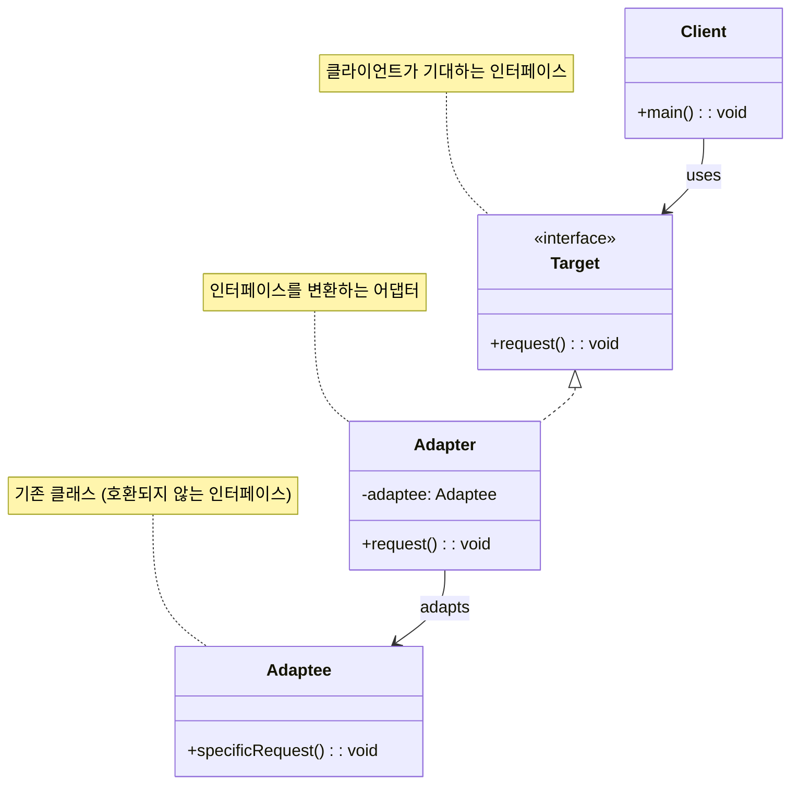

# 어댑터 패턴 (Adapter Pattern)

## 정의

어댑터 패턴은 한 클래스의 인터페이스를 클라이언트가 기대하는 다른 인터페이스로 변환하는 구조 디자인 패턴입니다. 어댑터를 사용하면 호환되지 않는 인터페이스를 가진 클래스들이 함께 작동할 수 있습니다.

## 구조 (Structure)



## 사용 이유

- **호환성 문제 해결**: 서로 다른 인터페이스를 가진 두 클래스를 직접 수정하지 않고도 함께 사용하고 싶을 때 유용합니다.
- **기존 코드 재사용**: 레거시 시스템이나 외부 라이브러리의 클래스를 새로운 시스템의 인터페이스에 맞춰 재사용할 수 있습니다.
- **유연성 증가**: 클라이언트 코드는 대상 인터페이스에만 의존하므로, 실제 구현 클래스가 변경되더라도 클라이언트 코드는 영향을 받지 않습니다.

## 적용 상황

어댑터 패턴은 다음과 같은 상황에서 특히 유용합니다:

### 1. 외부 라이브러리 통합
- **써드파티 API**: 외부 API의 인터페이스가 내부 시스템과 다를 때
- **레거시 시스템**: 기존 시스템을 새로운 아키텍처에 통합할 때
- **오픈소스 라이브러리**: 라이브러리의 인터페이스를 표준화할 때

### 2. 데이터 형식 변환
```java
// 나쁜 예: 직접 변환으로 코드 중복
class DataProcessor {
    public void processXMLData(XMLData data) {
        // XML을 JSON으로 변환하는 코드
        JSONData jsonData = convertXMLToJSON(data);
        processData(jsonData);
    }

    public void processCSVData(CSVData data) {
        // CSV를 JSON으로 변환하는 코드 (중복)
        JSONData jsonData = convertCSVToJSON(data);
        processData(jsonData);
    }
}

// 좋은 예: 어댑터 패턴 사용
interface DataAdapter {
    JSONData toJSON();
}

class XMLAdapter implements DataAdapter {
    private XMLData xmlData;

    public JSONData toJSON() {
        return convertXMLToJSON(xmlData);
    }
}
```

### 3. 시스템 간 인터페이스 통일
- **마이크로서비스**: 서로 다른 서비스 간의 통신 인터페이스 통일
- **데이터베이스 추상화**: 다양한 DB 벤더의 API를 통일된 인터페이스로 제공
- **파일 시스템**: 로컬, 클라우드, FTP 등 다양한 저장소의 통일된 접근

## 실생활 예제 - 통합 결제 시스템

다양한 결제 서비스들을 하나의 통일된 인터페이스로 통합하는 시스템을 어댑터 패턴으로 구현해보겠습니다.

```java
import java.util.*;
import java.time.LocalDateTime;
import java.time.format.DateTimeFormatter;

// 결제 정보 클래스
class PaymentInfo {
    private String orderId;
    private double amount;
    private String currency;
    private String customerEmail;
    private Map<String, String> metadata;

    public PaymentInfo(String orderId, double amount, String currency, String customerEmail) {
        this.orderId = orderId;
        this.amount = amount;
        this.currency = currency;
        this.customerEmail = customerEmail;
        this.metadata = new HashMap<>();
    }

    public void addMetadata(String key, String value) {
        metadata.put(key, value);
    }

    // getter 메서드들
    public String getOrderId() { return orderId; }
    public double getAmount() { return amount; }
    public String getCurrency() { return currency; }
    public String getCustomerEmail() { return customerEmail; }
    public Map<String, String> getMetadata() { return metadata; }
}

// 결제 결과 클래스
class PaymentResult {
    private boolean success;
    private String transactionId;
    private String message;
    private LocalDateTime processedAt;
    private Map<String, Object> details;

    public PaymentResult(boolean success, String transactionId, String message) {
        this.success = success;
        this.transactionId = transactionId;
        this.message = message;
        this.processedAt = LocalDateTime.now();
        this.details = new HashMap<>();
    }

    public void addDetail(String key, Object value) {
        details.put(key, value);
    }

    // getter 메서드들
    public boolean isSuccess() { return success; }
    public String getTransactionId() { return transactionId; }
    public String getMessage() { return message; }
    public LocalDateTime getProcessedAt() { return processedAt; }
    public Map<String, Object> getDetails() { return details; }

    @Override
    public String toString() {
        DateTimeFormatter formatter = DateTimeFormatter.ofPattern("yyyy-MM-dd HH:mm:ss");
        return String.format("PaymentResult{success=%s, transactionId='%s', message='%s', processedAt=%s}",
                success, transactionId, message, processedAt.format(formatter));
    }
}

// 통일된 결제 인터페이스 (Target)
interface PaymentProcessor {
    PaymentResult processPayment(PaymentInfo paymentInfo);
    boolean validatePaymentInfo(PaymentInfo paymentInfo);
    String getProviderName();
    List<String> getSupportedCurrencies();
}

// 기존 PayPal API (Adaptee)
class PayPalAPI {
    public Map<String, Object> makePayment(String email, double usdAmount, String orderRef) {
        // PayPal API 시뮬레이션
        System.out.println("🅿️ PayPal API 호출: " + email + ", $" + usdAmount);

        Map<String, Object> response = new HashMap<>();
        response.put("status", "completed");
        response.put("paypal_transaction_id", "PP-" + System.currentTimeMillis());
        response.put("fee", usdAmount * 0.029 + 0.30); // PayPal 수수료

        try {
            Thread.sleep(800); // API 호출 지연 시뮬레이션
        } catch (InterruptedException e) {
            Thread.currentThread().interrupt();
        }

        return response;
    }

    public boolean verifyAccount(String email) {
        return email != null && email.contains("@");
    }
}

// 기존 Stripe API (Adaptee)
class StripeAPI {
    public StripeResponse charge(StripeRequest request) {
        // Stripe API 시뮬레이션
        System.out.println("💳 Stripe API 호출: " + request.getAmount() + " " + request.getCurrency());

        StripeResponse response = new StripeResponse();
        response.setId("ch_" + System.currentTimeMillis());
        response.setStatus("succeeded");
        response.setAmount(request.getAmount());
        response.setCurrency(request.getCurrency());

        try {
            Thread.sleep(600); // API 호출 지연 시뮬레이션
        } catch (InterruptedException e) {
            Thread.currentThread().interrupt();
        }

        return response;
    }

    public static class StripeRequest {
        private double amount;
        private String currency;
        private String source;

        public StripeRequest(double amount, String currency, String source) {
            this.amount = amount;
            this.currency = currency;
            this.source = source;
        }

        public double getAmount() { return amount; }
        public String getCurrency() { return currency; }
        public String getSource() { return source; }
    }

    public static class StripeResponse {
        private String id;
        private String status;
        private double amount;
        private String currency;

        public void setId(String id) { this.id = id; }
        public void setStatus(String status) { this.status = status; }
        public void setAmount(double amount) { this.amount = amount; }
        public void setCurrency(String currency) { this.currency = currency; }

        public String getId() { return id; }
        public String getStatus() { return status; }
        public double getAmount() { return amount; }
        public String getCurrency() { return currency; }
    }
}

// 기존 KakaoPay API (Adaptee)
class KakaoPayAPI {
    public KakaoPayResult payment(KakaoPayRequest request) {
        // KakaoPay API 시뮬레이션
        System.out.println("🟡 KakaoPay API 호출: " + request.getTotalAmount() + "원");

        KakaoPayResult result = new KakaoPayResult();
        result.setTid("T" + System.currentTimeMillis());
        result.setStatus("SUCCESS");
        result.setApprovedAt(LocalDateTime.now());

        try {
            Thread.sleep(500); // API 호출 지연 시뮬레이션
        } catch (InterruptedException e) {
            Thread.currentThread().interrupt();
        }

        return result;
    }

    public static class KakaoPayRequest {
        private int totalAmount;
        private String itemName;
        private String userEmail;

        public KakaoPayRequest(int totalAmount, String itemName, String userEmail) {
            this.totalAmount = totalAmount;
            this.itemName = itemName;
            this.userEmail = userEmail;
        }

        public int getTotalAmount() { return totalAmount; }
        public String getItemName() { return itemName; }
        public String getUserEmail() { return userEmail; }
    }

    public static class KakaoPayResult {
        private String tid;
        private String status;
        private LocalDateTime approvedAt;

        public void setTid(String tid) { this.tid = tid; }
        public void setStatus(String status) { this.status = status; }
        public void setApprovedAt(LocalDateTime approvedAt) { this.approvedAt = approvedAt; }

        public String getTid() { return tid; }
        public String getStatus() { return status; }
        public LocalDateTime getApprovedAt() { return approvedAt; }
    }
}

// PayPal 어댑터
class PayPalAdapter implements PaymentProcessor {
    private PayPalAPI paypalAPI;

    public PayPalAdapter(PayPalAPI paypalAPI) {
        this.paypalAPI = paypalAPI;
    }

    @Override
    public PaymentResult processPayment(PaymentInfo paymentInfo) {
        try {
            // PayPal은 USD만 지원한다고 가정
            double usdAmount = convertToUSD(paymentInfo.getAmount(), paymentInfo.getCurrency());

            Map<String, Object> paypalResponse = paypalAPI.makePayment(
                paymentInfo.getCustomerEmail(),
                usdAmount,
                paymentInfo.getOrderId()
            );

            boolean success = "completed".equals(paypalResponse.get("status"));
            String transactionId = (String) paypalResponse.get("paypal_transaction_id");
            String message = success ? "PayPal 결제가 성공적으로 완료되었습니다." : "PayPal 결제에 실패했습니다.";

            PaymentResult result = new PaymentResult(success, transactionId, message);
            result.addDetail("provider", "PayPal");
            result.addDetail("fee", paypalResponse.get("fee"));
            result.addDetail("original_amount", paymentInfo.getAmount());
            result.addDetail("usd_amount", usdAmount);

            return result;

        } catch (Exception e) {
            return new PaymentResult(false, null, "PayPal 결제 중 오류 발생: " + e.getMessage());
        }
    }

    @Override
    public boolean validatePaymentInfo(PaymentInfo paymentInfo) {
        return paypalAPI.verifyAccount(paymentInfo.getCustomerEmail()) &&
               paymentInfo.getAmount() > 0;
    }

    @Override
    public String getProviderName() {
        return "PayPal";
    }

    @Override
    public List<String> getSupportedCurrencies() {
        return Arrays.asList("USD"); // PayPal 어댑터는 USD만 지원
    }

    private double convertToUSD(double amount, String currency) {
        // 간단한 환율 변환 (실제로는 외부 환율 API 사용)
        Map<String, Double> exchangeRates = Map.of(
            "USD", 1.0,
            "KRW", 0.00075,
            "EUR", 1.1,
            "JPY", 0.0067
        );

        return amount * exchangeRates.getOrDefault(currency, 1.0);
    }
}

// Stripe 어댑터
class StripeAdapter implements PaymentProcessor {
    private StripeAPI stripeAPI;

    public StripeAdapter(StripeAPI stripeAPI) {
        this.stripeAPI = stripeAPI;
    }

    @Override
    public PaymentResult processPayment(PaymentInfo paymentInfo) {
        try {
            StripeAPI.StripeRequest request = new StripeAPI.StripeRequest(
                paymentInfo.getAmount(),
                paymentInfo.getCurrency().toLowerCase(),
                "card_" + paymentInfo.getCustomerEmail().hashCode()
            );

            StripeAPI.StripeResponse stripeResponse = stripeAPI.charge(request);

            boolean success = "succeeded".equals(stripeResponse.getStatus());
            String message = success ? "Stripe 결제가 성공적으로 완료되었습니다." : "Stripe 결제에 실패했습니다.";

            PaymentResult result = new PaymentResult(success, stripeResponse.getId(), message);
            result.addDetail("provider", "Stripe");
            result.addDetail("amount", stripeResponse.getAmount());
            result.addDetail("currency", stripeResponse.getCurrency());
            result.addDetail("stripe_fee", stripeResponse.getAmount() * 0.029); // Stripe 수수료

            return result;

        } catch (Exception e) {
            return new PaymentResult(false, null, "Stripe 결제 중 오류 발생: " + e.getMessage());
        }
    }

    @Override
    public boolean validatePaymentInfo(PaymentInfo paymentInfo) {
        return paymentInfo.getCustomerEmail() != null &&
               paymentInfo.getAmount() > 0 &&
               getSupportedCurrencies().contains(paymentInfo.getCurrency().toUpperCase());
    }

    @Override
    public String getProviderName() {
        return "Stripe";
    }

    @Override
    public List<String> getSupportedCurrencies() {
        return Arrays.asList("USD", "EUR", "GBP", "JPY", "KRW");
    }
}

// KakaoPay 어댑터
class KakaoPayAdapter implements PaymentProcessor {
    private KakaoPayAPI kakaoPayAPI;

    public KakaoPayAdapter(KakaoPayAPI kakaoPayAPI) {
        this.kakaoPayAPI = kakaoPayAPI;
    }

    @Override
    public PaymentResult processPayment(PaymentInfo paymentInfo) {
        try {
            // KakaoPay는 KRW만 지원하고 정수 금액만 처리
            if (!"KRW".equals(paymentInfo.getCurrency())) {
                return new PaymentResult(false, null, "KakaoPay는 KRW 통화만 지원합니다.");
            }

            KakaoPayAPI.KakaoPayRequest request = new KakaoPayAPI.KakaoPayRequest(
                (int) paymentInfo.getAmount(),
                paymentInfo.getMetadata().getOrDefault("item_name", "상품"),
                paymentInfo.getCustomerEmail()
            );

            KakaoPayAPI.KakaoPayResult kakaoResult = kakaoPayAPI.payment(request);

            boolean success = "SUCCESS".equals(kakaoResult.getStatus());
            String message = success ? "KakaoPay 결제가 성공적으로 완료되었습니다." : "KakaoPay 결제에 실패했습니다.";

            PaymentResult result = new PaymentResult(success, kakaoResult.getTid(), message);
            result.addDetail("provider", "KakaoPay");
            result.addDetail("approved_at", kakaoResult.getApprovedAt());
            result.addDetail("currency", "KRW");

            return result;

        } catch (Exception e) {
            return new PaymentResult(false, null, "KakaoPay 결제 중 오류 발생: " + e.getMessage());
        }
    }

    @Override
    public boolean validatePaymentInfo(PaymentInfo paymentInfo) {
        return paymentInfo.getCustomerEmail() != null &&
               paymentInfo.getAmount() > 0 &&
               "KRW".equals(paymentInfo.getCurrency()) &&
               paymentInfo.getAmount() == (int) paymentInfo.getAmount(); // 정수 확인
    }

    @Override
    public String getProviderName() {
        return "KakaoPay";
    }

    @Override
    public List<String> getSupportedCurrencies() {
        return Arrays.asList("KRW");
    }
}

// 통합 결제 시스템
class IntegratedPaymentSystem {
    private Map<String, PaymentProcessor> processors;
    private List<String> paymentHistory;

    public IntegratedPaymentSystem() {
        this.processors = new HashMap<>();
        this.paymentHistory = new ArrayList<>();
        initializeProcessors();
    }

    private void initializeProcessors() {
        // 각 결제 서비스 API를 어댑터로 감싸서 등록
        processors.put("paypal", new PayPalAdapter(new PayPalAPI()));
        processors.put("stripe", new StripeAdapter(new StripeAPI()));
        processors.put("kakaopay", new KakaoPayAdapter(new KakaoPayAPI()));
    }

    public PaymentResult processPayment(String providerName, PaymentInfo paymentInfo) {
        PaymentProcessor processor = processors.get(providerName.toLowerCase());

        if (processor == null) {
            return new PaymentResult(false, null, "지원하지 않는 결제 서비스입니다: " + providerName);
        }

        // 결제 정보 검증
        if (!processor.validatePaymentInfo(paymentInfo)) {
            return new PaymentResult(false, null, processor.getProviderName() + "에서 결제 정보가 유효하지 않습니다.");
        }

        System.out.println("\n💳 결제 처리 시작 - " + processor.getProviderName());
        System.out.println("주문 ID: " + paymentInfo.getOrderId());
        System.out.println("금액: " + paymentInfo.getAmount() + " " + paymentInfo.getCurrency());
        System.out.println("고객: " + paymentInfo.getCustomerEmail());

        PaymentResult result = processor.processPayment(paymentInfo);

        // 결제 기록 저장
        String record = String.format("[%s] %s - %s (%s)",
            processor.getProviderName(),
            paymentInfo.getOrderId(),
            result.isSuccess() ? "성공" : "실패",
            paymentInfo.getAmount() + " " + paymentInfo.getCurrency()
        );
        paymentHistory.add(record);

        return result;
    }

    public List<String> getAvailableProviders() {
        return new ArrayList<>(processors.keySet());
    }

    public PaymentProcessor getProcessor(String providerName) {
        return processors.get(providerName.toLowerCase());
    }

    public void displayProviderInfo() {
        System.out.println("\n📋 등록된 결제 서비스 정보");
        System.out.println("=".repeat(50));

        for (Map.Entry<String, PaymentProcessor> entry : processors.entrySet()) {
            PaymentProcessor processor = entry.getValue();
            System.out.println("🔹 " + processor.getProviderName());
            System.out.println("   지원 통화: " + String.join(", ", processor.getSupportedCurrencies()));
        }
    }

    public void displayPaymentHistory() {
        System.out.println("\n📜 결제 기록");
        System.out.println("=".repeat(30));

        if (paymentHistory.isEmpty()) {
            System.out.println("결제 기록이 없습니다.");
            return;
        }

        for (int i = 0; i < paymentHistory.size(); i++) {
            System.out.println((i + 1) + ". " + paymentHistory.get(i));
        }
    }
}

// 통합 결제 시스템 데모
public class IntegratedPaymentDemo {
    public static void main(String[] args) throws InterruptedException {
        IntegratedPaymentSystem paymentSystem = new IntegratedPaymentSystem();

        System.out.println("💳 통합 결제 시스템 시작");
        System.out.println("=".repeat(50));

        // 결제 서비스 정보 출력
        paymentSystem.displayProviderInfo();

        // 다양한 결제 테스트

        // 1. PayPal 결제 (USD)
        PaymentInfo payment1 = new PaymentInfo("ORDER-001", 29.99, "USD", "john@example.com");
        PaymentResult result1 = paymentSystem.processPayment("paypal", payment1);
        System.out.println("결과: " + result1);
        Thread.sleep(1000);

        // 2. Stripe 결제 (EUR)
        PaymentInfo payment2 = new PaymentInfo("ORDER-002", 45.50, "EUR", "alice@example.com");
        PaymentResult result2 = paymentSystem.processPayment("stripe", payment2);
        System.out.println("결과: " + result2);
        Thread.sleep(1000);

        // 3. KakaoPay 결제 (KRW)
        PaymentInfo payment3 = new PaymentInfo("ORDER-003", 50000, "KRW", "kim@example.com");
        payment3.addMetadata("item_name", "스마트폰 케이스");
        PaymentResult result3 = paymentSystem.processPayment("kakaopay", payment3);
        System.out.println("결과: " + result3);
        Thread.sleep(1000);

        // 4. Stripe 결제 (KRW) - 다중 통화 지원 테스트
        PaymentInfo payment4 = new PaymentInfo("ORDER-004", 25000, "KRW", "park@example.com");
        PaymentResult result4 = paymentSystem.processPayment("stripe", payment4);
        System.out.println("결과: " + result4);
        Thread.sleep(1000);

        // 5. 지원하지 않는 결제 서비스 테스트
        PaymentInfo payment5 = new PaymentInfo("ORDER-005", 100.0, "USD", "test@example.com");
        PaymentResult result5 = paymentSystem.processPayment("unknown", payment5);
        System.out.println("결과: " + result5);
        Thread.sleep(1000);

        // 6. 잘못된 통화 테스트 (KakaoPay에 USD 요청)
        PaymentInfo payment6 = new PaymentInfo("ORDER-006", 50.0, "USD", "error@example.com");
        PaymentResult result6 = paymentSystem.processPayment("kakaopay", payment6);
        System.out.println("결과: " + result6);

        // 결제 기록 출력
        paymentSystem.displayPaymentHistory();

        System.out.println("\n🎯 통합 결제 시스템 데모 완료!");
    }
}
```

**실행 결과 예시:**
```
💳 통합 결제 시스템 시작
==================================================

📋 등록된 결제 서비스 정보
==================================================
🔹 PayPal
   지원 통화: USD
🔹 Stripe
   지원 통화: USD, EUR, GBP, JPY, KRW
🔹 KakaoPay
   지원 통화: KRW

💳 결제 처리 시작 - PayPal
주문 ID: ORDER-001
금액: 29.99 USD
고객: john@example.com
🅿️ PayPal API 호출: john@example.com, $29.99
결과: PaymentResult{success=true, transactionId='PP-1642234567890', message='PayPal 결제가 성공적으로 완료되었습니다.', processedAt=2024-01-15 14:30:15}

💳 결제 처리 시작 - Stripe
주문 ID: ORDER-002
금액: 45.5 EUR
고객: alice@example.com
💳 Stripe API 호출: 45.5 eur
결과: PaymentResult{success=true, transactionId='ch_1642234567891', message='Stripe 결제가 성공적으로 완료되었습니다.', processedAt=2024-01-15 14:30:16}
```

## 어댑터 패턴의 두 가지 유형

### 1. 객체 어댑터 (Object Adapter)
```java
// 컴포지션을 사용하는 방식 (위 예제에서 사용)
class ObjectAdapter implements Target {
    private Adaptee adaptee;  // 컴포지션

    public ObjectAdapter(Adaptee adaptee) {
        this.adaptee = adaptee;
    }
}
```

### 2. 클래스 어댑터 (Class Adapter)
```java
// 상속을 사용하는 방식 (Java에서는 다중 상속 불가로 제한적)
class ClassAdapter extends Adaptee implements Target {
    @Override
    public void request() {
        specificRequest();  // 상속받은 메서드 직접 호출
    }
}
```

## 기본 예제 코드 (Java)

```java
// Target Interface: 클라이언트가 사용하려는 인터페이스
interface Target {
    void request();
}

// Adaptee: 재사용하고 싶은 기존 클래스 (호환되지 않는 인터페이스)
class Adaptee {
    public void specificRequest() {
        System.out.println("Called specificRequest() in Adaptee");
    }
}

// Adapter: Adaptee의 인터페이스를 Target 인터페이스에 맞게 변환
class Adapter implements Target {
    private Adaptee adaptee;

    public Adapter(Adaptee adaptee) {
        this.adaptee = adaptee;
    }

    @Override
    public void request() {
        // 클라이언트의 요청(request)을 Adaptee가 이해할 수 있는 방식(specificRequest)으로 변환
        adaptee.specificRequest();
    }
}

// 사용 예시
public class Client {
    public static void main(String[] args) {
        Adaptee adaptee = new Adaptee();
        Target adapter = new Adapter(adaptee);

        // 클라이언트는 Target 인터페이스를 통해 Adaptee의 기능을 사용
        adapter.request();
    }
}
```

## 장점

- **재사용성 향상**: 기존 클래스의 코드를 변경하지 않고 새로운 시스템에 통합할 수 있습니다.
- **결합도 감소**: 클라이언트와 구현 클래스 사이의 결합도를 낮춥니다.
- **단일 책임 원칙(SRP)**: 인터페이스 변환 로직을 어댑터 클래스에 캡슐화하여 코드의 응집도를 높입니다.
- **개방-폐쇄 원칙**: 새로운 어댑터를 추가해도 기존 코드를 수정할 필요가 없습니다.
- **시스템 통합 용이**: 서로 다른 시스템 간의 통합을 쉽게 할 수 있습니다.

## 단점

- **코드 복잡성 증가**: 새로운 어댑터 클래스를 추가해야 하므로 전체적인 코드의 양과 복잡성이 늘어날 수 있습니다.
- **간접 호출**: 어댑터를 통한 간접 호출로 인해 약간의 성능 오버헤드가 발생할 수 있습니다.
- **디버깅 복잡성**: 여러 어댑터가 연결되면 디버깅이 복잡해질 수 있습니다.