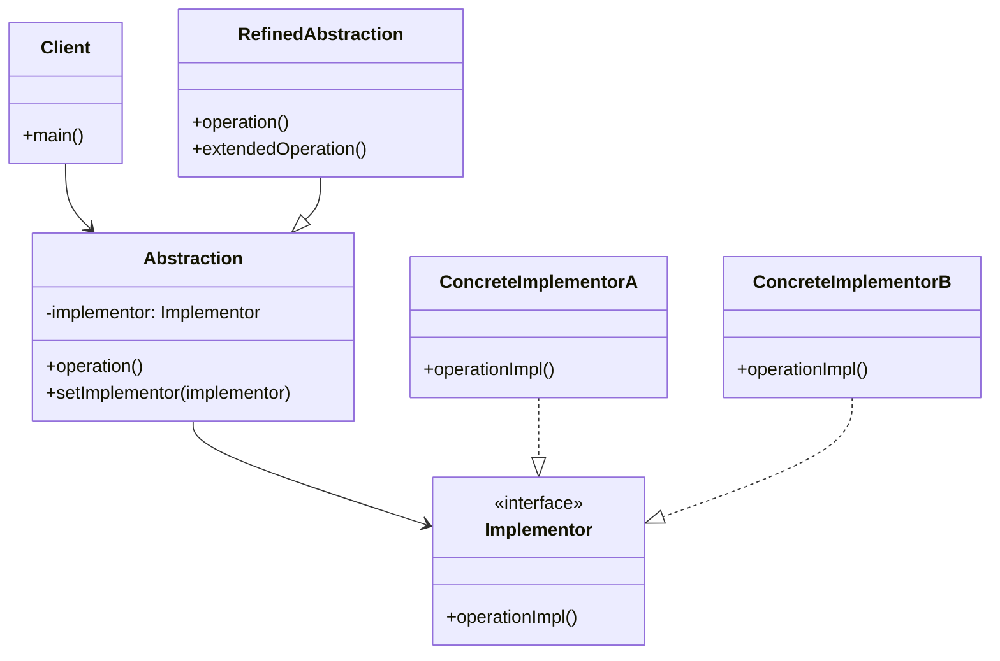

# Bridge 패턴 (브릿지 패턴)

## 개요

Bridge 패턴은 구현을 추상화로부터 분리하여 둘이 독립적으로 변할 수 있도록 하는 구조 패턴입니다. 이 패턴은 상속 대신 조합(Composition)을 사용하여 추상화와 구현 사이의 브릿지 역할을 합니다.

## 구조



## 주요 구성 요소

- **Abstraction**: 고수준 제어 로직을 정의하며, Implementor 객체에 대한 참조를 가집니다.
- **RefinedAbstraction**: Abstraction을 확장하여 추가 기능을 제공합니다.
- **Implementor**: 구현 클래스들을 위한 인터페이스를 정의합니다.
- **ConcreteImplementor**: Implementor 인터페이스의 구체적인 구현을 제공합니다.

## 실제 사용 사례

### 1. 그래픽 시스템
- 도형(추상화)과 렌더링 엔진(구현)을 분리
- 다양한 플랫폼(Windows, Linux, Mac)에서 동일한 도형 클래스 사용

### 2. 데이터베이스 연결
- 데이터 접근 계층(추상화)과 특정 데이터베이스 드라이버(구현) 분리
- MySQL, PostgreSQL, Oracle 등 다양한 데이터베이스 지원

### 3. 알림 시스템
- 알림 타입(추상화)과 전송 방식(구현) 분리
- 이메일, SMS, 푸시 알림 등 다양한 채널 지원

### 4. 미디어 플레이어
- 미디어 제어(추상화)와 코덱(구현) 분리
- MP3, MP4, AVI 등 다양한 포맷 지원

## 복잡한 실생활 예제: 크로스 플랫폼 메시지 전송 시스템

```java
// Implementor 인터페이스
interface MessageSender {
    void sendMessage(String recipient, String message);
    boolean isAvailable();
    String getStatus();
}

// ConcreteImplementor들
class EmailSender implements MessageSender {
    private String smtpServer;
    private int port;

    public EmailSender(String smtpServer, int port) {
        this.smtpServer = smtpServer;
        this.port = port;
    }

    @Override
    public void sendMessage(String recipient, String message) {
        System.out.println("이메일 전송:");
        System.out.println("서버: " + smtpServer + ":" + port);
        System.out.println("받는 사람: " + recipient);
        System.out.println("내용: " + message);
        // 실제 이메일 전송 로직
    }

    @Override
    public boolean isAvailable() {
        // SMTP 서버 연결 상태 확인
        return true;
    }

    @Override
    public String getStatus() {
        return "이메일 서비스 정상";
    }
}

class SMSSender implements MessageSender {
    private String apiKey;
    private String serviceProvider;

    public SMSSender(String apiKey, String serviceProvider) {
        this.apiKey = apiKey;
        this.serviceProvider = serviceProvider;
    }

    @Override
    public void sendMessage(String recipient, String message) {
        System.out.println("SMS 전송:");
        System.out.println("서비스 제공자: " + serviceProvider);
        System.out.println("받는 번호: " + recipient);
        System.out.println("내용: " + message);
        // 실제 SMS 전송 로직
    }

    @Override
    public boolean isAvailable() {
        // SMS API 상태 확인
        return true;
    }

    @Override
    public String getStatus() {
        return "SMS 서비스 정상";
    }
}

class SlackSender implements MessageSender {
    private String webhookUrl;
    private String channel;

    public SlackSender(String webhookUrl, String channel) {
        this.webhookUrl = webhookUrl;
        this.channel = channel;
    }

    @Override
    public void sendMessage(String recipient, String message) {
        System.out.println("Slack 메시지 전송:");
        System.out.println("채널: " + channel);
        System.out.println("사용자: " + recipient);
        System.out.println("내용: " + message);
        // 실제 Slack 메시지 전송 로직
    }

    @Override
    public boolean isAvailable() {
        // Slack 웹훅 상태 확인
        return true;
    }

    @Override
    public String getStatus() {
        return "Slack 서비스 정상";
    }
}

// Abstraction
abstract class Message {
    protected MessageSender sender;
    protected String content;
    protected String timestamp;

    public Message(MessageSender sender) {
        this.sender = sender;
        this.timestamp = java.time.LocalDateTime.now().toString();
    }

    public abstract void send(String recipient);

    public void setSender(MessageSender sender) {
        this.sender = sender;
    }

    public String getStatus() {
        return sender.getStatus();
    }

    public boolean isDeliverable() {
        return sender.isAvailable();
    }
}

// RefinedAbstraction들
class TextMessage extends Message {
    public TextMessage(MessageSender sender, String content) {
        super(sender);
        this.content = content;
    }

    @Override
    public void send(String recipient) {
        if (!isDeliverable()) {
            System.out.println("전송 실패: 서비스 사용 불가");
            return;
        }

        System.out.println("=== 텍스트 메시지 전송 ===");
        System.out.println("시간: " + timestamp);
        sender.sendMessage(recipient, content);
        System.out.println("전송 완료\n");
    }
}

class UrgentMessage extends Message {
    private int priority;

    public UrgentMessage(MessageSender sender, String content, int priority) {
        super(sender);
        this.content = "[긴급] " + content;
        this.priority = priority;
    }

    @Override
    public void send(String recipient) {
        if (!isDeliverable()) {
            System.out.println("긴급 메시지 전송 실패: 서비스 사용 불가");
            return;
        }

        System.out.println("=== 긴급 메시지 전송 ===");
        System.out.println("우선순위: " + priority);
        System.out.println("시간: " + timestamp);

        // 우선순위가 높으면 여러 채널로 전송
        if (priority >= 9) {
            System.out.println("최고 우선순위: 다중 채널 전송");
        }

        sender.sendMessage(recipient, content);
        System.out.println("긴급 메시지 전송 완료\n");
    }

    public void escalate(MessageSender backupSender, String supervisor) {
        System.out.println("에스컬레이션: 백업 채널로 상급자에게 전송");
        MessageSender originalSender = this.sender;
        this.sender = backupSender;
        send(supervisor);
        this.sender = originalSender;
    }
}

class ScheduledMessage extends Message {
    private String scheduledTime;
    private boolean isRecurring;

    public ScheduledMessage(MessageSender sender, String content, String scheduledTime) {
        super(sender);
        this.content = content;
        this.scheduledTime = scheduledTime;
        this.isRecurring = false;
    }

    @Override
    public void send(String recipient) {
        if (!isDeliverable()) {
            System.out.println("예약 메시지 전송 실패: 서비스 사용 불가");
            return;
        }

        System.out.println("=== 예약 메시지 전송 ===");
        System.out.println("예약 시간: " + scheduledTime);
        System.out.println("현재 시간: " + timestamp);
        System.out.println("반복 여부: " + (isRecurring ? "예" : "아니오"));

        sender.sendMessage(recipient, content);
        System.out.println("예약 메시지 전송 완료\n");
    }

    public void setRecurring(boolean recurring) {
        this.isRecurring = recurring;
    }
}

// 클라이언트 코드
public class MessageSystemDemo {
    public static void main(String[] args) {
        // 다양한 메시지 전송 방식 설정
        MessageSender emailSender = new EmailSender("smtp.company.com", 587);
        MessageSender smsSender = new SMSSender("API_KEY_123", "Twilio");
        MessageSender slackSender = new SlackSender("https://hooks.slack.com/webhook", "#alerts");

        // 일반 텍스트 메시지
        Message textMessage = new TextMessage(emailSender, "정기 보고서가 준비되었습니다.");
        textMessage.send("manager@company.com");

        // 긴급 메시지 (SMS로 전송)
        UrgentMessage urgentMsg = new UrgentMessage(smsSender, "서버 다운 감지!", 10);
        urgentMsg.send("010-1234-5678");

        // 같은 긴급 메시지를 다른 채널로 에스컬레이션
        urgentMsg.escalate(slackSender, "@channel");

        // 예약 메시지 (Slack으로 전송)
        ScheduledMessage scheduledMsg = new ScheduledMessage(
            slackSender,
            "주간 팀 미팅 알림",
            "2024-01-15 09:00"
        );
        scheduledMsg.setRecurring(true);
        scheduledMsg.send("#team-general");

        // 런타임에 전송 방식 변경
        System.out.println("=== 전송 방식 동적 변경 ===");
        textMessage.setSender(slackSender);
        textMessage.send("#notifications");

        // 상태 확인
        System.out.println("=== 서비스 상태 확인 ===");
        System.out.println("이메일 상태: " + emailSender.getStatus());
        System.out.println("SMS 상태: " + smsSender.getStatus());
        System.out.println("Slack 상태: " + slackSender.getStatus());
    }
}
```

## 기본 Bridge 패턴 예제

```java
// Implementor
interface DrawingAPI {
    void drawCircle(double x, double y, double radius);
    void drawRectangle(double x, double y, double width, double height);
}

// ConcreteImplementor
class VectorDrawingAPI implements DrawingAPI {
    @Override
    public void drawCircle(double x, double y, double radius) {
        System.out.printf("Vector: 원 그리기 중심(%f, %f) 반지름 %f%n", x, y, radius);
    }

    @Override
    public void drawRectangle(double x, double y, double width, double height) {
        System.out.printf("Vector: 사각형 그리기 (%f, %f) 크기 %fx%f%n", x, y, width, height);
    }
}

class RasterDrawingAPI implements DrawingAPI {
    @Override
    public void drawCircle(double x, double y, double radius) {
        System.out.printf("Raster: 픽셀로 원 그리기 중심(%f, %f) 반지름 %f%n", x, y, radius);
    }

    @Override
    public void drawRectangle(double x, double y, double width, double height) {
        System.out.printf("Raster: 픽셀로 사각형 그리기 (%f, %f) 크기 %fx%f%n", x, y, width, height);
    }
}

// Abstraction
abstract class Shape {
    protected DrawingAPI drawingAPI;

    protected Shape(DrawingAPI drawingAPI) {
        this.drawingAPI = drawingAPI;
    }

    public abstract void draw();

    public void setDrawingAPI(DrawingAPI drawingAPI) {
        this.drawingAPI = drawingAPI;
    }
}

// RefinedAbstraction
class Circle extends Shape {
    private double x, y, radius;

    public Circle(double x, double y, double radius, DrawingAPI drawingAPI) {
        super(drawingAPI);
        this.x = x;
        this.y = y;
        this.radius = radius;
    }

    @Override
    public void draw() {
        drawingAPI.drawCircle(x, y, radius);
    }
}

class Rectangle extends Shape {
    private double x, y, width, height;

    public Rectangle(double x, double y, double width, double height, DrawingAPI drawingAPI) {
        super(drawingAPI);
        this.x = x;
        this.y = y;
        this.width = width;
        this.height = height;
    }

    @Override
    public void draw() {
        drawingAPI.drawRectangle(x, y, width, height);
    }
}
```

## 장점

- **분리된 인터페이스와 구현**: 추상화와 구현을 독립적으로 확장할 수 있습니다.
- **런타임 구현 변경**: 객체의 구현을 런타임에 변경할 수 있습니다.
- **플랫폼 독립성**: 플랫폼별 구현을 숨기고 통일된 인터페이스를 제공합니다.
- **코드 재사용성**: 추상화와 구현을 독립적으로 재사용할 수 있습니다.

## 단점

- **복잡성 증가**: 간단한 경우에는 과도한 추상화가 될 수 있습니다.
- **간접 참조**: 추가적인 간접 참조로 인한 성능 오버헤드가 있을 수 있습니다.
- **설계 복잡도**: 초기 설계 시 추상화와 구현의 경계를 정확히 파악해야 합니다.

## Adapter 패턴과의 차이점

- **Bridge**: 설계 초기에 추상화와 구현을 분리하기 위해 사용
- **Adapter**: 기존의 호환되지 않는 인터페이스를 연결하기 위해 사용

## 언제 사용할까?

1. 추상화와 구현이 컴파일 타임에 바인딩되는 것을 피하고 싶을 때
2. 추상화와 구현을 독립적으로 확장해야 할 때
3. 구현의 변경이 클라이언트에 영향을 주지 않아야 할 때
4. 플랫폼별 구현을 숨기고 싶을 때
5. 여러 객체 간에 구현을 공유하고 싶을 때