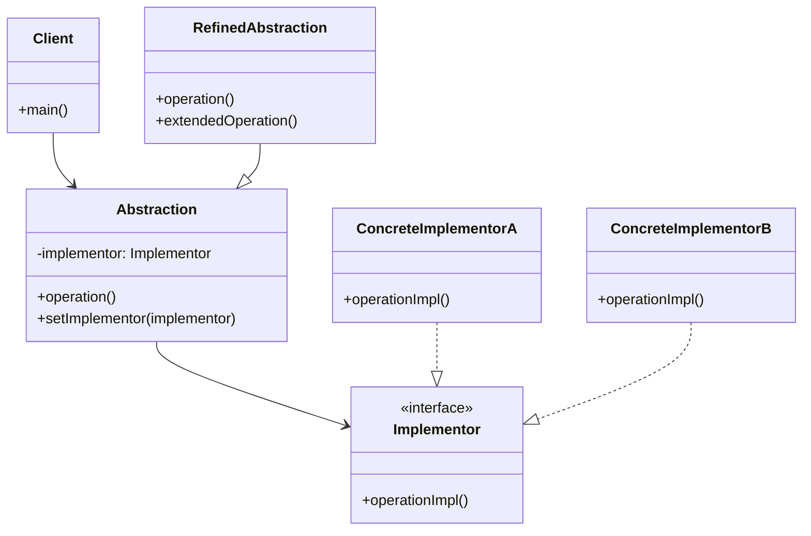
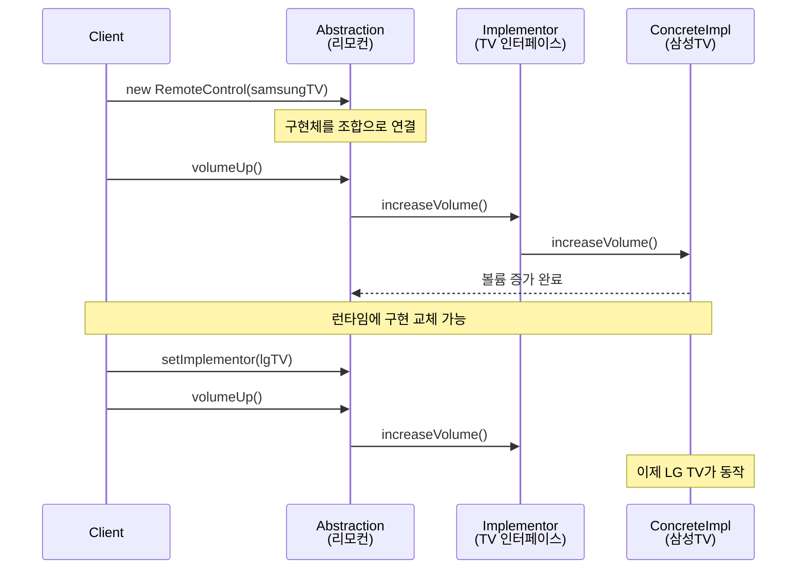
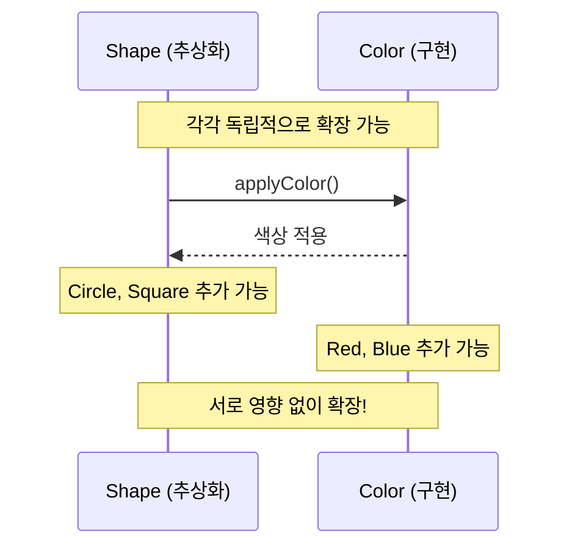

# Bridge 패턴 (브릿지 패턴)

## 개요

Bridge 패턴은 구현을 추상화로부터 분리하여 둘이 독립적으로 변할 수 있도록 하는 구조 패턴입니다. 이 패턴은 상속 대신 조합(Composition)을 사용하여 추상화와 구현 사이의 브릿지 역할을 합니다.

## 🎯 한눈에 보기

| 항목 | 설명 |
|------|------|
| **핵심** | **추상화**와 **구현**을 분리하여 독립적으로 확장 |
| **비유** | 리모컨(추상화)과 TV(구현) - 삼성/LG TV에 같은 리모컨 사용 |
| **언제** | "무엇을"과 "어떻게"가 모두 확장되어야 할 때 |
| **Spring** | `JdbcTemplate` + DataSource, `RestTemplate` + HttpClient |

### 핵심 구성요소
```
Abstraction      → 고수준 로직 정의 (리모컨)
Implementor      → 저수준 구현 인터페이스 (TV 인터페이스)
ConcreteImpl     → 실제 구현 (삼성TV, LG TV)
```

### Bridge가 필요한 상황
```
상속으로 해결하면? (조합 폭발)
├── Shape
│   ├── RedCircle, BlueCircle, GreenCircle
│   ├── RedSquare, BlueSquare, GreenSquare
│   └── ... (도형 × 색상 개수만큼 클래스 필요!)

Bridge로 해결하면?
├── Shape (추상화) ─────→ Color (구현)
│   ├── Circle             ├── Red
│   └── Square             ├── Blue
                           └── Green
```

## 구조


```mermaid
classDiagram
    class Abstraction {
        -implementor: Implementor
        +operation()
        +setImplementor(implementor)
    }

    class RefinedAbstraction {
        +operation()
        +extendedOperation()
    }

    class Implementor {
        <<interface>>
        +operationImpl()
    }

    class ConcreteImplementorA {
        +operationImpl()
    }

    class ConcreteImplementorB {
        +operationImpl()
    }

    class Client {
        +main()
    }

    Client --> Abstraction
    Abstraction --> Implementor
    RefinedAbstraction --|> Abstraction
    ConcreteImplementorA ..|> Implementor
    ConcreteImplementorB ..|> Implementor
```

## 주요 구성 요소

- **Abstraction**: 고수준 제어 로직을 정의하며, Implementor 객체에 대한 참조를 가집니다.
- **RefinedAbstraction**: Abstraction을 확장하여 추가 기능을 제공합니다.
- **Implementor**: 구현 클래스들을 위한 인터페이스를 정의합니다.
- **ConcreteImplementor**: Implementor 인터페이스의 구체적인 구현을 제공합니다.

## 동작 흐름


```mermaid
sequenceDiagram
    participant Client
    participant Abstraction as Abstraction<br/>(리모컨)
    participant Implementor as Implementor<br/>(TV 인터페이스)
    participant ConcreteImpl as ConcreteImpl<br/>(삼성TV)

    Client->>Abstraction: new RemoteControl(samsungTV)
    Note over Abstraction: 구현체를 조합으로 연결

    Client->>Abstraction: volumeUp()
    Abstraction->>Implementor: increaseVolume()
    Implementor->>ConcreteImpl: increaseVolume()
    ConcreteImpl-->>Abstraction: 볼륨 증가 완료

    Note over Client,ConcreteImpl: 런타임에 구현 교체 가능

    Client->>Abstraction: setImplementor(lgTV)
    Client->>Abstraction: volumeUp()
    Abstraction->>Implementor: increaseVolume()
    Note over ConcreteImpl: 이제 LG TV가 동작
```

### 추상화와 구현의 분리


```mermaid
sequenceDiagram
    participant Shape as Shape (추상화)
    participant Color as Color (구현)

    Note over Shape,Color: 각각 독립적으로 확장 가능

    Shape->>Color: applyColor()
    Color-->>Shape: 색상 적용

    Note over Shape: Circle, Square 추가 가능
    Note over Color: Red, Blue 추가 가능
    Note over Shape,Color: 서로 영향 없이 확장!
```

## 실제 사용 사례

### 1. 그래픽 시스템
- 도형(추상화)과 렌더링 엔진(구현)을 분리
- 다양한 플랫폼(Windows, Linux, Mac)에서 동일한 도형 클래스 사용

### 2. 데이터베이스 연결
- 데이터 접근 계층(추상화)과 특정 데이터베이스 드라이버(구현) 분리
- MySQL, PostgreSQL, Oracle 등 다양한 데이터베이스 지원

### 3. 알림 시스템
- 알림 타입(추상화)과 전송 방식(구현) 분리
- 이메일, SMS, 푸시 알림 등 다양한 채널 지원

### 4. 미디어 플레이어
- 미디어 제어(추상화)와 코덱(구현) 분리
- MP3, MP4, AVI 등 다양한 포맷 지원

## 초급 예제: 리모컨과 TV

가장 직관적인 Bridge 패턴 예제입니다. 리모컨(추상화)과 TV(구현)를 분리합니다.

```java
// 1. 구현(Implementor) - TV 인터페이스
interface TV {
    void on();
    void off();
    void setChannel(int channel);
}

// 2. 구체적인 구현들 - 각 제조사 TV
class SamsungTV implements TV {
    @Override
    public void on() { System.out.println("삼성 TV 켜짐"); }

    @Override
    public void off() { System.out.println("삼성 TV 꺼짐"); }

    @Override
    public void setChannel(int channel) {
        System.out.println("삼성 TV 채널 " + channel);
    }
}

class LGTV implements TV {
    @Override
    public void on() { System.out.println("LG TV 켜짐"); }

    @Override
    public void off() { System.out.println("LG TV 꺼짐"); }

    @Override
    public void setChannel(int channel) {
        System.out.println("LG TV 채널 " + channel);
    }
}

// 3. 추상화(Abstraction) - 리모컨
class RemoteControl {
    protected TV tv;  // 구현체를 조합으로 연결 (Bridge!)

    public RemoteControl(TV tv) {
        this.tv = tv;
    }

    public void turnOn() { tv.on(); }
    public void turnOff() { tv.off(); }
    public void changeChannel(int channel) { tv.setChannel(channel); }
}

// 4. 확장된 추상화 - 고급 리모컨
class AdvancedRemote extends RemoteControl {
    public AdvancedRemote(TV tv) {
        super(tv);
    }

    public void mute() {
        System.out.println("음소거");
    }
}

// 5. 사용 예제
public class BridgeDemo {
    public static void main(String[] args) {
        // 같은 리모컨으로 다른 TV 제어 가능
        TV samsung = new SamsungTV();
        TV lg = new LGTV();

        RemoteControl remote1 = new RemoteControl(samsung);
        remote1.turnOn();           // 삼성 TV 켜짐
        remote1.changeChannel(5);   // 삼성 TV 채널 5

        RemoteControl remote2 = new RemoteControl(lg);
        remote2.turnOn();           // LG TV 켜짐
        remote2.changeChannel(10);  // LG TV 채널 10
    }
}
```

**실행 결과:**
```
삼성 TV 켜짐
삼성 TV 채널 5
LG TV 켜짐
LG TV 채널 10
```

**핵심 포인트:**
- `RemoteControl`(추상화)과 `TV`(구현)가 분리됨
- 새 TV 추가 시 `TV` 인터페이스만 구현
- 새 리모컨 기능 추가 시 `RemoteControl`만 확장
- 서로 독립적으로 확장 가능!

## 복잡한 실생활 예제: 크로스 플랫폼 메시지 전송 시스템

```java
// Implementor 인터페이스
interface MessageSender {
    void sendMessage(String recipient, String message);
    boolean isAvailable();
    String getStatus();
}

// ConcreteImplementor들
class EmailSender implements MessageSender {
    private String smtpServer;
    private int port;

    public EmailSender(String smtpServer, int port) {
        this.smtpServer = smtpServer;
        this.port = port;
    }

    @Override
    public void sendMessage(String recipient, String message) {
        System.out.println("이메일 전송:");
        System.out.println("서버: " + smtpServer + ":" + port);
        System.out.println("받는 사람: " + recipient);
        System.out.println("내용: " + message);
        // 실제 이메일 전송 로직
    }

    @Override
    public boolean isAvailable() {
        // SMTP 서버 연결 상태 확인
        return true;
    }

    @Override
    public String getStatus() {
        return "이메일 서비스 정상";
    }
}

class SMSSender implements MessageSender {
    private String apiKey;
    private String serviceProvider;

    public SMSSender(String apiKey, String serviceProvider) {
        this.apiKey = apiKey;
        this.serviceProvider = serviceProvider;
    }

    @Override
    public void sendMessage(String recipient, String message) {
        System.out.println("SMS 전송:");
        System.out.println("서비스 제공자: " + serviceProvider);
        System.out.println("받는 번호: " + recipient);
        System.out.println("내용: " + message);
        // 실제 SMS 전송 로직
    }

    @Override
    public boolean isAvailable() {
        // SMS API 상태 확인
        return true;
    }

    @Override
    public String getStatus() {
        return "SMS 서비스 정상";
    }
}

class SlackSender implements MessageSender {
    private String webhookUrl;
    private String channel;

    public SlackSender(String webhookUrl, String channel) {
        this.webhookUrl = webhookUrl;
        this.channel = channel;
    }

    @Override
    public void sendMessage(String recipient, String message) {
        System.out.println("Slack 메시지 전송:");
        System.out.println("채널: " + channel);
        System.out.println("사용자: " + recipient);
        System.out.println("내용: " + message);
        // 실제 Slack 메시지 전송 로직
    }

    @Override
    public boolean isAvailable() {
        // Slack 웹훅 상태 확인
        return true;
    }

    @Override
    public String getStatus() {
        return "Slack 서비스 정상";
    }
}

// Abstraction
abstract class Message {
    protected MessageSender sender;
    protected String content;
    protected String timestamp;

    public Message(MessageSender sender) {
        this.sender = sender;
        this.timestamp = java.time.LocalDateTime.now().toString();
    }

    public abstract void send(String recipient);

    public void setSender(MessageSender sender) {
        this.sender = sender;
    }

    public String getStatus() {
        return sender.getStatus();
    }

    public boolean isDeliverable() {
        return sender.isAvailable();
    }
}

// RefinedAbstraction들
class TextMessage extends Message {
    public TextMessage(MessageSender sender, String content) {
        super(sender);
        this.content = content;
    }

    @Override
    public void send(String recipient) {
        if (!isDeliverable()) {
            System.out.println("전송 실패: 서비스 사용 불가");
            return;
        }

        System.out.println("=== 텍스트 메시지 전송 ===");
        System.out.println("시간: " + timestamp);
        sender.sendMessage(recipient, content);
        System.out.println("전송 완료\n");
    }
}

class UrgentMessage extends Message {
    private int priority;

    public UrgentMessage(MessageSender sender, String content, int priority) {
        super(sender);
        this.content = "[긴급] " + content;
        this.priority = priority;
    }

    @Override
    public void send(String recipient) {
        if (!isDeliverable()) {
            System.out.println("긴급 메시지 전송 실패: 서비스 사용 불가");
            return;
        }

        System.out.println("=== 긴급 메시지 전송 ===");
        System.out.println("우선순위: " + priority);
        System.out.println("시간: " + timestamp);

        // 우선순위가 높으면 여러 채널로 전송
        if (priority >= 9) {
            System.out.println("최고 우선순위: 다중 채널 전송");
        }

        sender.sendMessage(recipient, content);
        System.out.println("긴급 메시지 전송 완료\n");
    }

    public void escalate(MessageSender backupSender, String supervisor) {
        System.out.println("에스컬레이션: 백업 채널로 상급자에게 전송");
        MessageSender originalSender = this.sender;
        this.sender = backupSender;
        send(supervisor);
        this.sender = originalSender;
    }
}

class ScheduledMessage extends Message {
    private String scheduledTime;
    private boolean isRecurring;

    public ScheduledMessage(MessageSender sender, String content, String scheduledTime) {
        super(sender);
        this.content = content;
        this.scheduledTime = scheduledTime;
        this.isRecurring = false;
    }

    @Override
    public void send(String recipient) {
        if (!isDeliverable()) {
            System.out.println("예약 메시지 전송 실패: 서비스 사용 불가");
            return;
        }

        System.out.println("=== 예약 메시지 전송 ===");
        System.out.println("예약 시간: " + scheduledTime);
        System.out.println("현재 시간: " + timestamp);
        System.out.println("반복 여부: " + (isRecurring ? "예" : "아니오"));

        sender.sendMessage(recipient, content);
        System.out.println("예약 메시지 전송 완료\n");
    }

    public void setRecurring(boolean recurring) {
        this.isRecurring = recurring;
    }
}

// 클라이언트 코드
public class MessageSystemDemo {
    public static void main(String[] args) {
        // 다양한 메시지 전송 방식 설정
        MessageSender emailSender = new EmailSender("smtp.company.com", 587);
        MessageSender smsSender = new SMSSender("API_KEY_123", "Twilio");
        MessageSender slackSender = new SlackSender("https://hooks.slack.com/webhook", "#alerts");

        // 일반 텍스트 메시지
        Message textMessage = new TextMessage(emailSender, "정기 보고서가 준비되었습니다.");
        textMessage.send("manager@company.com");

        // 긴급 메시지 (SMS로 전송)
        UrgentMessage urgentMsg = new UrgentMessage(smsSender, "서버 다운 감지!", 10);
        urgentMsg.send("010-1234-5678");

        // 같은 긴급 메시지를 다른 채널로 에스컬레이션
        urgentMsg.escalate(slackSender, "@channel");

        // 예약 메시지 (Slack으로 전송)
        ScheduledMessage scheduledMsg = new ScheduledMessage(
            slackSender,
            "주간 팀 미팅 알림",
            "2024-01-15 09:00"
        );
        scheduledMsg.setRecurring(true);
        scheduledMsg.send("#team-general");

        // 런타임에 전송 방식 변경
        System.out.println("=== 전송 방식 동적 변경 ===");
        textMessage.setSender(slackSender);
        textMessage.send("#notifications");

        // 상태 확인
        System.out.println("=== 서비스 상태 확인 ===");
        System.out.println("이메일 상태: " + emailSender.getStatus());
        System.out.println("SMS 상태: " + smsSender.getStatus());
        System.out.println("Slack 상태: " + slackSender.getStatus());
    }
}
```

## 기본 Bridge 패턴 예제

```java
// Implementor
interface DrawingAPI {
    void drawCircle(double x, double y, double radius);
    void drawRectangle(double x, double y, double width, double height);
}

// ConcreteImplementor
class VectorDrawingAPI implements DrawingAPI {
    @Override
    public void drawCircle(double x, double y, double radius) {
        System.out.printf("Vector: 원 그리기 중심(%f, %f) 반지름 %f%n", x, y, radius);
    }

    @Override
    public void drawRectangle(double x, double y, double width, double height) {
        System.out.printf("Vector: 사각형 그리기 (%f, %f) 크기 %fx%f%n", x, y, width, height);
    }
}

class RasterDrawingAPI implements DrawingAPI {
    @Override
    public void drawCircle(double x, double y, double radius) {
        System.out.printf("Raster: 픽셀로 원 그리기 중심(%f, %f) 반지름 %f%n", x, y, radius);
    }

    @Override
    public void drawRectangle(double x, double y, double width, double height) {
        System.out.printf("Raster: 픽셀로 사각형 그리기 (%f, %f) 크기 %fx%f%n", x, y, width, height);
    }
}

// Abstraction
abstract class Shape {
    protected DrawingAPI drawingAPI;

    protected Shape(DrawingAPI drawingAPI) {
        this.drawingAPI = drawingAPI;
    }

    public abstract void draw();

    public void setDrawingAPI(DrawingAPI drawingAPI) {
        this.drawingAPI = drawingAPI;
    }
}

// RefinedAbstraction
class Circle extends Shape {
    private double x, y, radius;

    public Circle(double x, double y, double radius, DrawingAPI drawingAPI) {
        super(drawingAPI);
        this.x = x;
        this.y = y;
        this.radius = radius;
    }

    @Override
    public void draw() {
        drawingAPI.drawCircle(x, y, radius);
    }
}

class Rectangle extends Shape {
    private double x, y, width, height;

    public Rectangle(double x, double y, double width, double height, DrawingAPI drawingAPI) {
        super(drawingAPI);
        this.x = x;
        this.y = y;
        this.width = width;
        this.height = height;
    }

    @Override
    public void draw() {
        drawingAPI.drawRectangle(x, y, width, height);
    }
}
```

## Spring Boot에서의 Bridge 패턴

### 1. 알림 서비스 (추상화) + 전송 채널 (구현)

```java
// 구현(Implementor) - 알림 전송 채널
public interface NotificationSender {
    void send(String recipient, String title, String message);
    boolean isAvailable();
}

// 구체적인 구현들
@Component("email")
@RequiredArgsConstructor
public class EmailNotificationSender implements NotificationSender {
    private final JavaMailSender mailSender;

    @Override
    public void send(String recipient, String title, String message) {
        SimpleMailMessage mail = new SimpleMailMessage();
        mail.setTo(recipient);
        mail.setSubject(title);
        mail.setText(message);
        mailSender.send(mail);
    }

    @Override
    public boolean isAvailable() {
        return true;  // 실제로는 SMTP 연결 확인
    }
}

@Component("sms")
@RequiredArgsConstructor
public class SmsNotificationSender implements NotificationSender {
    private final SmsClient smsClient;

    @Override
    public void send(String recipient, String title, String message) {
        smsClient.sendSms(recipient, title + ": " + message);
    }

    @Override
    public boolean isAvailable() {
        return smsClient.checkConnection();
    }
}

@Component("push")
@RequiredArgsConstructor
public class PushNotificationSender implements NotificationSender {
    private final FirebaseMessaging firebaseMessaging;

    @Override
    public void send(String recipient, String title, String message) {
        Message firebaseMessage = Message.builder()
            .setToken(recipient)
            .setNotification(Notification.builder()
                .setTitle(title)
                .setBody(message)
                .build())
            .build();
        firebaseMessaging.send(firebaseMessage);
    }

    @Override
    public boolean isAvailable() {
        return true;
    }
}
```

### 2. 추상화 계층 - 알림 서비스

```java
// 추상화(Abstraction) - 알림 타입별 서비스
public abstract class NotificationService {
    protected final NotificationSender sender;

    protected NotificationService(NotificationSender sender) {
        this.sender = sender;
    }

    public abstract void notify(String recipient, String content);

    // 런타임에 전송 채널 변경 가능
    public void changeSender(NotificationSender newSender) {
        // 새 인스턴스 생성이 필요한 경우 팩토리 사용
    }
}

// 확장된 추상화들
@Component
public class OrderNotificationService extends NotificationService {

    public OrderNotificationService(@Qualifier("email") NotificationSender sender) {
        super(sender);
    }

    @Override
    public void notify(String recipient, String content) {
        sender.send(recipient, "주문 알림", content);
    }

    public void notifyOrderConfirmed(String recipient, String orderId) {
        notify(recipient, "주문 " + orderId + "이 확인되었습니다.");
    }

    public void notifyShipped(String recipient, String orderId, String trackingNo) {
        notify(recipient, "주문 " + orderId + " 배송 시작. 운송장: " + trackingNo);
    }
}

@Component
public class SecurityNotificationService extends NotificationService {

    public SecurityNotificationService(@Qualifier("sms") NotificationSender sender) {
        super(sender);
    }

    @Override
    public void notify(String recipient, String content) {
        sender.send(recipient, "[보안 알림]", content);
    }

    public void notifyLoginAttempt(String recipient, String location) {
        notify(recipient, "새로운 로그인 시도: " + location);
    }

    public void notifyPasswordChanged(String recipient) {
        notify(recipient, "비밀번호가 변경되었습니다.");
    }
}
```

### 3. 전송 채널 팩토리와 동적 선택

```java
@Component
@RequiredArgsConstructor
public class NotificationSenderFactory {
    // Spring이 모든 구현체를 Map으로 주입
    private final Map<String, NotificationSender> senders;

    public NotificationSender getSender(String type) {
        NotificationSender sender = senders.get(type);
        if (sender == null) {
            throw new IllegalArgumentException("Unknown sender type: " + type);
        }
        return sender;
    }

    public NotificationSender getAvailableSender() {
        return senders.values().stream()
            .filter(NotificationSender::isAvailable)
            .findFirst()
            .orElseThrow(() -> new IllegalStateException("No available sender"));
    }
}

// 동적 알림 서비스
@Service
@RequiredArgsConstructor
public class DynamicNotificationService {
    private final NotificationSenderFactory senderFactory;

    public void sendNotification(String channelType, String recipient,
                                 String title, String message) {
        NotificationSender sender = senderFactory.getSender(channelType);
        if (sender.isAvailable()) {
            sender.send(recipient, title, message);
        } else {
            // 폴백: 사용 가능한 다른 채널 사용
            senderFactory.getAvailableSender().send(recipient, title, message);
        }
    }
}
```

### 4. 데이터 저장소 Bridge 패턴

```java
// 구현 - 저장소 인터페이스
public interface DataStorage {
    void save(String key, byte[] data);
    byte[] load(String key);
    void delete(String key);
}

@Component
@Profile("local")
public class LocalFileStorage implements DataStorage {
    @Value("${storage.local.path}")
    private String basePath;

    @Override
    public void save(String key, byte[] data) {
        Path path = Path.of(basePath, key);
        Files.write(path, data);
    }

    @Override
    public byte[] load(String key) {
        return Files.readAllBytes(Path.of(basePath, key));
    }

    @Override
    public void delete(String key) {
        Files.deleteIfExists(Path.of(basePath, key));
    }
}

@Component
@Profile("prod")
@RequiredArgsConstructor
public class S3Storage implements DataStorage {
    private final AmazonS3 s3Client;

    @Value("${storage.s3.bucket}")
    private String bucket;

    @Override
    public void save(String key, byte[] data) {
        s3Client.putObject(bucket, key, new ByteArrayInputStream(data), null);
    }

    @Override
    public byte[] load(String key) {
        S3Object object = s3Client.getObject(bucket, key);
        return object.getObjectContent().readAllBytes();
    }

    @Override
    public void delete(String key) {
        s3Client.deleteObject(bucket, key);
    }
}

// 추상화 - 파일 서비스
@Service
@RequiredArgsConstructor
public class FileService {
    private final DataStorage storage;  // Bridge!

    public void uploadFile(String filename, MultipartFile file) {
        storage.save(filename, file.getBytes());
    }

    public byte[] downloadFile(String filename) {
        return storage.load(filename);
    }
}
```

### 5. 컨트롤러에서 사용

```java
@RestController
@RequestMapping("/api/notifications")
@RequiredArgsConstructor
public class NotificationController {
    private final DynamicNotificationService notificationService;
    private final OrderNotificationService orderService;

    @PostMapping("/send")
    public ResponseEntity<String> send(
            @RequestParam String channel,
            @RequestParam String recipient,
            @RequestParam String title,
            @RequestParam String message) {
        notificationService.sendNotification(channel, recipient, title, message);
        return ResponseEntity.ok("전송 완료");
    }

    @PostMapping("/orders/{orderId}/confirm")
    public ResponseEntity<String> confirmOrder(
            @PathVariable String orderId,
            @RequestParam String email) {
        orderService.notifyOrderConfirmed(email, orderId);
        return ResponseEntity.ok("주문 확인 알림 전송");
    }
}
```

## 장점

- **분리된 인터페이스와 구현**: 추상화와 구현을 독립적으로 확장할 수 있습니다.
- **런타임 구현 변경**: 객체의 구현을 런타임에 변경할 수 있습니다.
- **플랫폼 독립성**: 플랫폼별 구현을 숨기고 통일된 인터페이스를 제공합니다.
- **코드 재사용성**: 추상화와 구현을 독립적으로 재사용할 수 있습니다.

## 단점

- **복잡성 증가**: 간단한 경우에는 과도한 추상화가 될 수 있습니다.
- **간접 참조**: 추가적인 간접 참조로 인한 성능 오버헤드가 있을 수 있습니다.
- **설계 복잡도**: 초기 설계 시 추상화와 구현의 경계를 정확히 파악해야 합니다.

## Adapter 패턴과의 차이점

- **Bridge**: 설계 초기에 추상화와 구현을 분리하기 위해 사용
- **Adapter**: 기존의 호환되지 않는 인터페이스를 연결하기 위해 사용

## 언제 사용할까?

1. 추상화와 구현이 컴파일 타임에 바인딩되는 것을 피하고 싶을 때
2. 추상화와 구현을 독립적으로 확장해야 할 때
3. 구현의 변경이 클라이언트에 영향을 주지 않아야 할 때
4. 플랫폼별 구현을 숨기고 싶을 때
5. 여러 객체 간에 구현을 공유하고 싶을 때

## 관련 패턴

| 패턴 | 관계 | 비교 |
|------|------|------|
| **Adapter** | 유사 | Adapter는 기존 인터페이스 변환, Bridge는 설계 시 분리 |
| **Strategy** | 유사 | Strategy는 알고리즘 교체, Bridge는 추상화+구현 모두 확장 |
| **Abstract Factory** | 조합 | Abstract Factory로 Bridge의 구현체를 생성할 수 있음 |
| **Decorator** | 조합 | Decorator로 추상화 계층을 확장할 수 있음 |

### Bridge vs Adapter vs Strategy

```java
// Adapter: 기존 인터페이스를 원하는 형태로 변환
class LegacyPaymentAdapter implements PaymentGateway {
    private LegacyPaymentSystem legacy;  // 기존 시스템 감싸기
    public void pay(int amount) {
        legacy.oldPayMethod(amount);  // 변환
    }
}

// Strategy: 알고리즘만 교체
class PaymentService {
    private PaymentStrategy strategy;  // 결제 알고리즘만 교체
    public void pay(int amount) {
        strategy.execute(amount);
    }
}

// Bridge: 추상화와 구현 모두 독립적으로 확장
class PaymentService {           // 추상화: 다양한 결제 서비스
    private PaymentGateway gateway;  // 구현: 다양한 결제 게이트웨이
    // 서비스 종류(일반/정기/분할)와 게이트웨이(카드/계좌/간편)
    // 모두 독립적으로 확장 가능
}
```

**선택 기준:**
- 기존 코드 호환 필요 → **Adapter**
- 알고리즘/행위만 교체 → **Strategy**
- "무엇"과 "어떻게" 모두 확장 → **Bridge**