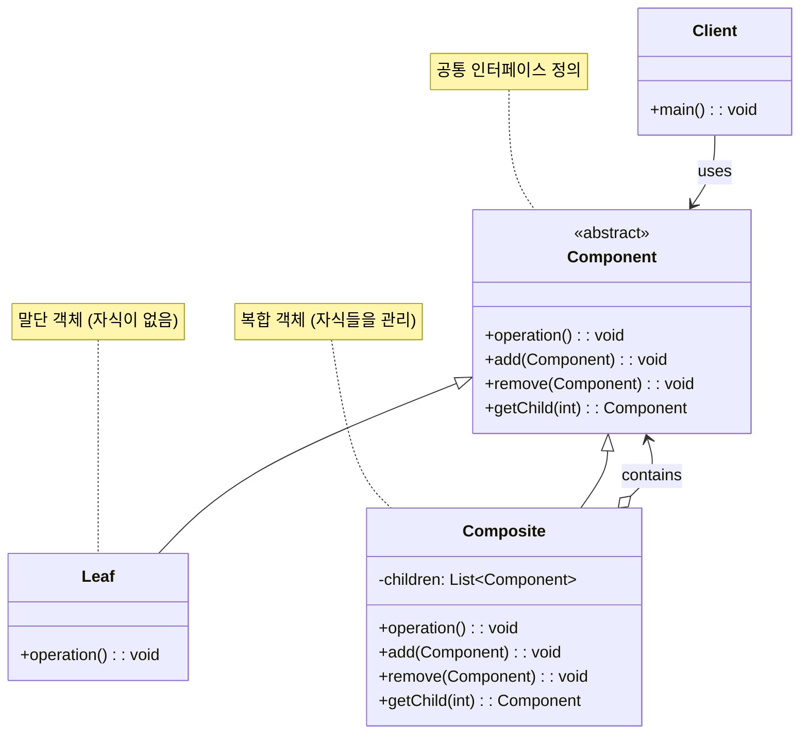

# 컴포지트 패턴 (Composite Pattern)

## 정의

컴포지트 패턴은 객체들을 트리 구조로 구성하여 부분-전체 계층을 표현하는 구조 디자인 패턴입니다. 개별 객체와 객체들의 조합(컴포지트)을 같은 방식으로 다룰 수 있게 해주어, 클라이언트가 단일 객체와 복합 객체를 구별하지 않고 동일한 인터페이스로 사용할 수 있습니다.

## 구조 (Structure)



## 사용 이유

- **일관된 처리**: 개별 객체와 객체들의 집합을 동일한 방식으로 처리할 수 있습니다.
- **트리 구조 표현**: 계층적 구조를 자연스럽게 표현하고 조작할 수 있습니다.
- **재귀적 구조**: 복잡한 트리 구조를 재귀적으로 처리할 수 있습니다.
- **확장성**: 새로운 종류의 컴포넌트를 쉽게 추가할 수 있습니다.

## 적용 상황

컴포지트 패턴은 다음과 같은 상황에서 특히 유용합니다:

### 1. 계층적 구조가 있는 시스템
- **파일 시스템**: 파일과 디렉토리의 트리 구조
- **조직도**: 부서와 직원의 계층 구조
- **GUI 컴포넌트**: 패널과 위젯의 중첩 구조

### 2. 부분-전체 관계의 일관된 처리
```java
// 나쁜 예: 개별 객체와 그룹을 다르게 처리
class GraphicsEditor {
    public void draw(Shape shape) {
        shape.draw();
    }

    public void draw(ShapeGroup group) {
        for (Shape shape : group.getShapes()) {
            shape.draw();  // 다른 처리 방식
        }
    }
}

// 좋은 예: 컴포지트 패턴으로 일관된 처리
interface Drawable {
    void draw();
}

class Shape implements Drawable { /* 구현 */ }
class ShapeGroup implements Drawable { /* 구현 */ }

class GraphicsEditor {
    public void draw(Drawable drawable) {
        drawable.draw();  // 동일한 처리 방식
    }
}
```

### 3. 재귀적 구조 처리
- **수학 표현식**: 숫자와 연산자의 트리 구조
- **메뉴 시스템**: 메뉴와 서브메뉴의 중첩 구조
- **문서 구조**: 섹션, 단락, 텍스트의 계층 구조

## 실생활 예제 - 파일 시스템 관리

파일과 디렉토리를 동일한 방식으로 처리하는 파일 시스템을 컴포지트 패턴으로 구현해보겠습니다.

```java
import java.util.*;
import java.time.LocalDateTime;
import java.time.format.DateTimeFormatter;

// 파일 시스템 컴포넌트 추상 클래스
abstract class FileSystemComponent {
    protected String name;
    protected String path;
    protected LocalDateTime created;
    protected LocalDateTime modified;
    protected FileSystemComponent parent;

    public FileSystemComponent(String name, String path) {
        this.name = name;
        this.path = path;
        this.created = LocalDateTime.now();
        this.modified = LocalDateTime.now();
    }

    // 공통 메서드들
    public abstract long getSize();
    public abstract void display(int depth);
    public abstract List<FileSystemComponent> search(String keyword);
    public abstract FileSystemComponent copy();

    // 컴포지트 전용 메서드들 (기본 구현: 예외 발생)
    public void add(FileSystemComponent component) {
        throw new UnsupportedOperationException("이 컴포넌트는 자식을 추가할 수 없습니다.");
    }

    public void remove(FileSystemComponent component) {
        throw new UnsupportedOperationException("이 컴포넌트는 자식을 제거할 수 없습니다.");
    }

    public List<FileSystemComponent> getChildren() {
        throw new UnsupportedOperationException("이 컴포넌트는 자식이 없습니다.");
    }

    // 유틸리티 메서드들
    protected String getIndentation(int depth) {
        return "  ".repeat(depth);
    }

    protected String formatSize(long bytes) {
        if (bytes < 1024) return bytes + " B";
        if (bytes < 1024 * 1024) return String.format("%.1f KB", bytes / 1024.0);
        if (bytes < 1024 * 1024 * 1024) return String.format("%.1f MB", bytes / (1024.0 * 1024));
        return String.format("%.1f GB", bytes / (1024.0 * 1024 * 1024));
    }

    protected String formatDateTime(LocalDateTime dateTime) {
        return dateTime.format(DateTimeFormatter.ofPattern("yyyy-MM-dd HH:mm"));
    }

    // getter/setter 메서드들
    public String getName() { return name; }
    public String getPath() { return path; }
    public LocalDateTime getCreated() { return created; }
    public LocalDateTime getModified() { return modified; }
    public FileSystemComponent getParent() { return parent; }
    public void setParent(FileSystemComponent parent) { this.parent = parent; }

    public void touch() {
        this.modified = LocalDateTime.now();
    }

    public String getFullPath() {
        if (parent == null) {
            return path;
        }
        return parent.getFullPath() + "/" + name;
    }
}

// 파일 클래스 (Leaf)
class File extends FileSystemComponent {
    private String extension;
    private long size;
    private String content;
    private String mimeType;

    public File(String name, String path, String extension, long size) {
        super(name, path);
        this.extension = extension;
        this.size = size;
        this.content = "";
        this.mimeType = determineMimeType(extension);
    }

    public File(String name, String path, String extension, String content) {
        super(name, path);
        this.extension = extension;
        this.content = content;
        this.size = content.length();
        this.mimeType = determineMimeType(extension);
    }

    private String determineMimeType(String extension) {
        return switch (extension.toLowerCase()) {
            case "txt" -> "text/plain";
            case "java" -> "text/x-java-source";
            case "html" -> "text/html";
            case "css" -> "text/css";
            case "js" -> "application/javascript";
            case "json" -> "application/json";
            case "xml" -> "application/xml";
            case "pdf" -> "application/pdf";
            case "jpg", "jpeg" -> "image/jpeg";
            case "png" -> "image/png";
            case "gif" -> "image/gif";
            case "mp3" -> "audio/mpeg";
            case "mp4" -> "video/mp4";
            case "zip" -> "application/zip";
            default -> "application/octet-stream";
        };
    }

    @Override
    public long getSize() {
        return size;
    }

    @Override
    public void display(int depth) {
        String icon = getFileIcon();
        System.out.printf("%s%s %s (%s) - %s%n",
                getIndentation(depth), icon, name,
                formatSize(size), formatDateTime(modified));
    }

    private String getFileIcon() {
        return switch (extension.toLowerCase()) {
            case "txt" -> "📄";
            case "java" -> "☕";
            case "html" -> "🌐";
            case "css" -> "🎨";
            case "js" -> "📜";
            case "json" -> "📋";
            case "xml" -> "📰";
            case "pdf" -> "📕";
            case "jpg", "jpeg", "png", "gif" -> "🖼️";
            case "mp3" -> "🎵";
            case "mp4" -> "🎬";
            case "zip" -> "📦";
            default -> "📄";
        };
    }

    @Override
    public List<FileSystemComponent> search(String keyword) {
        List<FileSystemComponent> results = new ArrayList<>();
        if (name.toLowerCase().contains(keyword.toLowerCase()) ||
            content.toLowerCase().contains(keyword.toLowerCase())) {
            results.add(this);
        }
        return results;
    }

    @Override
    public FileSystemComponent copy() {
        File copy = new File(name + "_copy", path, extension, content);
        return copy;
    }

    // 파일 특화 메서드들
    public void write(String content) {
        this.content = content;
        this.size = content.length();
        touch();
    }

    public String read() {
        return content;
    }

    public void append(String content) {
        this.content += content;
        this.size = this.content.length();
        touch();
    }

    // getter 메서드들
    public String getExtension() { return extension; }
    public String getContent() { return content; }
    public String getMimeType() { return mimeType; }
}

// 디렉토리 클래스 (Composite)
class Directory extends FileSystemComponent {
    private List<FileSystemComponent> children;
    private Map<String, Integer> fileTypeCount;

    public Directory(String name, String path) {
        super(name, path);
        this.children = new ArrayList<>();
        this.fileTypeCount = new HashMap<>();
    }

    @Override
    public void add(FileSystemComponent component) {
        if (!children.contains(component)) {
            children.add(component);
            component.setParent(this);
            updateFileTypeCount(component, 1);
            touch();
        }
    }

    @Override
    public void remove(FileSystemComponent component) {
        if (children.remove(component)) {
            component.setParent(null);
            updateFileTypeCount(component, -1);
            touch();
        }
    }

    @Override
    public List<FileSystemComponent> getChildren() {
        return new ArrayList<>(children);
    }

    private void updateFileTypeCount(FileSystemComponent component, int delta) {
        if (component instanceof File file) {
            String extension = file.getExtension();
            fileTypeCount.merge(extension, delta, Integer::sum);
            if (fileTypeCount.get(extension) <= 0) {
                fileTypeCount.remove(extension);
            }
        } else if (component instanceof Directory dir) {
            // 하위 디렉토리의 파일 타입도 카운트에 반영
            for (FileSystemComponent child : dir.getChildren()) {
                updateFileTypeCount(child, delta);
            }
        }
    }

    @Override
    public long getSize() {
        return children.stream()
                .mapToLong(FileSystemComponent::getSize)
                .sum();
    }

    @Override
    public void display(int depth) {
        String icon = children.isEmpty() ? "📁" : "📂";
        long totalSize = getSize();
        int fileCount = countFiles();
        int dirCount = countDirectories();

        System.out.printf("%s%s %s/ (%s, %d files, %d dirs) - %s%n",
                getIndentation(depth), icon, name,
                formatSize(totalSize), fileCount, dirCount, formatDateTime(modified));

        // 정렬된 자식들 출력 (디렉토리 먼저, 그 다음 파일)
        children.stream()
                .sorted((a, b) -> {
                    if (a instanceof Directory && b instanceof File) return -1;
                    if (a instanceof File && b instanceof Directory) return 1;
                    return a.getName().compareToIgnoreCase(b.getName());
                })
                .forEach(child -> child.display(depth + 1));
    }

    private int countFiles() {
        return (int) children.stream()
                .mapToLong(child -> child instanceof File ? 1 : ((Directory) child).countFiles())
                .sum();
    }

    private int countDirectories() {
        return (int) children.stream()
                .mapToLong(child -> child instanceof Directory ?
                    1 + ((Directory) child).countDirectories() : 0)
                .sum();
    }

    @Override
    public List<FileSystemComponent> search(String keyword) {
        List<FileSystemComponent> results = new ArrayList<>();

        // 디렉토리 이름 검사
        if (name.toLowerCase().contains(keyword.toLowerCase())) {
            results.add(this);
        }

        // 자식들에서 재귀적으로 검색
        for (FileSystemComponent child : children) {
            results.addAll(child.search(keyword));
        }

        return results;
    }

    @Override
    public FileSystemComponent copy() {
        Directory copy = new Directory(name + "_copy", path);

        // 모든 자식들을 재귀적으로 복사
        for (FileSystemComponent child : children) {
            copy.add(child.copy());
        }

        return copy;
    }

    // 디렉토리 특화 메서드들
    public FileSystemComponent findByName(String name) {
        for (FileSystemComponent child : children) {
            if (child.getName().equals(name)) {
                return child;
            }
            if (child instanceof Directory) {
                FileSystemComponent found = ((Directory) child).findByName(name);
                if (found != null) {
                    return found;
                }
            }
        }
        return null;
    }

    public List<File> getAllFiles() {
        List<File> files = new ArrayList<>();
        for (FileSystemComponent child : children) {
            if (child instanceof File) {
                files.add((File) child);
            } else if (child instanceof Directory) {
                files.addAll(((Directory) child).getAllFiles());
            }
        }
        return files;
    }

    public List<Directory> getAllDirectories() {
        List<Directory> directories = new ArrayList<>();
        for (FileSystemComponent child : children) {
            if (child instanceof Directory dir) {
                directories.add(dir);
                directories.addAll(dir.getAllDirectories());
            }
        }
        return directories;
    }

    public void displayStatistics() {
        System.out.println("\n📊 디렉토리 통계: " + name);
        System.out.println("=".repeat(40));
        System.out.println("총 크기: " + formatSize(getSize()));
        System.out.println("파일 수: " + countFiles());
        System.out.println("디렉토리 수: " + countDirectories());

        if (!fileTypeCount.isEmpty()) {
            System.out.println("\n파일 타입별 분포:");
            fileTypeCount.entrySet().stream()
                    .sorted(Map.Entry.<String, Integer>comparingByValue().reversed())
                    .forEach(entry ->
                        System.out.println("  ." + entry.getKey() + ": " + entry.getValue() + "개"));
        }
    }

    public boolean isEmpty() {
        return children.isEmpty();
    }

    public void clear() {
        children.clear();
        fileTypeCount.clear();
        touch();
    }
}

// 파일 시스템 관리자
class FileSystemManager {
    private Directory root;
    private List<String> operationLog;

    public FileSystemManager() {
        this.root = new Directory("root", "/");
        this.operationLog = new ArrayList<>();
    }

    public void createFile(String path, String name, String extension, String content) {
        Directory parent = findOrCreateDirectory(path);
        File file = new File(name, path, extension, content);
        parent.add(file);
        logOperation("파일 생성: " + path + "/" + name + "." + extension);
    }

    public void createDirectory(String path, String name) {
        Directory parent = findOrCreateDirectory(path);
        Directory newDir = new Directory(name, path + "/" + name);
        parent.add(newDir);
        logOperation("디렉토리 생성: " + path + "/" + name);
    }

    private Directory findOrCreateDirectory(String path) {
        if (path.equals("/") || path.isEmpty()) {
            return root;
        }

        String[] parts = path.split("/");
        Directory current = root;

        for (String part : parts) {
            if (part.isEmpty()) continue;

            FileSystemComponent found = null;
            for (FileSystemComponent child : current.getChildren()) {
                if (child.getName().equals(part)) {
                    found = child;
                    break;
                }
            }

            if (found instanceof Directory) {
                current = (Directory) found;
            } else if (found == null) {
                // 디렉토리가 없으면 생성
                Directory newDir = new Directory(part, current.getFullPath() + "/" + part);
                current.add(newDir);
                current = newDir;
                logOperation("자동 디렉토리 생성: " + newDir.getFullPath());
            } else {
                throw new IllegalArgumentException("경로에 파일이 존재합니다: " + part);
            }
        }

        return current;
    }

    public void moveComponent(String sourcePath, String targetPath) {
        FileSystemComponent source = findComponent(sourcePath);
        if (source == null) {
            System.out.println("❌ 소스를 찾을 수 없습니다: " + sourcePath);
            return;
        }

        Directory targetDir = findOrCreateDirectory(targetPath);
        Directory sourceParent = (Directory) source.getParent();

        if (sourceParent != null) {
            sourceParent.remove(source);
        }
        targetDir.add(source);

        logOperation("이동: " + sourcePath + " → " + targetPath);
    }

    public void copyComponent(String sourcePath, String targetPath) {
        FileSystemComponent source = findComponent(sourcePath);
        if (source == null) {
            System.out.println("❌ 소스를 찾을 수 없습니다: " + sourcePath);
            return;
        }

        Directory targetDir = findOrCreateDirectory(targetPath);
        FileSystemComponent copy = source.copy();
        targetDir.add(copy);

        logOperation("복사: " + sourcePath + " → " + targetPath);
    }

    public void deleteComponent(String path) {
        FileSystemComponent component = findComponent(path);
        if (component == null) {
            System.out.println("❌ 컴포넌트를 찾을 수 없습니다: " + path);
            return;
        }

        if (component.getParent() != null) {
            ((Directory) component.getParent()).remove(component);
            logOperation("삭제: " + path);
        }
    }

    private FileSystemComponent findComponent(String path) {
        if (path.equals("/")) {
            return root;
        }

        String[] parts = path.split("/");
        FileSystemComponent current = root;

        for (String part : parts) {
            if (part.isEmpty()) continue;

            if (current instanceof Directory) {
                boolean found = false;
                for (FileSystemComponent child : ((Directory) current).getChildren()) {
                    if (child.getName().equals(part)) {
                        current = child;
                        found = true;
                        break;
                    }
                }
                if (!found) {
                    return null;
                }
            } else {
                return null;
            }
        }

        return current;
    }

    public void displayFileSystem() {
        System.out.println("\n🌳 파일 시스템 구조");
        System.out.println("=".repeat(50));
        root.display(0);
    }

    public void search(String keyword) {
        System.out.println("\n🔍 검색 결과: '" + keyword + "'");
        System.out.println("=".repeat(30));

        List<FileSystemComponent> results = root.search(keyword);
        if (results.isEmpty()) {
            System.out.println("검색 결과가 없습니다.");
        } else {
            for (FileSystemComponent result : results) {
                System.out.println("📍 " + result.getFullPath());
            }
        }
    }

    public void displayStatistics() {
        root.displayStatistics();
    }

    private void logOperation(String operation) {
        String timestamp = LocalDateTime.now().format(DateTimeFormatter.ofPattern("HH:mm:ss"));
        operationLog.add("[" + timestamp + "] " + operation);
    }

    public void displayOperationLog() {
        System.out.println("\n📜 작업 로그");
        System.out.println("=".repeat(30));

        if (operationLog.isEmpty()) {
            System.out.println("작업 기록이 없습니다.");
            return;
        }

        for (String log : operationLog) {
            System.out.println(log);
        }
    }

    public Directory getRoot() {
        return root;
    }
}

// 파일 시스템 데모
public class FileSystemDemo {
    public static void main(String[] args) throws InterruptedException {
        FileSystemManager fsManager = new FileSystemManager();

        System.out.println("💾 파일 시스템 관리 시스템");
        System.out.println("=".repeat(50));

        // 1. 디렉토리 및 파일 생성
        fsManager.createDirectory("/", "projects");
        fsManager.createDirectory("/projects", "web-app");
        fsManager.createDirectory("/projects", "mobile-app");
        fsManager.createDirectory("/projects/web-app", "src");
        fsManager.createDirectory("/projects/web-app", "assets");
        fsManager.createDirectory("/projects/web-app/src", "components");
        fsManager.createDirectory("/projects/web-app/assets", "images");

        Thread.sleep(500);

        // 2. 파일 생성
        fsManager.createFile("/projects/web-app", "index", "html",
            "<!DOCTYPE html><html><head><title>Web App</title></head><body><h1>Hello World</h1></body></html>");

        fsManager.createFile("/projects/web-app", "styles", "css",
            "body { font-family: Arial, sans-serif; margin: 0; padding: 20px; }");

        fsManager.createFile("/projects/web-app/src", "App", "java",
            "public class App {\n    public static void main(String[] args) {\n        System.out.println(\"Hello World\");\n    }\n}");

        fsManager.createFile("/projects/web-app/src/components", "Button", "java",
            "public class Button extends Component {\n    private String label;\n    // Implementation...\n}");

        fsManager.createFile("/projects/mobile-app", "MainActivity", "java",
            "public class MainActivity extends Activity {\n    @Override\n    protected void onCreate(Bundle savedInstanceState) {\n        // Implementation...\n    }\n}");

        fsManager.createFile("/", "README", "txt", "이것은 프로젝트 루트 디렉토리입니다.");

        Thread.sleep(500);

        // 3. 파일 시스템 구조 출력
        fsManager.displayFileSystem();
        Thread.sleep(1000);

        // 4. 검색 테스트
        fsManager.search("java");
        Thread.sleep(500);

        fsManager.search("App");
        Thread.sleep(500);

        // 5. 파일 복사 테스트
        System.out.println("\n📋 파일 복사 테스트");
        fsManager.copyComponent("/projects/web-app/src/App.java", "/projects/mobile-app");
        Thread.sleep(500);

        // 6. 디렉토리 이동 테스트
        System.out.println("\n📁 디렉토리 이동 테스트");
        fsManager.createDirectory("/projects", "backup");
        fsManager.moveComponent("/projects/web-app/assets", "/projects/backup");
        Thread.sleep(500);

        // 7. 업데이트된 구조 출력
        System.out.println("\n📁 업데이트된 파일 시스템 구조");
        fsManager.displayFileSystem();
        Thread.sleep(1000);

        // 8. 통계 정보 출력
        fsManager.displayStatistics();
        Thread.sleep(500);

        // 9. 작업 로그 출력
        fsManager.displayOperationLog();

        System.out.println("\n🎯 파일 시스템 데모 완료!");
    }
}
```

**실행 결과 예시:**
```
💾 파일 시스템 관리 시스템
==================================================

🌳 파일 시스템 구조
==================================================
📂 root/ (15.2 KB, 6 files, 7 dirs) - 2024-01-15 14:30
  📂 projects/ (14.8 KB, 5 files, 6 dirs) - 2024-01-15 14:30
    📂 mobile-app/ (2.1 KB, 1 files, 0 dirs) - 2024-01-15 14:30
      ☕ MainActivity.java (198 B) - 2024-01-15 14:30
    📂 web-app/ (12.7 KB, 4 files, 2 dirs) - 2024-01-15 14:30
      📂 assets/ (0 B, 0 files, 1 dirs) - 2024-01-15 14:30
        📁 images/ (0 B, 0 files, 0 dirs) - 2024-01-15 14:30
      📂 src/ (1.2 KB, 2 files, 1 dirs) - 2024-01-15 14:30
        📂 components/ (187 B, 1 files, 0 dirs) - 2024-01-15 14:30
          ☕ Button.java (187 B) - 2024-01-15 14:30
        ☕ App.java (142 B) - 2024-01-15 14:30
      🌐 index.html (98 B) - 2024-01-15 14:30
      🎨 styles.css (67 B) - 2024-01-15 14:30
  📄 README.txt (42 B) - 2024-01-15 14:30

🔍 검색 결과: 'java'
==============================
📍 /projects/web-app/src/App.java
📍 /projects/web-app/src/components/Button.java
📍 /projects/mobile-app/MainActivity.java
```

## 컴포지트 패턴의 두 가지 접근 방식

### 1. Safety Approach (안전한 접근)
```java
// Leaf와 Composite에서 서로 다른 인터페이스 제공
interface Component {
    void operation();
}

interface CompositeInterface extends Component {
    void add(Component component);
    void remove(Component component);
    List<Component> getChildren();
}
```

### 2. Transparency Approach (투명한 접근)
```java
// 모든 메서드를 공통 인터페이스에 정의 (위 예제에서 사용)
abstract class Component {
    public abstract void operation();
    public void add(Component component) { /* 기본: 예외 */ }
    public void remove(Component component) { /* 기본: 예외 */ }
}
```

## 기본 예제 코드 (Java)

```java
// Component 인터페이스
interface Component {
    void operation();
    void add(Component component);
    void remove(Component component);
    List<Component> getChildren();
}

// Leaf 클래스
class Leaf implements Component {
    private String name;

    public Leaf(String name) {
        this.name = name;
    }

    @Override
    public void operation() {
        System.out.println("Leaf " + name + " operation");
    }

    @Override
    public void add(Component component) {
        throw new UnsupportedOperationException("Leaf cannot add children");
    }

    @Override
    public void remove(Component component) {
        throw new UnsupportedOperationException("Leaf cannot remove children");
    }

    @Override
    public List<Component> getChildren() {
        return Collections.emptyList();
    }
}

// Composite 클래스
class Composite implements Component {
    private String name;
    private List<Component> children = new ArrayList<>();

    public Composite(String name) {
        this.name = name;
    }

    @Override
    public void operation() {
        System.out.println("Composite " + name + " operation");
        for (Component child : children) {
            child.operation();
        }
    }

    @Override
    public void add(Component component) {
        children.add(component);
    }

    @Override
    public void remove(Component component) {
        children.remove(component);
    }

    @Override
    public List<Component> getChildren() {
        return new ArrayList<>(children);
    }
}

// 사용 예시
public class CompositePatternDemo {
    public static void main(String[] args) {
        Component root = new Composite("Root");
        Component branch1 = new Composite("Branch1");
        Component branch2 = new Composite("Branch2");

        Component leaf1 = new Leaf("Leaf1");
        Component leaf2 = new Leaf("Leaf2");
        Component leaf3 = new Leaf("Leaf3");

        root.add(branch1);
        root.add(branch2);
        root.add(leaf1);

        branch1.add(leaf2);
        branch2.add(leaf3);

        root.operation(); // 전체 트리 구조를 재귀적으로 처리
    }
}
```

## 장점

- **일관성**: 개별 객체와 복합 객체를 동일한 방식으로 처리할 수 있습니다.
- **확장성**: 새로운 종류의 컴포넌트를 쉽게 추가할 수 있습니다.
- **단순성**: 클라이언트 코드가 단순해지고 객체의 계층 구조를 쉽게 다룰 수 있습니다.
- **재귀적 구조**: 복잡한 트리 구조를 자연스럽게 표현하고 조작할 수 있습니다.
- **유연성**: 런타임에 객체 구조를 변경할 수 있습니다.

## 단점

- **타입 안전성**: 모든 객체가 같은 인터페이스를 구현하므로 타입 확인이 어려울 수 있습니다.
- **오버헤드**: 단순한 구조에서는 불필요한 복잡성을 추가할 수 있습니다.
- **디자인 제약**: 모든 자식이 같은 인터페이스를 가져야 하므로 설계에 제약이 생길 수 있습니다.
- **과도한 일반화**: 서로 다른 종류의 객체를 강제로 같은 방식으로 다루게 될 수 있습니다.