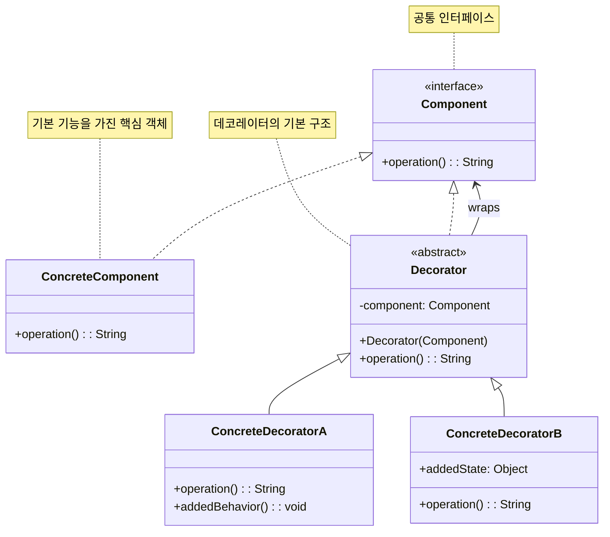

# 데코레이터 패턴 (Decorator Pattern)

## 정의

데코레이터 패턴은 객체의 기존 코드를 수정하지 않고 동적으로 새로운 책임이나 기능을 추가할 수 있게 해주는 구조 디자인 패턴입니다. 객체를 장식(Decorate)하는 것처럼 기능을 추가한다고 해서 데코레이터 패턴이라고 불립니다.

## 구조 (Structure)



## 사용 이유

- **동적 기능 추가**: 런타임에 객체에 유연하게 기능을 추가하거나 제거하고 싶을 때 사용됩니다. 상속을 사용하면 컴파일 타임에 기능이 고정되지만, 데코레이터 패턴은 동적으로 기능을 조합할 수 있습니다.
- **클래스 폭발 방지**: 기능의 모든 조합에 대해 서브클래스를 만드는 대신, 기본 클래스와 여러 데코레이터 클래스를 조합하여 필요한 기능을 구성할 수 있습니다. 이는 클래스의 수를 기하급수적으로 늘리는 것을 방지합니다.
- **단일 책임 원칙(SRP) 준수**: 각 기능(장식)을 별도의 클래스로 분리하여 관리하므로, 각 클래스는 하나의 책임만 갖게 됩니다.

## 적용 상황

데코레이터 패턴은 다음과 같은 상황에서 특히 유용합니다:

### 1. 동적 기능 조합이 필요한 경우
- **UI 컴포넌트**: 스크롤바, 테두리, 그림자 등을 동적으로 추가
- **파일 처리**: 압축, 암호화, 버퍼링 등의 기능을 조합
- **네트워크 통신**: 로깅, 암호화, 압축, 캐싱 등을 레이어별로 적용

### 2. 상속으로 인한 클래스 폭발 문제
```java
// 나쁜 예: 모든 조합을 위한 클래스들
class SimpleCoffee { }
class CoffeeWithMilk { }
class CoffeeWithSugar { }
class CoffeeWithMilkAndSugar { }
class CoffeeWithMilkAndSugarAndWhip { }
// ... 기하급수적으로 증가

// 좋은 예: 데코레이터 패턴 사용
interface Coffee {
    double getCost();
    String getDescription();
}

class SimpleCoffee implements Coffee { /* 기본 구현 */ }

abstract class CoffeeDecorator implements Coffee {
    protected Coffee coffee;
    // 데코레이터들을 조합하여 원하는 기능 구성
}
```

### 3. 기능의 선택적 적용
- **스트림 처리**: Java의 InputStream/OutputStream
- **미들웨어**: 웹 서버의 요청/응답 처리 파이프라인
- **데이터 변환**: ETL 과정에서 다양한 변환 규칙 적용

## 실생활 예제 - 카페 주문 시스템

다양한 옵션을 추가할 수 있는 커피 주문 시스템을 데코레이터 패턴으로 구현해보겠습니다.

```java
import java.util.*;
import java.text.DecimalFormat;

// 커피 컴포넌트 인터페이스
interface Coffee {
    double getCost();
    String getDescription();
    List<String> getIngredients();
    int getCalories();
    String getSize();
}

// 기본 커피 클래스들 (ConcreteComponent)
abstract class BaseCoffee implements Coffee {
    protected String size;
    protected Map<String, Double> sizePriceMultiplier;

    public BaseCoffee(String size) {
        this.size = size;
        this.sizePriceMultiplier = Map.of(
            "Small", 1.0,
            "Medium", 1.3,
            "Large", 1.6
        );
    }

    @Override
    public String getSize() {
        return size;
    }

    protected double applySizeMultiplier(double basePrice) {
        return basePrice * sizePriceMultiplier.getOrDefault(size, 1.0);
    }
}

// 에스프레소
class Espresso extends BaseCoffee {
    public Espresso(String size) {
        super(size);
    }

    @Override
    public double getCost() {
        return applySizeMultiplier(2.50);
    }

    @Override
    public String getDescription() {
        return size + " 에스프레소";
    }

    @Override
    public List<String> getIngredients() {
        return Arrays.asList("에스프레소 원두");
    }

    @Override
    public int getCalories() {
        return 5;
    }
}

// 아메리카노
class Americano extends BaseCoffee {
    public Americano(String size) {
        super(size);
    }

    @Override
    public double getCost() {
        return applySizeMultiplier(3.00);
    }

    @Override
    public String getDescription() {
        return size + " 아메리카노";
    }

    @Override
    public List<String> getIngredients() {
        return Arrays.asList("에스프레소 원두", "뜨거운 물");
    }

    @Override
    public int getCalories() {
        return 10;
    }
}

// 라떼
class Latte extends BaseCoffee {
    public Latte(String size) {
        super(size);
    }

    @Override
    public double getCost() {
        return applySizeMultiplier(4.50);
    }

    @Override
    public String getDescription() {
        return size + " 카페 라떼";
    }

    @Override
    public List<String> getIngredients() {
        return Arrays.asList("에스프레소 원두", "스팀 우유");
    }

    @Override
    public int getCalories() {
        return 120;
    }
}

// 추상 데코레이터 클래스
abstract class CoffeeDecorator implements Coffee {
    protected Coffee coffee;
    protected String addOnName;
    protected double addOnPrice;
    protected int addOnCalories;

    public CoffeeDecorator(Coffee coffee, String addOnName, double addOnPrice, int addOnCalories) {
        this.coffee = coffee;
        this.addOnName = addOnName;
        this.addOnPrice = addOnPrice;
        this.addOnCalories = addOnCalories;
    }

    @Override
    public double getCost() {
        return coffee.getCost() + addOnPrice;
    }

    @Override
    public String getDescription() {
        return coffee.getDescription() + ", " + addOnName;
    }

    @Override
    public List<String> getIngredients() {
        List<String> ingredients = new ArrayList<>(coffee.getIngredients());
        ingredients.add(addOnName);
        return ingredients;
    }

    @Override
    public int getCalories() {
        return coffee.getCalories() + addOnCalories;
    }

    @Override
    public String getSize() {
        return coffee.getSize();
    }
}

// 구체적인 데코레이터들 (ConcreteDecorator)

// 우유 추가
class MilkDecorator extends CoffeeDecorator {
    public MilkDecorator(Coffee coffee) {
        super(coffee, "우유", 0.60, 42);
    }
}

// 설탕 추가
class SugarDecorator extends CoffeeDecorator {
    private int packets;

    public SugarDecorator(Coffee coffee, int packets) {
        super(coffee, packets + "포 설탕", packets * 0.10, packets * 16);
        this.packets = packets;
    }
}

// 휘핑크림 추가
class WhippedCreamDecorator extends CoffeeDecorator {
    public WhippedCreamDecorator(Coffee coffee) {
        super(coffee, "휘핑크림", 0.80, 52);
    }
}

// 바닐라 시럽 추가
class VanillaSyrupDecorator extends CoffeeDecorator {
    public VanillaSyrupDecorator(Coffee coffee) {
        super(coffee, "바닐라 시럽", 0.70, 20);
    }
}

// 캐러멜 시럽 추가
class CaramelSyrupDecorator extends CoffeeDecorator {
    public CaramelSyrupDecorator(Coffee coffee) {
        super(coffee, "캐러멜 시럽", 0.70, 25);
    }
}

// 헤이즐넛 시럽 추가
class HazelnutSyrupDecorator extends CoffeeDecorator {
    public HazelnutSyrupDecorator(Coffee coffee) {
        super(coffee, "헤이즐넛 시럽", 0.70, 20);
    }
}

// 계피 추가
class CinnamonDecorator extends CoffeeDecorator {
    public CinnamonDecorator(Coffee coffee) {
        super(coffee, "계피", 0.30, 6);
    }
}

// 추가 샷 (에스프레소)
class ExtraShotDecorator extends CoffeeDecorator {
    private int shots;

    public ExtraShotDecorator(Coffee coffee, int shots) {
        super(coffee, shots + "샷 추가", shots * 0.75, shots * 5);
        this.shots = shots;
    }
}

// 디카페인 옵션
class DecafDecorator extends CoffeeDecorator {
    public DecafDecorator(Coffee coffee) {
        super(coffee, "디카페인", 0.00, 0);
    }

    @Override
    public String getDescription() {
        return coffee.getDescription().replace("에스프레소", "디카페인 에스프레소");
    }
}

// 두유 대체
class SoyMilkDecorator extends CoffeeDecorator {
    public SoyMilkDecorator(Coffee coffee) {
        super(coffee, "두유 대체", 0.50, 35);
    }
}

// 오트밀크 대체
class OatMilkDecorator extends CoffeeDecorator {
    public OatMilkDecorator(Coffee coffee) {
        super(coffee, "오트밀크 대체", 0.60, 40);
    }
}

// 주문 항목 클래스
class OrderItem {
    private Coffee coffee;
    private int quantity;
    private LocalDateTime orderTime;

    public OrderItem(Coffee coffee, int quantity) {
        this.coffee = coffee;
        this.quantity = quantity;
        this.orderTime = LocalDateTime.now();
    }

    public double getTotalCost() {
        return coffee.getCost() * quantity;
    }

    public int getTotalCalories() {
        return coffee.getCalories() * quantity;
    }

    // getter 메서드들
    public Coffee getCoffee() { return coffee; }
    public int getQuantity() { return quantity; }
    public LocalDateTime getOrderTime() { return orderTime; }

    @Override
    public String toString() {
        DecimalFormat df = new DecimalFormat("#,##0.00");
        return String.format("%dx %s - $%s (%d칼로리)",
                quantity, coffee.getDescription(),
                df.format(getTotalCost()), getTotalCalories());
    }
}

// 카페 주문 시스템
class CafeOrderSystem {
    private List<OrderItem> orders;
    private Map<String, Integer> popularAddOns;

    public CafeOrderSystem() {
        this.orders = new ArrayList<>();
        this.popularAddOns = new HashMap<>();
    }

    public void addOrder(Coffee coffee, int quantity) {
        OrderItem order = new OrderItem(coffee, quantity);
        orders.add(order);
        trackAddOns(coffee);

        System.out.println("✅ 주문 추가: " + order);
    }

    private void trackAddOns(Coffee coffee) {
        // 인기 추가 옵션 추적 (단순화된 구현)
        String description = coffee.getDescription();
        if (description.contains("우유")) popularAddOns.merge("우유", 1, Integer::sum);
        if (description.contains("시럽")) popularAddOns.merge("시럽", 1, Integer::sum);
        if (description.contains("휘핑크림")) popularAddOns.merge("휘핑크림", 1, Integer::sum);
        if (description.contains("추가")) popularAddOns.merge("추가샷", 1, Integer::sum);
    }

    public void displayOrder() {
        if (orders.isEmpty()) {
            System.out.println("주문 내역이 없습니다.");
            return;
        }

        System.out.println("\n📋 주문 내역");
        System.out.println("=".repeat(50));

        double totalCost = 0;
        int totalCalories = 0;

        for (int i = 0; i < orders.size(); i++) {
            OrderItem order = orders.get(i);
            System.out.println((i + 1) + ". " + order);

            // 상세 재료 정보
            System.out.println("   재료: " + String.join(", ", order.getCoffee().getIngredients()));

            totalCost += order.getTotalCost();
            totalCalories += order.getTotalCalories();
        }

        DecimalFormat df = new DecimalFormat("#,##0.00");
        System.out.println("-".repeat(50));
        System.out.println("총 금액: $" + df.format(totalCost));
        System.out.println("총 칼로리: " + totalCalories + "kcal");
    }

    public void displayPopularAddOns() {
        System.out.println("\n📊 인기 추가 옵션");
        System.out.println("=".repeat(30));

        popularAddOns.entrySet().stream()
            .sorted(Map.Entry.<String, Integer>comparingByValue().reversed())
            .forEach(entry ->
                System.out.println(entry.getKey() + ": " + entry.getValue() + "회"));
    }

    public void clearOrders() {
        orders.clear();
        System.out.println("🗑️ 주문이 초기화되었습니다.");
    }

    public double getTotalRevenue() {
        return orders.stream().mapToDouble(OrderItem::getTotalCost).sum();
    }

    public List<OrderItem> getOrders() {
        return new ArrayList<>(orders);
    }
}

// 커피 빌더 (편의성을 위한 유틸리티)
class CoffeeBuilder {
    private Coffee coffee;

    public static CoffeeBuilder create(String coffeeType, String size) {
        CoffeeBuilder builder = new CoffeeBuilder();

        switch (coffeeType.toLowerCase()) {
            case "espresso" -> builder.coffee = new Espresso(size);
            case "americano" -> builder.coffee = new Americano(size);
            case "latte" -> builder.coffee = new Latte(size);
            default -> throw new IllegalArgumentException("지원하지 않는 커피 타입: " + coffeeType);
        }

        return builder;
    }

    public CoffeeBuilder addMilk() {
        coffee = new MilkDecorator(coffee);
        return this;
    }

    public CoffeeBuilder addSugar(int packets) {
        coffee = new SugarDecorator(coffee, packets);
        return this;
    }

    public CoffeeBuilder addWhippedCream() {
        coffee = new WhippedCreamDecorator(coffee);
        return this;
    }

    public CoffeeBuilder addVanillaSyrup() {
        coffee = new VanillaSyrupDecorator(coffee);
        return this;
    }

    public CoffeeBuilder addCaramelSyrup() {
        coffee = new CaramelSyrupDecorator(coffee);
        return this;
    }

    public CoffeeBuilder addHazelnutSyrup() {
        coffee = new HazelnutSyrupDecorator(coffee);
        return this;
    }

    public CoffeeBuilder addCinnamon() {
        coffee = new CinnamonDecorator(coffee);
        return this;
    }

    public CoffeeBuilder addExtraShots(int shots) {
        coffee = new ExtraShotDecorator(coffee, shots);
        return this;
    }

    public CoffeeBuilder makeDecaf() {
        coffee = new DecafDecorator(coffee);
        return this;
    }

    public CoffeeBuilder withSoyMilk() {
        coffee = new SoyMilkDecorator(coffee);
        return this;
    }

    public CoffeeBuilder withOatMilk() {
        coffee = new OatMilkDecorator(coffee);
        return this;
    }

    public Coffee build() {
        return coffee;
    }
}

// 카페 주문 시스템 데모
public class CafeOrderDemo {
    public static void main(String[] args) {
        CafeOrderSystem orderSystem = new CafeOrderSystem();

        System.out.println("☕ 카페 주문 시스템 시작");
        System.out.println("=".repeat(50));

        // 1. 기본 커피들
        Coffee espresso = new Espresso("Small");
        Coffee americano = new Americano("Medium");

        orderSystem.addOrder(espresso, 1);
        orderSystem.addOrder(americano, 1);

        // 2. 데코레이터를 사용한 커스터마이징
        Coffee customLatte = new Latte("Large");
        customLatte = new VanillaSyrupDecorator(customLatte);
        customLatte = new WhippedCreamDecorator(customLatte);
        customLatte = new ExtraShotDecorator(customLatte, 1);

        orderSystem.addOrder(customLatte, 1);

        // 3. 빌더 패턴을 사용한 편리한 주문
        Coffee complexCoffee = CoffeeBuilder.create("americano", "Large")
            .addSugar(2)
            .addMilk()
            .addCaramelSyrup()
            .addCinnamon()
            .addExtraShots(2)
            .build();

        orderSystem.addOrder(complexCoffee, 2);

        // 4. 특별한 요구사항이 있는 주문
        Coffee veganFriendly = CoffeeBuilder.create("latte", "Medium")
            .withOatMilk()
            .addVanillaSyrup()
            .makeDecaf()
            .build();

        orderSystem.addOrder(veganFriendly, 1);

        // 5. 고급 커스터마이징
        Coffee signatureDrink = CoffeeBuilder.create("espresso", "Small")
            .addHazelnutSyrup()
            .addWhippedCream()
            .addCinnamon()
            .addSugar(1)
            .build();

        orderSystem.addOrder(signatureDrink, 1);

        // 주문 내역 및 통계 출력
        orderSystem.displayOrder();
        orderSystem.displayPopularAddOns();

        System.out.println("\n💰 총 매출: $" +
            new DecimalFormat("#,##0.00").format(orderSystem.getTotalRevenue()));

        System.out.println("\n🎯 카페 주문 시스템 데모 완료!");
    }
}
```

**실행 결과 예시:**
```
☕ 카페 주문 시스템 시작
==================================================
✅ 주문 추가: 1x Small 에스프레소 - $2.50 (5칼로리)
✅ 주문 추가: 1x Medium 아메리카노 - $3.90 (10칼로리)
✅ 주문 추가: 1x Large 카페 라떼, 바닐라 시럽, 휘핑크림, 1샷 추가 - $8.95 (217칼로리)
✅ 주문 추가: 2x Large 아메리카노, 2포 설탕, 우유, 캐러멜 시럽, 계피, 2샷 추가 - $12.40 (175칼로리)
✅ 주문 추가: 1x Medium 카페 라떼, 오트밀크 대체, 바닐라 시럽, 디카페인 - $7.65 (180칼로리)
✅ 주문 추가: 1x Small 에스프레소, 헤이즐넛 시럽, 휘핑크림, 계피, 1포 설탕 - $4.15 (83칼로리)

📋 주문 내역
==================================================
1. 1x Small 에스프레소 - $2.50 (5칼로리)
   재료: 에스프레소 원두
2. 1x Medium 아메리카노 - $3.90 (10칼로리)
   재료: 에스프레소 원두, 뜨거운 물
3. 1x Large 카페 라떼, 바닐라 시럽, 휘핑크림, 1샷 추가 - $8.95 (217칼로리)
   재료: 에스프레소 원두, 스팀 우유, 바닐라 시럽, 휘핑크림, 1샷 추가
```

## Java의 데코레이터 패턴 예시

Java 표준 라이브러리에서 데코레이터 패턴이 널리 사용됩니다:

```java
// InputStream 데코레이터 체인
import java.io.*;

try {
    InputStream fileStream = new FileInputStream("data.txt");
    InputStream bufferedStream = new BufferedInputStream(fileStream);
    InputStream dataStream = new DataInputStream(bufferedStream);

    // 여러 기능이 레이어별로 추가됨:
    // FileInputStream: 파일 읽기
    // BufferedInputStream: 버퍼링 기능 추가
    // DataInputStream: 데이터 타입별 읽기 기능 추가

} catch (IOException e) {
    e.printStackTrace();
}
```

## 기본 예제 코드 (Java)

```java
// Component Interface: 모든 컴포넌트와 데코레이터가 구현할 공통 인터페이스
interface Component {
    String operation();
}

// ConcreteComponent: 기본 기능을 가진 핵심 객체
class ConcreteComponent implements Component {
    @Override
    public String operation() {
        return "ConcreteComponent";
    }
}

// Decorator: 추상 데코레이터 클래스. Component 인터페이스를 구현하고 Component 객체를 가짐
abstract class Decorator implements Component {
    protected Component component;

    public Decorator(Component component) {
        this.component = component;
    }

    @Override
    public String operation() {
        return component.operation(); // 감싸고 있는 객체에 작업 위임
    }
}

// ConcreteDecoratorA: 새로운 기능을 추가하는 구체적인 데코레이터
class ConcreteDecoratorA extends Decorator {
    public ConcreteDecoratorA(Component component) {
        super(component);
    }

    @Override
    public String operation() {
        return "ConcreteDecoratorA(" + super.operation() + ")"; // 원래 기능에 새로운 기능 추가
    }
}

// ConcreteDecoratorB: 또 다른 새로운 기능을 추가하는 구체적인 데코레이터
class ConcreteDecoratorB extends Decorator {
    public ConcreteDecoratorB(Component component) {
        super(component);
    }

    @Override
    public String operation() {
        return "ConcreteDecoratorB(" + super.operation() + ")";
    }
}

// 사용 예시
public class Client {
    public static void main(String[] args) {
        // 기본 컴포넌트
        Component simple = new ConcreteComponent();
        System.out.println("기본 객체: " + simple.operation());

        // 데코레이터 A로 장식
        Component decoratorA = new ConcreteDecoratorA(simple);
        System.out.println("데코레이터 A 추가: " + decoratorA.operation());

        // 데코레이터 B로 장식
        Component decoratorB = new ConcreteDecoratorB(decoratorA);
        System.out.println("데코레이터 B 추가: " + decoratorB.operation());
    }
}
```

## 장점

- **유연성**: 컴파일 타임이 아닌 런타임에 객체에 새로운 기능을 추가하거나 제거할 수 있습니다.
- **확장성**: 기존 코드를 변경하지 않고 새로운 데코레이터 클래스를 추가하여 시스템을 쉽게 확장할 수 있습니다 (개방-폐쇄 원칙).
- **코드 중복 감소**: 상속을 통한 기능 조합으로 발생할 수 있는 많은 수의 서브클래스를 피할 수 있습니다.
- **조합의 자유**: 다양한 데코레이터를 자유롭게 조합하여 원하는 기능을 만들 수 있습니다.
- **단일 책임 원칙**: 각 데코레이터는 하나의 기능만 담당합니다.

## 단점

- **복잡성**: 데코레이터 체인이 길어지면 코드를 이해하고 디버깅하기 어려워질 수 있습니다.
- **작은 객체들의 증가**: 많은 작은 데코레이터 객체들이 생성되어 시스템을 복잡하게 만들 수 있습니다.
- **정체성 문제**: 데코레이터로 감싸진 객체는 원래 객체와 동일하지 않으므로 객체 비교 시 주의가 필요합니다.
- **설정 복잡성**: 많은 데코레이터가 있을 때 올바른 순서로 조합하는 것이 복잡할 수 있습니다.
- **복잡성**: 데코레이터 체인이 길어지면 코드를 이해하고 디버깅하기 어려워질 수 있습니다.
- **작은 객체들의 증가**: 많은 작은 데코레이터 객체들이 생성되어 시스템을 복잡하게 만들 수 있습니다.