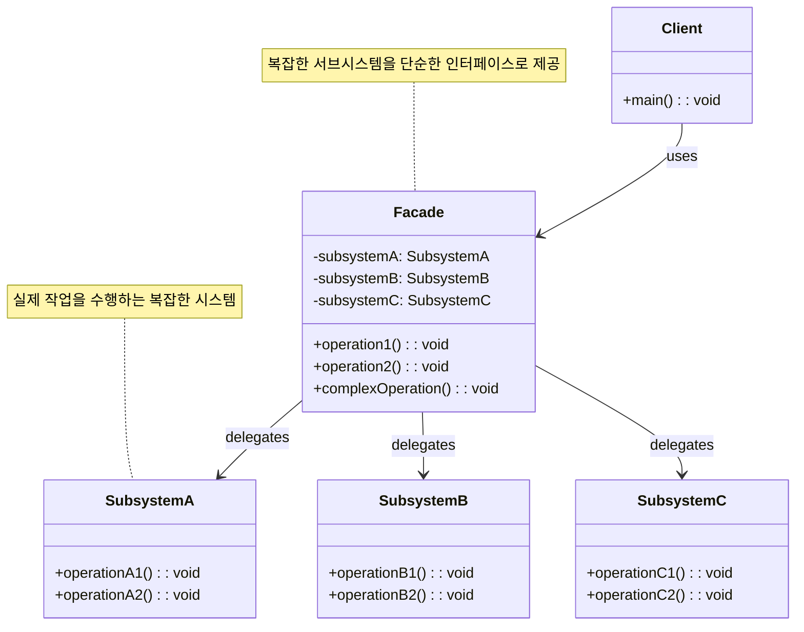

# 퍼사드 패턴 (Facade Pattern)

## 정의

퍼사드 패턴은 복잡한 서브시스템에 대해 간단하고 통일된 인터페이스를 제공하는 구조 디자인 패턴입니다. '퍼사드(Facade)'는 건물의 정면을 의미하며, 복잡한 내부 구조를 가리고 단순한 외부 모습만 보여주는 것처럼, 이 패턴은 복잡한 내부 로직을 숨기고 클라이언트에게 필요한 기능만 노출하는 역할을 합니다.

## 구조 (Structure)



## 사용 이유

- **복잡성 감소**: 여러 개의 복잡한 클래스들로 구성된 서브시스템을 직접 사용하는 대신, 단순한 퍼사드 클래스를 통해 사용함으로써 클라이언트 코드의 복잡성을 크게 줄일 수 있습니다.
- **결합도 감소**: 클라이언트는 퍼사드 인터페이스에만 의존하게 되므로, 서브시스템의 내부 클래스들이 변경되더라도 클라이언트 코드는 영향을 받지 않습니다. 이는 서브시스템과 클라이언트 간의 결합도를 낮추는 효과를 가져옵니다.
- **계층화된 구조**: 시스템을 여러 계층으로 구성할 때, 각 계층의 진입점으로 퍼사드를 사용하여 계층 간의 통신을 단순화할 수 있습니다.

## 적용 상황

퍼사드 패턴은 다음과 같은 상황에서 특히 유용합니다:

### 1. 복잡한 라이브러리나 프레임워크 사용
- **외부 API 통합**: 복잡한 외부 API를 간단한 인터페이스로 래핑
- **레거시 시스템**: 복잡한 레거시 코드를 현대적인 인터페이스로 제공
- **멀티 라이브러리 통합**: 여러 라이브러리를 하나의 통합된 인터페이스로 제공

### 2. 복잡한 초기화 과정 단순화
```java
// 나쁜 예: 클라이언트가 복잡한 초기화 과정을 직접 처리
class ComplexClient {
    public void useSystem() {
        // 복잡한 초기화 과정
        DatabaseConnection db = new DatabaseConnection();
        db.connect("server", "port", "username", "password");

        CacheManager cache = new CacheManager();
        cache.initialize(db);
        cache.preloadData();

        SecurityManager security = new SecurityManager();
        security.loadPermissions();
        security.validateUser();

        // 실제 업무 로직은 이제서야 시작...
    }
}

// 좋은 예: 퍼사드가 복잡한 과정을 단순화
class SystemFacade {
    public void initializeAndStart() {
        // 복잡한 초기화 과정을 내부에서 처리
        // 클라이언트는 단순한 메서드 하나만 호출
    }
}
```

### 3. 계층화된 아키텍처
- **서비스 레이어**: 여러 비즈니스 로직을 조합하는 서비스 인터페이스
- **API 게이트웨이**: 마이크로서비스들을 하나의 통합된 API로 제공
- **데이터 액세스 레이어**: 다양한 데이터 소스를 통합된 인터페이스로 제공

## 실생활 예제 - 스마트 홈 시어터 시스템

복잡한 홈 시어터 장비들을 간단한 인터페이스로 제어하는 시스템을 퍼사드 패턴으로 구현해보겠습니다.

```java
import java.util.*;
import java.time.LocalDateTime;
import java.time.format.DateTimeFormatter;

// 복잡한 서브시스템들

// 프로젝터 시스템
class Projector {
    private String model;
    private boolean isOn;
    private String resolution;
    private int brightness;
    private String inputSource;

    public Projector(String model) {
        this.model = model;
        this.isOn = false;
        this.resolution = "1920x1080";
        this.brightness = 50;
        this.inputSource = "HDMI1";
    }

    public void powerOn() {
        System.out.println("📽️ " + model + " 프로젝터 전원 켜는 중...");
        isOn = true;
        System.out.println("   워밍업 중... (30초 소요)");
        simulateDelay(500);
        System.out.println("   프로젝터 준비 완료!");
    }

    public void powerOff() {
        System.out.println("📽️ " + model + " 프로젝터 전원 끄는 중...");
        System.out.println("   쿨링 모드 진입...");
        simulateDelay(300);
        isOn = false;
        System.out.println("   프로젝터 종료 완료");
    }

    public void setInputSource(String source) {
        this.inputSource = source;
        System.out.println("📽️ 입력 소스를 " + source + "로 변경");
    }

    public void setResolution(String resolution) {
        this.resolution = resolution;
        System.out.println("📽️ 해상도를 " + resolution + "로 설정");
    }

    public void setBrightness(int brightness) {
        this.brightness = brightness;
        System.out.println("📽️ 밝기를 " + brightness + "%로 조정");
    }

    private void simulateDelay(int millis) {
        try {
            Thread.sleep(millis);
        } catch (InterruptedException e) {
            Thread.currentThread().interrupt();
        }
    }

    public boolean isOn() { return isOn; }
    public String getModel() { return model; }
    public String getResolution() { return resolution; }
    public int getBrightness() { return brightness; }
    public String getInputSource() { return inputSource; }
}

// 사운드 시스템
class SoundSystem {
    private String brand;
    private boolean isOn;
    private int volume;
    private String mode; // "Stereo", "Surround", "Cinema", "Music"
    private boolean bassBoost;

    public SoundSystem(String brand) {
        this.brand = brand;
        this.isOn = false;
        this.volume = 30;
        this.mode = "Stereo";
        this.bassBoost = false;
    }

    public void powerOn() {
        System.out.println("🔊 " + brand + " 사운드 시스템 전원 켜는 중...");
        isOn = true;
        System.out.println("   스피커 시스템 초기화 중...");
        simulateDelay(200);
        System.out.println("   오디오 시스템 준비 완료!");
    }

    public void powerOff() {
        System.out.println("🔊 " + brand + " 사운드 시스템 전원 끄는 중...");
        isOn = false;
        System.out.println("   오디오 시스템 종료 완료");
    }

    public void setVolume(int volume) {
        this.volume = Math.max(0, Math.min(100, volume));
        System.out.println("🔊 볼륨을 " + this.volume + "으로 설정");
    }

    public void setMode(String mode) {
        this.mode = mode;
        System.out.println("🔊 오디오 모드를 " + mode + "로 변경");

        switch (mode) {
            case "Cinema" -> System.out.println("   다이나믹 레인지 최적화 적용");
            case "Music" -> System.out.println("   음질 향상 모드 적용");
            case "Surround" -> System.out.println("   5.1 서라운드 사운드 활성화");
        }
    }

    public void setBassBoost(boolean enable) {
        this.bassBoost = enable;
        System.out.println("🔊 베이스 부스트 " + (enable ? "활성화" : "비활성화"));
    }

    public void mute() {
        System.out.println("🔇 음소거 활성화");
    }

    public void unmute() {
        System.out.println("🔊 음소거 해제");
    }

    private void simulateDelay(int millis) {
        try {
            Thread.sleep(millis);
        } catch (InterruptedException e) {
            Thread.currentThread().interrupt();
        }
    }

    // getter 메서드들
    public boolean isOn() { return isOn; }
    public String getBrand() { return brand; }
    public int getVolume() { return volume; }
    public String getMode() { return mode; }
    public boolean isBassBoostEnabled() { return bassBoost; }
}

// 미디어 플레이어
class MediaPlayer {
    private String type;
    private boolean isOn;
    private String currentMedia;
    private boolean isPlaying;
    private String quality;

    public MediaPlayer(String type) {
        this.type = type;
        this.isOn = false;
        this.isPlaying = false;
        this.quality = "HD";
    }

    public void powerOn() {
        System.out.println("📱 " + type + " 미디어 플레이어 전원 켜는 중...");
        isOn = true;
        System.out.println("   시스템 부팅 중...");
        simulateDelay(300);
        System.out.println("   미디어 플레이어 준비 완료!");
    }

    public void powerOff() {
        System.out.println("📱 " + type + " 미디어 플레이어 종료 중...");
        if (isPlaying) {
            stop();
        }
        isOn = false;
        System.out.println("   미디어 플레이어 종료 완료");
    }

    public void loadMedia(String media) {
        this.currentMedia = media;
        System.out.println("📱 미디어 로딩: " + media);
        System.out.println("   코덱 확인 및 버퍼링 중...");
        simulateDelay(400);
        System.out.println("   미디어 로딩 완료!");
    }

    public void play() {
        if (currentMedia != null) {
            isPlaying = true;
            System.out.println("▶️ 재생 시작: " + currentMedia);
        } else {
            System.out.println("❌ 재생할 미디어가 없습니다");
        }
    }

    public void pause() {
        if (isPlaying) {
            isPlaying = false;
            System.out.println("⏸️ 재생 일시정지");
        }
    }

    public void stop() {
        isPlaying = false;
        System.out.println("⏹️ 재생 정지");
    }

    public void setQuality(String quality) {
        this.quality = quality;
        System.out.println("📱 재생 품질을 " + quality + "로 설정");
    }

    private void simulateDelay(int millis) {
        try {
            Thread.sleep(millis);
        } catch (InterruptedException e) {
            Thread.currentThread().interrupt();
        }
    }

    // getter 메서드들
    public boolean isOn() { return isOn; }
    public String getType() { return type; }
    public String getCurrentMedia() { return currentMedia; }
    public boolean isPlaying() { return isPlaying; }
    public String getQuality() { return quality; }
}

// 조명 시스템
class LightingSystem {
    private boolean isOn;
    private int brightness;
    private String color;
    private String scene;

    public LightingSystem() {
        this.isOn = false;
        this.brightness = 100;
        this.color = "Warm White";
        this.scene = "Default";
    }

    public void powerOn() {
        System.out.println("💡 조명 시스템 켜는 중...");
        isOn = true;
        System.out.println("   LED 조명 활성화");
    }

    public void powerOff() {
        System.out.println("💡 조명 시스템 끄는 중...");
        isOn = false;
        System.out.println("   모든 조명 비활성화");
    }

    public void setBrightness(int brightness) {
        this.brightness = Math.max(0, Math.min(100, brightness));
        System.out.println("💡 조명 밝기를 " + this.brightness + "%로 조정");
    }

    public void setColor(String color) {
        this.color = color;
        System.out.println("💡 조명 색상을 " + color + "로 변경");
    }

    public void setScene(String scene) {
        this.scene = scene;
        System.out.println("💡 조명 씬을 " + scene + "로 설정");

        switch (scene) {
            case "Movie" -> {
                setBrightness(20);
                setColor("Deep Blue");
            }
            case "Party" -> {
                setBrightness(80);
                setColor("Rainbow");
            }
            case "Romantic" -> {
                setBrightness(30);
                setColor("Warm Red");
            }
        }
    }

    // getter 메서드들
    public boolean isOn() { return isOn; }
    public int getBrightness() { return brightness; }
    public String getColor() { return color; }
    public String getScene() { return scene; }
}

// 스크린 시스템
class Screen {
    private boolean isDown;
    private String type;

    public Screen(String type) {
        this.type = type;
        this.isDown = false;
    }

    public void down() {
        if (!isDown) {
            System.out.println("🎬 " + type + " 스크린 내리는 중...");
            isDown = true;
            simulateDelay(200);
            System.out.println("   스크린 설치 완료");
        }
    }

    public void up() {
        if (isDown) {
            System.out.println("🎬 " + type + " 스크린 올리는 중...");
            isDown = false;
            simulateDelay(200);
            System.out.println("   스크린 수납 완료");
        }
    }

    private void simulateDelay(int millis) {
        try {
            Thread.sleep(millis);
        } catch (InterruptedException e) {
            Thread.currentThread().interrupt();
        }
    }

    public boolean isDown() { return isDown; }
    public String getType() { return type; }
}

// 홈 시어터 퍼사드
class HomeTheaterFacade {
    private Projector projector;
    private SoundSystem soundSystem;
    private MediaPlayer mediaPlayer;
    private LightingSystem lightingSystem;
    private Screen screen;
    private List<String> activityLog;

    public HomeTheaterFacade() {
        this.projector = new Projector("Sony VPL-VW295ES");
        this.soundSystem = new SoundSystem("Bose Lifestyle 650");
        this.mediaPlayer = new MediaPlayer("Apple TV 4K");
        this.lightingSystem = new LightingSystem();
        this.screen = new Screen("Elite Screens");
        this.activityLog = new ArrayList<>();
    }

    // 영화 감상 모드
    public void startMovieMode(String movieTitle) {
        System.out.println("🎬 영화 감상 모드 시작: " + movieTitle);
        System.out.println("=".repeat(50));

        logActivity("영화 모드 시작: " + movieTitle);

        // 1. 스크린 준비
        screen.down();

        // 2. 프로젝터 설정
        projector.powerOn();
        projector.setInputSource("HDMI1");
        projector.setResolution("4K");
        projector.setBrightness(70);

        // 3. 사운드 시스템 설정
        soundSystem.powerOn();
        soundSystem.setMode("Cinema");
        soundSystem.setVolume(60);
        soundSystem.setBassBoost(true);

        // 4. 미디어 플레이어 설정
        mediaPlayer.powerOn();
        mediaPlayer.setQuality("4K HDR");
        mediaPlayer.loadMedia(movieTitle);

        // 5. 조명 설정
        lightingSystem.powerOn();
        lightingSystem.setScene("Movie");

        System.out.println("\n✅ 영화 감상 환경 준비 완료!");
        System.out.println("🍿 영화를 즐기세요!");
    }

    // 음악 감상 모드
    public void startMusicMode(String playlist) {
        System.out.println("🎵 음악 감상 모드 시작: " + playlist);
        System.out.println("=".repeat(50));

        logActivity("음악 모드 시작: " + playlist);

        // 음악 모드에서는 프로젝터 불필요
        // 1. 사운드 시스템 최적화
        soundSystem.powerOn();
        soundSystem.setMode("Music");
        soundSystem.setVolume(45);
        soundSystem.setBassBoost(false);

        // 2. 미디어 플레이어 설정
        mediaPlayer.powerOn();
        mediaPlayer.setQuality("Hi-Fi");
        mediaPlayer.loadMedia(playlist);

        // 3. 조명 설정
        lightingSystem.powerOn();
        lightingSystem.setScene("Party");

        System.out.println("\n✅ 음악 감상 환경 준비 완료!");
        System.out.println("🎶 음악을 즐기세요!");
    }

    // 게임 모드
    public void startGamingMode(String gameTitle) {
        System.out.println("🎮 게임 모드 시작: " + gameTitle);
        System.out.println("=".repeat(50));

        logActivity("게임 모드 시작: " + gameTitle);

        // 1. 스크린 준비
        screen.down();

        // 2. 프로젝터 게임 최적화
        projector.powerOn();
        projector.setInputSource("HDMI2"); // 게임 콘솔 연결
        projector.setResolution("1440p"); // 높은 주사율을 위한 해상도 조정
        projector.setBrightness(80);

        // 3. 사운드 게임 최적화
        soundSystem.powerOn();
        soundSystem.setMode("Surround");
        soundSystem.setVolume(55);
        soundSystem.setBassBoost(true);

        // 4. 조명 설정
        lightingSystem.powerOn();
        lightingSystem.setBrightness(40);
        lightingSystem.setColor("Gaming Blue");

        System.out.println("\n✅ 게임 환경 준비 완료!");
        System.out.println("🕹️ 게임을 즐기세요!");
    }

    // 로맨틱 모드
    public void startRomanticMode() {
        System.out.println("💝 로맨틱 모드 시작");
        System.out.println("=".repeat(50));

        logActivity("로맨틱 모드 시작");

        // 1. 부드러운 음악 재생
        soundSystem.powerOn();
        soundSystem.setMode("Stereo");
        soundSystem.setVolume(25);

        mediaPlayer.powerOn();
        mediaPlayer.loadMedia("Romantic Jazz Playlist");
        mediaPlayer.play();

        // 2. 로맨틱 조명
        lightingSystem.powerOn();
        lightingSystem.setScene("Romantic");

        System.out.println("\n✅ 로맨틱 분위기 조성 완료!");
        System.out.println("💕 특별한 시간을 보내세요!");
    }

    // 모든 시스템 종료
    public void shutdown() {
        System.out.println("🔌 홈 시어터 시스템 종료");
        System.out.println("=".repeat(50));

        logActivity("시스템 전체 종료");

        // 역순으로 종료
        mediaPlayer.powerOff();
        soundSystem.powerOff();
        projector.powerOff();
        lightingSystem.powerOff();
        screen.up();

        System.out.println("\n✅ 모든 시스템 종료 완료");
        System.out.println("🌙 안녕히 주무세요!");
    }

    // 빠른 재생 제어
    public void playMedia() {
        if (mediaPlayer.isOn()) {
            mediaPlayer.play();
        } else {
            System.out.println("❌ 미디어 플레이어가 꺼져있습니다");
        }
    }

    public void pauseMedia() {
        if (mediaPlayer.isOn()) {
            mediaPlayer.pause();
        }
    }

    public void adjustVolume(int volume) {
        if (soundSystem.isOn()) {
            soundSystem.setVolume(volume);
        } else {
            System.out.println("❌ 사운드 시스템이 꺼져있습니다");
        }
    }

    public void muteSound() {
        if (soundSystem.isOn()) {
            soundSystem.mute();
        }
    }

    public void unmuteSound() {
        if (soundSystem.isOn()) {
            soundSystem.unmute();
        }
    }

    // 시스템 상태 확인
    public void displaySystemStatus() {
        System.out.println("\n📊 홈 시어터 시스템 상태");
        System.out.println("=".repeat(40));

        System.out.println("📽️ 프로젝터: " + (projector.isOn() ? "ON" : "OFF"));
        if (projector.isOn()) {
            System.out.println("   - 모델: " + projector.getModel());
            System.out.println("   - 해상도: " + projector.getResolution());
            System.out.println("   - 밝기: " + projector.getBrightness() + "%");
            System.out.println("   - 입력: " + projector.getInputSource());
        }

        System.out.println("\n🔊 사운드 시스템: " + (soundSystem.isOn() ? "ON" : "OFF"));
        if (soundSystem.isOn()) {
            System.out.println("   - 브랜드: " + soundSystem.getBrand());
            System.out.println("   - 볼륨: " + soundSystem.getVolume());
            System.out.println("   - 모드: " + soundSystem.getMode());
            System.out.println("   - 베이스 부스트: " + (soundSystem.isBassBoostEnabled() ? "ON" : "OFF"));
        }

        System.out.println("\n📱 미디어 플레이어: " + (mediaPlayer.isOn() ? "ON" : "OFF"));
        if (mediaPlayer.isOn()) {
            System.out.println("   - 타입: " + mediaPlayer.getType());
            System.out.println("   - 현재 미디어: " + mediaPlayer.getCurrentMedia());
            System.out.println("   - 재생 상태: " + (mediaPlayer.isPlaying() ? "재생 중" : "정지"));
            System.out.println("   - 품질: " + mediaPlayer.getQuality());
        }

        System.out.println("\n💡 조명 시스템: " + (lightingSystem.isOn() ? "ON" : "OFF"));
        if (lightingSystem.isOn()) {
            System.out.println("   - 밝기: " + lightingSystem.getBrightness() + "%");
            System.out.println("   - 색상: " + lightingSystem.getColor());
            System.out.println("   - 씬: " + lightingSystem.getScene());
        }

        System.out.println("\n🎬 스크린: " + (screen.isDown() ? "내려짐" : "올려짐"));
        System.out.println("   - 타입: " + screen.getType());
    }

    // 활동 로그
    private void logActivity(String activity) {
        String timestamp = LocalDateTime.now().format(DateTimeFormatter.ofPattern("HH:mm:ss"));
        activityLog.add("[" + timestamp + "] " + activity);
    }

    public void displayActivityLog() {
        System.out.println("\n📜 활동 기록");
        System.out.println("=".repeat(30));

        if (activityLog.isEmpty()) {
            System.out.println("활동 기록이 없습니다.");
            return;
        }

        for (String log : activityLog) {
            System.out.println(log);
        }
    }
}

// 스마트 홈 시어터 데모
public class HomeTheaterDemo {
    public static void main(String[] args) throws InterruptedException {
        HomeTheaterFacade homeTheater = new HomeTheaterFacade();

        System.out.println("🏠 스마트 홈 시어터 시스템");
        System.out.println("=".repeat(50));

        // 1. 영화 감상 모드
        homeTheater.startMovieMode("어벤져스: 엔드게임");
        Thread.sleep(2000);

        homeTheater.playMedia();
        Thread.sleep(1000);

        // 2. 볼륨 조절 테스트
        System.out.println("\n🔊 볼륨 조절 테스트");
        homeTheater.adjustVolume(70);
        Thread.sleep(500);

        homeTheater.muteSound();
        Thread.sleep(500);

        homeTheater.unmuteSound();
        Thread.sleep(1000);

        // 3. 시스템 상태 확인
        homeTheater.displaySystemStatus();
        Thread.sleep(2000);

        // 4. 모드 전환: 음악 모드
        System.out.println("\n" + "=".repeat(70));
        homeTheater.startMusicMode("Chill Out Playlist");
        Thread.sleep(2000);

        // 5. 게임 모드 전환
        System.out.println("\n" + "=".repeat(70));
        homeTheater.startGamingMode("FIFA 2024");
        Thread.sleep(2000);

        // 6. 로맨틱 모드
        System.out.println("\n" + "=".repeat(70));
        homeTheater.startRomanticMode();
        Thread.sleep(2000);

        // 7. 활동 로그 확인
        homeTheater.displayActivityLog();

        // 8. 시스템 종료
        System.out.println("\n" + "=".repeat(70));
        homeTheater.shutdown();

        System.out.println("\n🎯 홈 시어터 시스템 데모 완료!");
    }
}
```

**실행 결과 예시:**
```
🏠 스마트 홈 시어터 시스템
==================================================
🎬 영화 감상 모드 시작: 어벤져스: 엔드게임
==================================================
🎬 Elite Screens 스크린 내리는 중...
   스크린 설치 완료
📽️ Sony VPL-VW295ES 프로젝터 전원 켜는 중...
   워밍업 중... (30초 소요)
   프로젝터 준비 완료!
📽️ 입력 소스를 HDMI1로 변경
📽️ 해상도를 4K로 설정
📽️ 밝기를 70%로 조정
🔊 Bose Lifestyle 650 사운드 시스템 전원 켜는 중...
   스피커 시스템 초기화 중...
   오디오 시스템 준비 완료!
🔊 오디오 모드를 Cinema로 변경
   다이나믹 레인지 최적화 적용
🔊 볼륨을 60으로 설정
🔊 베이스 부스트 활성화
📱 Apple TV 4K 미디어 플레이어 전원 켜는 중...
   시스템 부팅 중...
   미디어 플레이어 준비 완료!
📱 재생 품질을 4K HDR로 설정
📱 미디어 로딩: 어벤져스: 엔드게임
   코덱 확인 및 버퍼링 중...
   미디어 로딩 완료!
💡 조명 시스템 켜는 중...
   LED 조명 활성화
💡 조명 씬을 Movie로 설정
💡 조명 밝기를 20%로 조정
💡 조명 색상을 Deep Blue로 변경

✅ 영화 감상 환경 준비 완료!
🍿 영화를 즐기세요!
```

## 퍼사드 vs 어댑터 패턴 비교

| 특성 | 퍼사드 패턴 | 어댑터 패턴 |
|------|-------------|-------------|
| **목적** | 복잡한 시스템을 단순화 | 인터페이스 호환성 제공 |
| **대상** | 여러 클래스의 집합 | 단일 클래스 |
| **인터페이스** | 새로운 단순한 인터페이스 | 기존 인터페이스와 호환 |
| **사용 이유** | 복잡성 감소 | 호환성 문제 해결 |

## 기본 예제 코드 (Java)

```java
// 복잡한 서브시스템의 일부인 클래스들
class SubsystemA {
    public void operationA() {
        System.out.println("SubsystemA: Ready!");
    }
}

class SubsystemB {
    public void operationB() {
        System.out.println("SubsystemB: Go!");
    }
}

class SubsystemC {
    public void operationC() {
        System.out.println("SubsystemC: Fire!");
    }
}

// Facade 클래스: 서브시스템에 대한 단순한 인터페이스 제공
class Facade {
    private SubsystemA subsystemA;
    private SubsystemB subsystemB;
    private SubsystemC subsystemC;

    public Facade() {
        this.subsystemA = new SubsystemA();
        this.subsystemB = new SubsystemB();
        this.subsystemC = new SubsystemC();
    }

    // 클라이언트를 위한 단순화된 메서드
    public void performOperation() {
        System.out.println("Facade: Initiating operations.");
        subsystemA.operationA();
        subsystemB.operationB();
        subsystemC.operationC();
        System.out.println("Facade: Operations completed.");
    }
}

// 사용 예시
public class Client {
    public static void main(String[] args) {
        Facade facade = new Facade();
        // 클라이언트는 복잡한 내부 구조를 몰라도 퍼사드를 통해 작업을 수행
        facade.performOperation();
    }
}
```

## 장점

- **단순성**: 클라이언트가 복잡한 서브시스템을 쉽게 사용할 수 있도록 단순한 인터페이스를 제공합니다.
- **느슨한 결합**: 클라이언트와 서브시스템 간의 결합을 분리하여 시스템의 유연성과 유지보수성을 높입니다.
- **코드 가독성 향상**: 서브시스템의 사용법이 명확해져 코드의 가독성이 좋아집니다.
- **계층화**: 시스템을 계층별로 구성하여 아키텍처를 명확하게 만듭니다.
- **개발 효율성**: 복잡한 초기화나 설정 과정을 숨겨 개발자의 작업을 단순화합니다.

## 단점

- **전지전능한 객체 가능성**: 퍼사드 클래스가 너무 많은 책임을 떠맡아 모든 서브시스템에 강하게 결합된 '전지전능한 객체(God Object)'가 될 위험이 있습니다.
- **불필요한 간접 계층**: 서브시스템이 간단한 경우, 퍼사드를 도입하는 것이 오히려 불필요한 복잡성을 추가할 수 있습니다.
- **유연성 제한**: 퍼사드가 제공하지 않는 세부 기능에 접근하기 어려울 수 있습니다.
- **성능 오버헤드**: 추가적인 간접 호출로 인한 약간의 성능 저하가 있을 수 있습니다.