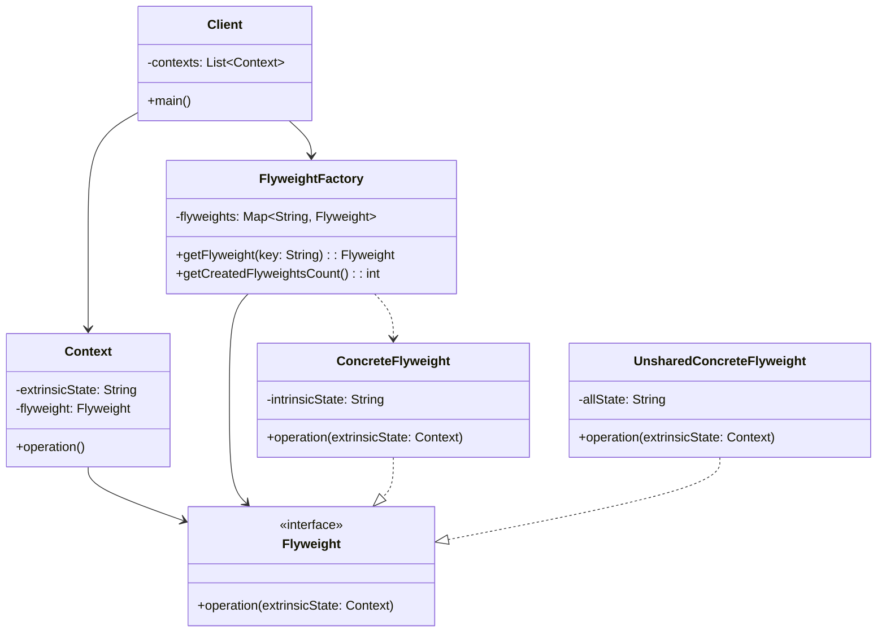

# Flyweight 패턴 (플라이웨이트 패턴)

## 개요

Flyweight 패턴은 많은 수의 객체를 효율적으로 지원하기 위해 메모리 사용을 최소화하는 구조 패턴입니다. 객체의 내재적 상태(intrinsic state)를 공유하고 외재적 상태(extrinsic state)를 별도로 관리하여 메모리 사용량을 줄입니다.

## 구조



## 주요 구성 요소

- **Flyweight**: 플라이웨이트 인터페이스로, 외재적 상태를 받아 작업을 수행하는 메서드를 정의합니다.
- **ConcreteFlyweight**: 내재적 상태를 저장하고 공유 가능한 플라이웨이트를 구현합니다.
- **UnsharedConcreteFlyweight**: 공유되지 않는 플라이웨이트 (모든 상태를 저장).
- **FlyweightFactory**: 플라이웨이트 인스턴스를 생성하고 관리하는 팩토리입니다.
- **Context**: 외재적 상태와 플라이웨이트 참조를 저장합니다.

## 내재적 상태 vs 외재적 상태

### 내재적 상태 (Intrinsic State)
- 객체에 저장되며 여러 컨텍스트에서 공유 가능
- 변하지 않는 정보 (예: 문자의 폰트, 색상)
- 플라이웨이트 객체 내부에 저장

### 외재적 상태 (Extrinsic State)
- 컨텍스트에 의존적이며 공유할 수 없음
- 변할 수 있는 정보 (예: 문자의 위치, 크기)
- 클라이언트가 플라이웨이트에 전달

## 실제 사용 사례

### 1. 텍스트 에디터
- 문자 객체의 글꼴, 스타일은 내재적 상태
- 문자의 위치, 크기는 외재적 상태

### 2. 게임 개발
- 파티클 시스템에서 텍스처, 색상은 내재적 상태
- 위치, 속도는 외재적 상태

### 3. 웹 브라우저
- HTML 요소의 스타일 정보는 내재적 상태
- DOM 트리에서의 위치는 외재적 상태

### 4. 아이콘 시스템
- 아이콘 이미지는 내재적 상태
- 화면에서의 위치, 크기는 외재적 상태

## 복잡한 실생활 예제: 대규모 온라인 게임의 파티클 시스템

```java
// 외재적 상태를 나타내는 컨텍스트
class ParticleContext {
    private double x, y, z;          // 위치
    private double velocityX, velocityY, velocityZ;  // 속도
    private double size;             // 크기
    private double rotation;         // 회전
    private double life;             // 생명력 (0.0 ~ 1.0)
    private long creationTime;       // 생성 시간

    public ParticleContext(double x, double y, double z, double velocityX,
                          double velocityY, double velocityZ, double size) {
        this.x = x;
        this.y = y;
        this.z = z;
        this.velocityX = velocityX;
        this.velocityY = velocityY;
        this.velocityZ = velocityZ;
        this.size = size;
        this.rotation = 0.0;
        this.life = 1.0;
        this.creationTime = System.currentTimeMillis();
    }

    // 파티클 업데이트 (물리 계산)
    public void update(double deltaTime) {
        // 위치 업데이트
        x += velocityX * deltaTime;
        y += velocityY * deltaTime;
        z += velocityZ * deltaTime;

        // 중력 효과
        velocityY -= 9.8 * deltaTime;

        // 회전 업데이트
        rotation += 180 * deltaTime; // 초당 180도 회전

        // 생명력 감소
        long currentTime = System.currentTimeMillis();
        double totalLifespan = 5000; // 5초
        life = Math.max(0, 1.0 - (currentTime - creationTime) / totalLifespan);
    }

    public boolean isAlive() {
        return life > 0;
    }

    // Getters
    public double getX() { return x; }
    public double getY() { return y; }
    public double getZ() { return z; }
    public double getSize() { return size; }
    public double getRotation() { return rotation; }
    public double getLife() { return life; }

    public void setSize(double size) { this.size = size; }
}

// Flyweight 인터페이스
interface ParticleFlyweight {
    void render(ParticleContext context, GraphicsContext graphics);
    String getType();
    void applyEffect(ParticleContext context, String effectType);
}

// 구체적인 Flyweight 구현들
class FireParticle implements ParticleFlyweight {
    private final String texture;
    private final String[] colors;
    private final double baseOpacity;

    public FireParticle() {
        this.texture = "fire_particle.png";
        this.colors = new String[]{"#FF4500", "#FF6347", "#FFD700", "#FF8C00"};
        this.baseOpacity = 0.8;
    }

    @Override
    public void render(ParticleContext context, GraphicsContext graphics) {
        // 생명력에 따른 색상과 투명도 계산
        double life = context.getLife();
        String color = colors[(int)(life * (colors.length - 1))];
        double opacity = baseOpacity * life;

        graphics.setColor(color);
        graphics.setOpacity(opacity);
        graphics.setTexture(texture);
        graphics.drawParticle(
            context.getX(), context.getY(), context.getZ(),
            context.getSize() * life, // 생명력에 따라 크기 감소
            context.getRotation()
        );
    }

    @Override
    public String getType() {
        return "FIRE";
    }

    @Override
    public void applyEffect(ParticleContext context, String effectType) {
        switch (effectType) {
            case "EXPLOSION":
                context.setSize(context.getSize() * 1.5);
                break;
            case "WIND":
                // 바람 효과는 외재적 상태에서 처리
                break;
        }
    }
}

class SmokeParticle implements ParticleFlyweight {
    private final String texture;
    private final String color;
    private final double baseOpacity;

    public SmokeParticle() {
        this.texture = "smoke_particle.png";
        this.color = "#696969";
        this.baseOpacity = 0.6;
    }

    @Override
    public void render(ParticleContext context, GraphicsContext graphics) {
        double life = context.getLife();
        double opacity = baseOpacity * life * 0.5; // 연기는 더 투명

        graphics.setColor(color);
        graphics.setOpacity(opacity);
        graphics.setTexture(texture);
        graphics.drawParticle(
            context.getX(), context.getY(), context.getZ(),
            context.getSize() * (2.0 - life), // 시간이 지날수록 크기 증가
            context.getRotation()
        );
    }

    @Override
    public String getType() {
        return "SMOKE";
    }

    @Override
    public void applyEffect(ParticleContext context, String effectType) {
        switch (effectType) {
            case "DISPERSE":
                context.setSize(context.getSize() * 2.0);
                break;
        }
    }
}

class WaterParticle implements ParticleFlyweight {
    private final String texture;
    private final String color;
    private final double baseOpacity;

    public WaterParticle() {
        this.texture = "water_particle.png";
        this.color = "#4169E1";
        this.baseOpacity = 0.9;
    }

    @Override
    public void render(ParticleContext context, GraphicsContext graphics) {
        double life = context.getLife();

        graphics.setColor(color);
        graphics.setOpacity(baseOpacity * life);
        graphics.setTexture(texture);
        graphics.drawParticle(
            context.getX(), context.getY(), context.getZ(),
            context.getSize(),
            context.getRotation()
        );
    }

    @Override
    public String getType() {
        return "WATER";
    }

    @Override
    public void applyEffect(ParticleContext context, String effectType) {
        switch (effectType) {
            case "SPLASH":
                context.setSize(context.getSize() * 0.8);
                break;
        }
    }
}

// Flyweight Factory
class ParticleFactory {
    private static final Map<String, ParticleFlyweight> flyweights = new HashMap<>();
    private static int createdFlyweights = 0;

    public static ParticleFlyweight getParticle(String type) {
        ParticleFlyweight flyweight = flyweights.get(type);

        if (flyweight == null) {
            switch (type.toUpperCase()) {
                case "FIRE":
                    flyweight = new FireParticle();
                    break;
                case "SMOKE":
                    flyweight = new SmokeParticle();
                    break;
                case "WATER":
                    flyweight = new WaterParticle();
                    break;
                default:
                    throw new IllegalArgumentException("Unknown particle type: " + type);
            }
            flyweights.put(type, flyweight);
            createdFlyweights++;
            System.out.println("새로운 " + type + " 파티클 타입 생성. 총 생성된 타입: " + createdFlyweights);
        }

        return flyweight;
    }

    public static int getCreatedFlyweightsCount() {
        return createdFlyweights;
    }

    public static void printFlyweightInfo() {
        System.out.println("=== Flyweight 정보 ===");
        System.out.println("생성된 Flyweight 타입 수: " + createdFlyweights);
        System.out.println("저장된 타입들: " + flyweights.keySet());
    }
}

// 그래픽 컨텍스트 (시뮬레이션용)
class GraphicsContext {
    private String currentColor;
    private double currentOpacity;
    private String currentTexture;

    public void setColor(String color) {
        this.currentColor = color;
    }

    public void setOpacity(double opacity) {
        this.currentOpacity = opacity;
    }

    public void setTexture(String texture) {
        this.currentTexture = texture;
    }

    public void drawParticle(double x, double y, double z, double size, double rotation) {
        System.out.printf("파티클 렌더링: 위치(%.1f, %.1f, %.1f) 크기=%.1f 회전=%.1f° " +
                         "색상=%s 투명도=%.2f 텍스처=%s%n",
                         x, y, z, size, rotation, currentColor, currentOpacity, currentTexture);
    }
}

// 파티클 시스템 관리자
class ParticleSystem {
    private final List<ParticleContext> particles;
    private final GraphicsContext graphics;
    private final Map<ParticleContext, ParticleFlyweight> particleTypes;

    public ParticleSystem() {
        this.particles = new ArrayList<>();
        this.graphics = new GraphicsContext();
        this.particleTypes = new HashMap<>();
    }

    public void addParticle(String type, double x, double y, double z,
                           double velocityX, double velocityY, double velocityZ, double size) {
        ParticleContext context = new ParticleContext(x, y, z, velocityX, velocityY, velocityZ, size);
        ParticleFlyweight flyweight = ParticleFactory.getParticle(type);

        particles.add(context);
        particleTypes.put(context, flyweight);
    }

    public void update(double deltaTime) {
        Iterator<ParticleContext> iterator = particles.iterator();
        while (iterator.hasNext()) {
            ParticleContext particle = iterator.next();
            particle.update(deltaTime);

            if (!particle.isAlive()) {
                particleTypes.remove(particle);
                iterator.remove();
            }
        }
    }

    public void render() {
        System.out.println("=== 파티클 렌더링 (총 " + particles.size() + "개) ===");
        for (ParticleContext particle : particles) {
            ParticleFlyweight flyweight = particleTypes.get(particle);
            flyweight.render(particle, graphics);
        }
    }

    public void addExplosionEffect(double x, double y, double z) {
        System.out.println("폭발 효과 생성!");

        // 화염 파티클들
        for (int i = 0; i < 50; i++) {
            double angle = Math.random() * 2 * Math.PI;
            double speed = 20 + Math.random() * 30;
            double velocityX = Math.cos(angle) * speed;
            double velocityY = 10 + Math.random() * 20;
            double velocityZ = Math.sin(angle) * speed;

            addParticle("FIRE", x, y, z, velocityX, velocityY, velocityZ, 1.0 + Math.random());
        }

        // 연기 파티클들
        for (int i = 0; i < 30; i++) {
            double angle = Math.random() * 2 * Math.PI;
            double speed = 5 + Math.random() * 10;
            double velocityX = Math.cos(angle) * speed;
            double velocityY = 2 + Math.random() * 5;
            double velocityZ = Math.sin(angle) * speed;

            addParticle("SMOKE", x, y, z, velocityX, velocityY, velocityZ, 2.0 + Math.random());
        }
    }

    public void applyGlobalEffect(String effectType) {
        System.out.println("글로벌 효과 적용: " + effectType);
        for (ParticleContext particle : particles) {
            ParticleFlyweight flyweight = particleTypes.get(particle);
            flyweight.applyEffect(particle, effectType);
        }
    }

    public void printSystemInfo() {
        System.out.println("=== 파티클 시스템 정보 ===");
        System.out.println("활성 파티클 수: " + particles.size());

        Map<String, Integer> typeCount = new HashMap<>();
        for (ParticleFlyweight flyweight : particleTypes.values()) {
            typeCount.merge(flyweight.getType(), 1, Integer::sum);
        }

        System.out.println("타입별 파티클 수:");
        typeCount.forEach((type, count) -> System.out.println("  " + type + ": " + count + "개"));
    }
}

// 클라이언트 코드
public class ParticleSystemDemo {
    public static void main(String[] args) {
        ParticleSystem system = new ParticleSystem();

        System.out.println("=== 파티클 시스템 시뮬레이션 시작 ===");

        // 초기 파티클들 생성
        system.addParticle("FIRE", 0, 0, 0, 1, 5, 0, 1.0);
        system.addParticle("SMOKE", 0, 2, 0, 0, 3, 0, 1.5);
        system.addParticle("WATER", 5, 0, 0, -2, 8, 0, 0.8);

        // 폭발 효과 (많은 파티클 생성)
        system.addExplosionEffect(10, 0, 10);

        ParticleFactory.printFlyweightInfo();
        system.printSystemInfo();

        // 시뮬레이션 루프
        for (int frame = 0; frame < 3; frame++) {
            System.out.println("\n=== 프레임 " + (frame + 1) + " ===");

            // 업데이트 (0.1초씩)
            system.update(0.1);

            // 몇 개 파티클만 렌더링 (출력 제한)
            if (frame == 0) {
                system.render();
            }

            // 글로벌 효과 적용
            if (frame == 1) {
                system.applyGlobalEffect("EXPLOSION");
            }

            system.printSystemInfo();
        }

        // 최종 통계
        System.out.println("\n=== 최종 통계 ===");
        ParticleFactory.printFlyweightInfo();

        // 메모리 사용량 비교
        int totalParticles = 100; // 실제 시나리오에서는 수천~수만 개
        int flyweightTypes = ParticleFactory.getCreatedFlyweightsCount();

        System.out.println("메모리 효율성:");
        System.out.println("Flyweight 없이: " + totalParticles + "개의 파티클 객체 필요");
        System.out.println("Flyweight 사용: " + flyweightTypes + "개의 Flyweight + " +
                          totalParticles + "개의 Context 객체");
        System.out.println("메모리 절약률: " +
                          String.format("%.1f%%", (1.0 - (double)flyweightTypes / totalParticles) * 100));
    }
}
```

## 기본 Flyweight 패턴 예제

```java
// Flyweight 인터페이스
interface CharacterFlyweight {
    void display(int row, int column, String font, int size);
}

// 구체적인 Flyweight
class Character implements CharacterFlyweight {
    private final char symbol; // 내재적 상태

    public Character(char symbol) {
        this.symbol = symbol;
        System.out.println("새로운 문자 객체 생성: " + symbol);
    }

    @Override
    public void display(int row, int column, String font, int size) {
        // 외재적 상태 (row, column, font, size)를 사용하여 렌더링
        System.out.printf("문자 '%c' 표시: 위치(%d, %d) 폰트=%s 크기=%d%n",
                         symbol, row, column, font, size);
    }
}

// Flyweight Factory
class CharacterFactory {
    private static final Map<Character, CharacterFlyweight> flyweights = new HashMap<>();

    public static CharacterFlyweight getCharacter(char symbol) {
        CharacterFlyweight flyweight = flyweights.get(symbol);
        if (flyweight == null) {
            flyweight = new Character(symbol);
            flyweights.put(symbol, flyweight);
        }
        return flyweight;
    }

    public static int getFlyweightCount() {
        return flyweights.size();
    }
}

// 컨텍스트 클래스
class TextContext {
    private int row, column;
    private String font;
    private int size;
    private CharacterFlyweight character;

    public TextContext(int row, int column, String font, int size, char symbol) {
        this.row = row;
        this.column = column;
        this.font = font;
        this.size = size;
        this.character = CharacterFactory.getCharacter(symbol);
    }

    public void display() {
        character.display(row, column, font, size);
    }
}
```

## Java 표준 라이브러리의 Flyweight 예제

### String 풀 (String Pool)
```java
public class StringPoolExample {
    public static void main(String[] args) {
        // 문자열 리터럴은 String Pool에서 관리 (Flyweight)
        String str1 = "Hello";
        String str2 = "Hello";
        String str3 = new String("Hello");

        System.out.println(str1 == str2);  // true (같은 객체 참조)
        System.out.println(str1 == str3);  // false (다른 객체)
        System.out.println(str1 == str3.intern()); // true (intern으로 풀에서 가져옴)
    }
}
```

### Integer 캐싱
```java
public class IntegerCacheExample {
    public static void main(String[] args) {
        // -128 ~ 127 범위의 Integer는 캐시됨 (Flyweight)
        Integer a = 100;
        Integer b = 100;
        Integer c = 200;
        Integer d = 200;

        System.out.println(a == b);  // true (캐시된 객체)
        System.out.println(c == d);  // false (캐시 범위 벗어남)
    }
}
```

## 장점

- **메모리 절약**: 많은 객체의 공통 부분을 공유하여 메모리 사용량을 크게 줄입니다.
- **성능 향상**: 객체 생성 비용을 줄여 애플리케이션 성능을 향상시킵니다.
- **확장성**: 대량의 객체를 효율적으로 처리할 수 있습니다.

## 단점

- **복잡성 증가**: 내재적/외재적 상태 분리로 코드 복잡성이 증가합니다.
- **외재적 상태 관리**: 클라이언트가 외재적 상태를 관리해야 하는 부담이 있습니다.
- **동기화 고려**: 멀티스레드 환경에서는 Flyweight Factory의 스레드 안전성을 고려해야 합니다.

## 다른 패턴과의 관계

- **Singleton**: FlyweightFactory는 보통 Singleton으로 구현됩니다.
- **Factory Method**: Flyweight 객체 생성에 Factory Method 패턴이 사용될 수 있습니다.
- **Composite**: Flyweight를 Composite 패턴의 잎(leaf) 노드로 사용할 수 있습니다.

## 언제 사용할까?

1. 애플리케이션이 대량의 객체를 사용할 때
2. 객체 저장 비용이 높을 때
3. 대부분의 객체 상태를 외재적으로 만들 수 있을 때
4. 객체의 그룹들을 비교적 적은 수의 공유 객체로 대체할 수 있을 때
5. 애플리케이션이 객체의 정체성에 의존하지 않을 때