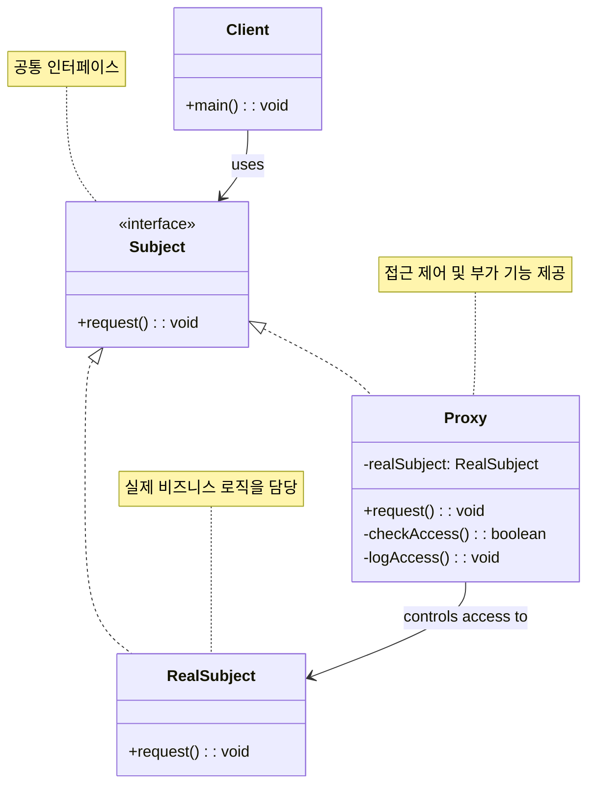

# 프록시 패턴 (Proxy Pattern)

## 정의

프록시 패턴은 다른 객체에 대한 접근을 제어하기 위해 대리자나 자리채움자 역할을 하는 객체를 제공하는 구조 디자인 패턴입니다. 프록시는 원래 객체와 같은 인터페이스를 구현하며, 클라이언트의 요청을 받아 실제 객체에 전달하기 전후에 추가적인 처리를 수행할 수 있습니다.

## 구조 (Structure)



## 사용 이유

- **접근 제어**: 실제 객체에 대한 접근을 제어하고 권한을 확인할 수 있습니다.
- **지연 초기화**: 실제로 필요할 때까지 무거운 객체의 생성을 지연시킬 수 있습니다.
- **캐싱**: 결과를 캐시하여 성능을 향상시킬 수 있습니다.
- **로깅**: 객체에 대한 접근을 기록하고 모니터링할 수 있습니다.
- **원격 접근**: 원격 객체에 대한 로컬 대리자 역할을 할 수 있습니다.

## 프록시 패턴의 종류

### 1. 가상 프록시 (Virtual Proxy)
무거운 객체의 생성을 지연시키는 프록시

### 2. 보호 프록시 (Protection Proxy)
접근 권한을 제어하는 프록시

### 3. 원격 프록시 (Remote Proxy)
원격 객체에 대한 로컬 대리자

### 4. 캐싱 프록시 (Caching Proxy)
결과를 캐시하여 성능을 향상시키는 프록시

## 적용 상황

프록시 패턴은 다음과 같은 상황에서 특히 유용합니다:

### 1. 지연 로딩 (Lazy Loading)
- **대용량 파일**: 이미지, 비디오 등의 무거운 리소스
- **데이터베이스 연결**: 실제 필요할 때까지 연결 지연
- **복잡한 계산**: 비용이 큰 연산의 지연 실행

### 2. 접근 제어 및 보안
```java
// 나쁜 예: 직접 접근으로 보안 취약
class SecretDocument {
    public String getContent() {
        return "기밀 내용";  // 누구나 접근 가능
    }
}

// 좋은 예: 프록시를 통한 접근 제어
class SecretDocumentProxy implements Document {
    private SecretDocument realDocument;
    private String userRole;

    public String getContent() {
        if (hasAccess()) {
            return getRealDocument().getContent();
        }
        throw new SecurityException("접근 권한 없음");
    }
}
```

### 3. 성능 최적화
- **캐싱**: 이전 결과를 저장하여 재사용
- **배치 처리**: 여러 요청을 모아서 일괄 처리
- **압축**: 데이터 압축/해제를 투명하게 처리

## 실생활 예제 - 이미지 로더 및 캐싱 시스템

대용량 이미지의 지연 로딩과 캐싱 기능을 제공하는 시스템을 프록시 패턴으로 구현해보겠습니다.

```java
import java.util.*;
import java.util.concurrent.ConcurrentHashMap;
import java.time.LocalDateTime;
import java.time.format.DateTimeFormatter;
import java.io.*;

// 이미지 인터페이스 (Subject)
interface Image {
    void display();
    void resize(int width, int height);
    void rotate(int degrees);
    ImageMetadata getMetadata();
    byte[] getRawData();
    String getFormat();
    boolean isLoaded();
}

// 이미지 메타데이터
class ImageMetadata {
    private String filename;
    private String format;
    private int width;
    private int height;
    private long fileSize;
    private LocalDateTime lastModified;
    private String colorSpace;

    public ImageMetadata(String filename, String format, int width, int height, long fileSize) {
        this.filename = filename;
        this.format = format;
        this.width = width;
        this.height = height;
        this.fileSize = fileSize;
        this.lastModified = LocalDateTime.now();
        this.colorSpace = "RGB";
    }

    // getter 메서드들
    public String getFilename() { return filename; }
    public String getFormat() { return format; }
    public int getWidth() { return width; }
    public int getHeight() { return height; }
    public long getFileSize() { return fileSize; }
    public LocalDateTime getLastModified() { return lastModified; }
    public String getColorSpace() { return colorSpace; }

    public void setDimensions(int width, int height) {
        this.width = width;
        this.height = height;
    }

    @Override
    public String toString() {
        return String.format("%s (%s) - %dx%d, %s, %.2f MB",
                filename, format, width, height, colorSpace, fileSize / (1024.0 * 1024));
    }
}

// 실제 이미지 클래스 (RealSubject)
class RealImage implements Image {
    private String filename;
    private ImageMetadata metadata;
    private byte[] imageData;
    private boolean loaded;
    private LocalDateTime loadTime;
    private int currentWidth;
    private int currentHeight;
    private int rotation;

    public RealImage(String filename) {
        this.filename = filename;
        this.loaded = false;
        this.rotation = 0;

        // 메타데이터만 먼저 로드 (실제 이미지 데이터는 지연 로드)
        loadMetadata();
        this.currentWidth = metadata.getWidth();
        this.currentHeight = metadata.getHeight();
    }

    private void loadMetadata() {
        // 파일 시스템에서 메타데이터 읽기 시뮬레이션
        String format = getFileExtension(filename);
        int width = 1920;  // 기본값
        int height = 1080;
        long fileSize = (long) (Math.random() * 10000000 + 1000000); // 1-10MB

        // 파일 타입에 따른 크기 조정
        switch (format.toLowerCase()) {
            case "jpg", "jpeg" -> {
                width = (int) (Math.random() * 2000 + 1000);
                height = (int) (Math.random() * 2000 + 1000);
            }
            case "png" -> {
                width = (int) (Math.random() * 1500 + 800);
                height = (int) (Math.random() * 1500 + 800);
            }
            case "gif" -> {
                width = (int) (Math.random() * 800 + 400);
                height = (int) (Math.random() * 800 + 400);
                fileSize = fileSize / 2; // GIF는 보통 더 작음
            }
        }

        this.metadata = new ImageMetadata(filename, format, width, height, fileSize);
        System.out.println("📋 메타데이터 로드 완료: " + filename);
    }

    private String getFileExtension(String filename) {
        int lastDot = filename.lastIndexOf('.');
        return lastDot > 0 ? filename.substring(lastDot + 1) : "unknown";
    }

    private void loadImageData() {
        if (loaded) return;

        System.out.println("⏳ 실제 이미지 데이터 로드 중: " + filename);

        // 대용량 이미지 로드 시뮬레이션
        try {
            Thread.sleep((long) (Math.random() * 2000 + 500)); // 0.5-2.5초 지연
        } catch (InterruptedException e) {
            Thread.currentThread().interrupt();
        }

        // 가상의 이미지 데이터 생성
        this.imageData = new byte[(int) metadata.getFileSize()];
        Arrays.fill(imageData, (byte) 1); // 더미 데이터

        this.loaded = true;
        this.loadTime = LocalDateTime.now();

        System.out.println("✅ 이미지 로드 완료: " + filename +
                " (" + formatFileSize(metadata.getFileSize()) + ")");
    }

    private String formatFileSize(long bytes) {
        if (bytes < 1024) return bytes + " B";
        if (bytes < 1024 * 1024) return String.format("%.1f KB", bytes / 1024.0);
        return String.format("%.1f MB", bytes / (1024.0 * 1024));
    }

    @Override
    public void display() {
        loadImageData(); // 실제 데이터가 필요할 때 로드

        System.out.println("🖼️ 이미지 표시: " + filename);
        System.out.println("   크기: " + currentWidth + "x" + currentHeight);
        System.out.println("   회전: " + rotation + "도");
        System.out.println("   로드 시간: " +
                (loadTime != null ? loadTime.format(DateTimeFormatter.ofPattern("HH:mm:ss")) : "N/A"));
    }

    @Override
    public void resize(int width, int height) {
        System.out.println("🔄 이미지 리사이즈: " + filename + " → " + width + "x" + height);
        this.currentWidth = width;
        this.currentHeight = height;

        // 메타데이터 업데이트
        metadata.setDimensions(width, height);
    }

    @Override
    public void rotate(int degrees) {
        System.out.println("↻ 이미지 회전: " + filename + " → " + degrees + "도");
        this.rotation = (rotation + degrees) % 360;

        // 90도 배수 회전 시 가로세로 치환
        if (degrees % 90 == 0 && degrees % 180 != 0) {
            int temp = currentWidth;
            currentWidth = currentHeight;
            currentHeight = temp;
        }
    }

    @Override
    public ImageMetadata getMetadata() {
        return metadata;
    }

    @Override
    public byte[] getRawData() {
        loadImageData();
        return imageData.clone();
    }

    @Override
    public String getFormat() {
        return metadata.getFormat();
    }

    @Override
    public boolean isLoaded() {
        return loaded;
    }
}

// 이미지 프록시 (가상 프록시 + 캐싱 프록시)
class ImageProxy implements Image {
    private String filename;
    private RealImage realImage;
    private ImageMetadata cachedMetadata;
    private static Map<String, byte[]> imageCache = new ConcurrentHashMap<>();
    private static Map<String, ImageMetadata> metadataCache = new ConcurrentHashMap<>();
    private static List<String> accessLog = new ArrayList<>();

    // 접근 제어를 위한 사용자 권한
    private static Set<String> authorizedUsers = new HashSet<>();
    private String currentUser;

    static {
        // 기본 권한 사용자 설정
        authorizedUsers.add("admin");
        authorizedUsers.add("user1");
        authorizedUsers.add("designer");
    }

    public ImageProxy(String filename, String user) {
        this.filename = filename;
        this.currentUser = user;

        // 캐시에서 메타데이터 확인
        this.cachedMetadata = metadataCache.get(filename);

        logAccess("프록시 생성");
    }

    private boolean checkAccess() {
        if (!authorizedUsers.contains(currentUser)) {
            System.out.println("❌ 접근 거부: " + currentUser + "는 이미지 접근 권한이 없습니다.");
            return false;
        }
        return true;
    }

    private void logAccess(String operation) {
        String timestamp = LocalDateTime.now().format(DateTimeFormatter.ofPattern("HH:mm:ss"));
        String logEntry = String.format("[%s] %s - %s (%s)", timestamp, operation, filename, currentUser);
        accessLog.add(logEntry);
    }

    private RealImage getRealImage() {
        if (realImage == null) {
            // 캐시에서 확인
            if (imageCache.containsKey(filename)) {
                System.out.println("💾 캐시에서 이미지 로드: " + filename);
                logAccess("캐시 히트");
            } else {
                logAccess("실제 객체 생성");
            }

            realImage = new RealImage(filename);

            // 메타데이터 캐싱
            if (cachedMetadata == null) {
                cachedMetadata = realImage.getMetadata();
                metadataCache.put(filename, cachedMetadata);
            }
        }
        return realImage;
    }

    @Override
    public void display() {
        if (!checkAccess()) return;

        logAccess("표시");

        // 캐시 확인 후 실제 이미지 표시
        if (imageCache.containsKey(filename)) {
            System.out.println("💾 캐시된 이미지 표시: " + filename);
        }

        getRealImage().display();

        // 이미지 데이터를 캐시에 저장
        if (realImage.isLoaded() && !imageCache.containsKey(filename)) {
            imageCache.put(filename, realImage.getRawData());
            System.out.println("💾 이미지 캐시에 저장: " + filename);
        }
    }

    @Override
    public void resize(int width, int height) {
        if (!checkAccess()) return;

        logAccess("리사이즈 " + width + "x" + height);
        getRealImage().resize(width, height);

        // 캐시 무효화 (크기가 변경되었으므로)
        imageCache.remove(filename);
        System.out.println("💾 캐시 무효화: " + filename);
    }

    @Override
    public void rotate(int degrees) {
        if (!checkAccess()) return;

        logAccess("회전 " + degrees + "도");
        getRealImage().rotate(degrees);

        // 캐시 무효화 (회전되었으므로)
        imageCache.remove(filename);
        System.out.println("💾 캐시 무효화: " + filename);
    }

    @Override
    public ImageMetadata getMetadata() {
        if (!checkAccess()) return null;

        // 메타데이터는 캐시에서 빠르게 반환
        if (cachedMetadata != null) {
            logAccess("메타데이터 (캐시)");
            return cachedMetadata;
        }

        logAccess("메타데이터");
        return getRealImage().getMetadata();
    }

    @Override
    public byte[] getRawData() {
        if (!checkAccess()) return null;

        logAccess("원본 데이터 요청");

        // 캐시에서 확인
        if (imageCache.containsKey(filename)) {
            System.out.println("💾 캐시에서 원본 데이터 반환: " + filename);
            return imageCache.get(filename).clone();
        }

        byte[] data = getRealImage().getRawData();
        imageCache.put(filename, data.clone());
        return data;
    }

    @Override
    public String getFormat() {
        return cachedMetadata != null ? cachedMetadata.getFormat() : getRealImage().getFormat();
    }

    @Override
    public boolean isLoaded() {
        return realImage != null && realImage.isLoaded();
    }

    // 정적 메서드들 (캐시 및 로그 관리)
    public static void displayCacheStatistics() {
        System.out.println("\n📊 캐시 통계");
        System.out.println("=".repeat(30));
        System.out.println("이미지 캐시 크기: " + imageCache.size());
        System.out.println("메타데이터 캐시 크기: " + metadataCache.size());

        if (!imageCache.isEmpty()) {
            System.out.println("\n캐시된 이미지:");
            for (String filename : imageCache.keySet()) {
                byte[] data = imageCache.get(filename);
                System.out.println("  - " + filename + " (" + formatBytes(data.length) + ")");
            }
        }
    }

    public static void displayAccessLog() {
        System.out.println("\n📜 접근 로그 (최근 20건)");
        System.out.println("=".repeat(50));

        int start = Math.max(0, accessLog.size() - 20);
        for (int i = start; i < accessLog.size(); i++) {
            System.out.println(accessLog.get(i));
        }
    }

    public static void clearCache() {
        imageCache.clear();
        metadataCache.clear();
        System.out.println("💾 모든 캐시가 클리어되었습니다.");
    }

    public static void addAuthorizedUser(String user) {
        authorizedUsers.add(user);
        System.out.println("👤 사용자 권한 추가: " + user);
    }

    public static void removeAuthorizedUser(String user) {
        authorizedUsers.remove(user);
        System.out.println("👤 사용자 권한 제거: " + user);
    }

    private static String formatBytes(long bytes) {
        if (bytes < 1024) return bytes + " B";
        if (bytes < 1024 * 1024) return String.format("%.1f KB", bytes / 1024.0);
        return String.format("%.1f MB", bytes / (1024.0 * 1024));
    }
}

// 이미지 갤러리 매니저
class ImageGalleryManager {
    private Map<String, Image> imageProxies;
    private String currentUser;

    public ImageGalleryManager(String user) {
        this.imageProxies = new HashMap<>();
        this.currentUser = user;
    }

    public void loadImage(String filename) {
        if (!imageProxies.containsKey(filename)) {
            imageProxies.put(filename, new ImageProxy(filename, currentUser));
            System.out.println("📸 이미지 프록시 생성: " + filename);
        }
    }

    public void displayImage(String filename) {
        Image image = imageProxies.get(filename);
        if (image != null) {
            image.display();
        } else {
            System.out.println("❌ 이미지를 찾을 수 없습니다: " + filename);
        }
    }

    public void resizeImage(String filename, int width, int height) {
        Image image = imageProxies.get(filename);
        if (image != null) {
            image.resize(width, height);
        } else {
            System.out.println("❌ 이미지를 찾을 수 없습니다: " + filename);
        }
    }

    public void rotateImage(String filename, int degrees) {
        Image image = imageProxies.get(filename);
        if (image != null) {
            image.rotate(degrees);
        } else {
            System.out.println("❌ 이미지를 찾을 수 없습니다: " + filename);
        }
    }

    public void showImageInfo(String filename) {
        Image image = imageProxies.get(filename);
        if (image != null) {
            ImageMetadata metadata = image.getMetadata();
            if (metadata != null) {
                System.out.println("ℹ️ 이미지 정보: " + metadata);
                System.out.println("   로드 상태: " + (image.isLoaded() ? "로드됨" : "지연 로드"));
            }
        } else {
            System.out.println("❌ 이미지를 찾을 수 없습니다: " + filename);
        }
    }

    public void listImages() {
        System.out.println("\n📁 로드된 이미지 목록");
        System.out.println("=".repeat(30));

        if (imageProxies.isEmpty()) {
            System.out.println("로드된 이미지가 없습니다.");
            return;
        }

        for (Map.Entry<String, Image> entry : imageProxies.entrySet()) {
            String filename = entry.getKey();
            Image image = entry.getValue();
            String status = image.isLoaded() ? "✅ 로드됨" : "⏳ 지연 로드";
            System.out.println("📸 " + filename + " - " + status);
        }
    }
}

// 이미지 프록시 시스템 데모
public class ImageProxyDemo {
    public static void main(String[] args) throws InterruptedException {
        System.out.println("🖼️ 이미지 프록시 및 캐싱 시스템");
        System.out.println("=".repeat(50));

        // 1. 갤러리 매니저 생성 (권한 있는 사용자)
        ImageGalleryManager gallery = new ImageGalleryManager("admin");

        // 2. 이미지 프록시들 생성 (실제 로드는 아직 안됨)
        gallery.loadImage("vacation_photo.jpg");
        gallery.loadImage("wedding_picture.png");
        gallery.loadImage("family_portrait.jpg");
        gallery.loadImage("landscape.png");

        Thread.sleep(500);

        // 3. 이미지 정보 확인 (메타데이터만 로드됨)
        System.out.println("\n📋 이미지 정보 확인 (지연 로드 상태)");
        gallery.showImageInfo("vacation_photo.jpg");
        gallery.showImageInfo("wedding_picture.png");

        Thread.sleep(1000);

        // 4. 실제 이미지 표시 (이때 실제 데이터 로드)
        System.out.println("\n🖼️ 이미지 표시 테스트");
        gallery.displayImage("vacation_photo.jpg");
        Thread.sleep(500);

        gallery.displayImage("wedding_picture.png");
        Thread.sleep(500);

        // 5. 캐시 효과 테스트 (두 번째 접근은 빠름)
        System.out.println("\n💾 캐시 효과 테스트");
        gallery.displayImage("vacation_photo.jpg"); // 캐시에서 빠르게 로드
        Thread.sleep(500);

        // 6. 이미지 편집 (캐시 무효화 확인)
        System.out.println("\n✏️ 이미지 편집 테스트");
        gallery.resizeImage("vacation_photo.jpg", 800, 600);
        gallery.rotateImage("wedding_picture.png", 90);
        Thread.sleep(500);

        // 7. 권한 없는 사용자 테스트
        System.out.println("\n🔒 권한 테스트");
        ImageGalleryManager restrictedGallery = new ImageGalleryManager("unauthorized_user");
        restrictedGallery.loadImage("secret_document.jpg");
        restrictedGallery.displayImage("secret_document.jpg");
        Thread.sleep(500);

        // 8. 사용자 권한 추가 및 재시도
        ImageProxy.addAuthorizedUser("unauthorized_user");
        restrictedGallery.displayImage("secret_document.jpg");
        Thread.sleep(500);

        // 9. 갤러리 상태 확인
        gallery.listImages();

        // 10. 캐시 통계 및 접근 로그
        ImageProxy.displayCacheStatistics();
        ImageProxy.displayAccessLog();

        // 11. 캐시 클리어 테스트
        System.out.println("\n🗑️ 캐시 클리어 테스트");
        ImageProxy.clearCache();

        // 12. 캐시 클리어 후 재접근
        System.out.println("\n🔄 캐시 클리어 후 재접근");
        gallery.displayImage("vacation_photo.jpg"); // 다시 실제 로드 필요

        System.out.println("\n🎯 이미지 프록시 시스템 데모 완료!");
    }
}
```

**실행 결과 예시:**
```
🖼️ 이미지 프록시 및 캐싱 시스템
==================================================
📸 이미지 프록시 생성: vacation_photo.jpg
📋 메타데이터 로드 완료: vacation_photo.jpg
📸 이미지 프록시 생성: wedding_picture.png
📋 메타데이터 로드 완료: wedding_picture.png
📸 이미지 프록시 생성: family_portrait.jpg
📋 메타데이터 로드 완료: family_portrait.jpg
📸 이미지 프록시 생성: landscape.png
📋 메타데이터 로드 완료: landscape.png

📋 이미지 정보 확인 (지연 로드 상태)
ℹ️ 이미지 정보: vacation_photo.jpg (jpg) - 1456x1789, RGB, 7.23 MB
   로드 상태: 지연 로드
ℹ️ 이미지 정보: wedding_picture.png (png) - 1123x967, RGB, 4.56 MB
   로드 상태: 지연 로드

🖼️ 이미지 표시 테스트
⏳ 실제 이미지 데이터 로드 중: vacation_photo.jpg
✅ 이미지 로드 완료: vacation_photo.jpg (7.2 MB)
🖼️ 이미지 표시: vacation_photo.jpg
   크기: 1456x1789
   회전: 0도
   로드 시간: 14:30:25
💾 이미지 캐시에 저장: vacation_photo.jpg

💾 캐시 효과 테스트
💾 캐시된 이미지 표시: vacation_photo.jpg
🖼️ 이미지 표시: vacation_photo.jpg
   크기: 1456x1789
   회전: 0도
   로드 시간: 14:30:25
```

## 다른 구조 패턴과의 비교

| 패턴 | 목적 | 주요 특징 |
|------|------|-----------|
| **Proxy** | 접근 제어 및 부가 기능 | 같은 인터페이스, 투명한 접근 |
| **Adapter** | 인터페이스 변환 | 호환되지 않는 인터페이스 연결 |
| **Decorator** | 기능 추가 | 런타임에 동적으로 기능 확장 |
| **Facade** | 복잡성 단순화 | 여러 객체를 하나의 간단한 인터페이스로 |

## 기본 예제 코드 (Java)

```java
// Subject 인터페이스
interface Subject {
    void request();
}

// RealSubject 클래스
class RealSubject implements Subject {
    @Override
    public void request() {
        System.out.println("RealSubject: Handling request");
    }
}

// Proxy 클래스
class Proxy implements Subject {
    private RealSubject realSubject;
    private String clientId;

    public Proxy(String clientId) {
        this.clientId = clientId;
    }

    @Override
    public void request() {
        if (checkAccess()) {
            if (realSubject == null) {
                realSubject = new RealSubject();
            }

            logAccess();
            realSubject.request();
        }
    }

    private boolean checkAccess() {
        System.out.println("Proxy: Checking access for " + clientId);
        return "authorized".equals(clientId);
    }

    private void logAccess() {
        System.out.println("Proxy: Logging access for " + clientId);
    }
}

// 사용 예시
public class ProxyPatternDemo {
    public static void main(String[] args) {
        System.out.println("권한 있는 클라이언트:");
        Subject proxy1 = new Proxy("authorized");
        proxy1.request();

        System.out.println("\n권한 없는 클라이언트:");
        Subject proxy2 = new Proxy("unauthorized");
        proxy2.request();
    }
}
```

## 장점

- **접근 제어**: 실제 객체에 대한 접근을 세밀하게 제어할 수 있습니다.
- **지연 초기화**: 무거운 객체의 생성을 실제 필요할 때까지 지연시킬 수 있습니다.
- **캐싱**: 결과를 캐시하여 성능을 향상시킬 수 있습니다.
- **투명성**: 클라이언트는 프록시와 실제 객체를 구별하지 않고 사용할 수 있습니다.
- **부가 기능**: 로깅, 모니터링, 보안 등의 부가 기능을 쉽게 추가할 수 있습니다.

## 단점

- **복잡성 증가**: 추가적인 간접 계층으로 인해 코드가 복잡해질 수 있습니다.
- **성능 오버헤드**: 프록시를 통한 간접 호출로 인한 약간의 성능 저하가 있을 수 있습니다.
- **응답 지연**: 지연 초기화로 인해 첫 번째 접근 시 응답이 늦을 수 있습니다.
- **메모리 사용**: 캐싱 프록시의 경우 추가적인 메모리가 필요할 수 있습니다.