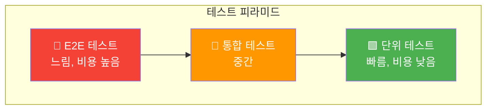
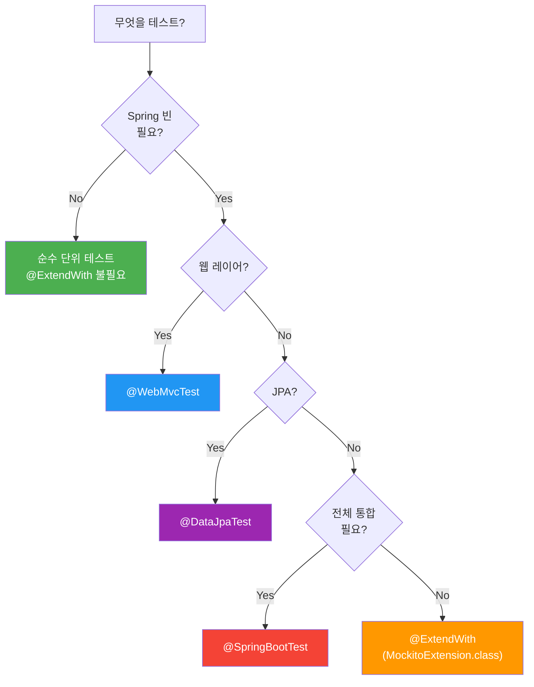

# Spring Boot TDD 가이드

## 정의

TDD(Test-Driven Development, 테스트 주도 개발)는 **테스트를 먼저 작성**하고, 그 테스트를 통과하는 코드를 구현하는 개발 방법론입니다.

## 🎯 한눈에 보기

| 항목 | 설명 |
|------|------|
| **핵심** | 테스트 먼저 → 구현 → 리팩토링 (Red-Green-Refactor) |
| **비유** | 시험 문제를 먼저 보고 공부하는 것 |
| **사용 라이브러리** | JUnit 5 + AssertJ + Mockito |
| **Spring Boot** | `@WebMvcTest`, `@ExtendWith` 등으로 가볍게 테스트 |

> **💡 왜 테스트를 먼저 작성할까?**
>
> **❌ Before (코드 먼저)**
> ```
> 코드 작성 → 수동 테스트 → 버그 발견 → 수정 → 또 수동 테스트...
> ```
>
> **✅ After (TDD)**
> ```
> 테스트 작성 → 실패 확인 → 구현 → 자동 통과 → 안전한 리팩토링
> ```

## 테스트 피라미드



| 계층 | 설명 | 예시 |
|------|------|------|
| **단위 테스트** | 클래스/메서드 단위로 테스트 | `CalculatorTest` |
| **통합 테스트** | 여러 컴포넌트 연동 테스트 | `OrderService + PaymentGateway` |
| **E2E 테스트** | 전체 시스템 테스트 | 브라우저로 주문 완료까지 |

> **TDD는 주로 단위 테스트에 집중합니다!**

## @SpringBootTest의 문제점

```java
@SpringBootTest  // ❌ 모든 빈을 로드 → 느림!
class OrderServiceTest {
    @Autowired
    OrderService orderService;

    @Test
    void testOrder() { ... }
}
```

### 왜 느릴까?


| 문제 | 설명 |
|------|------|
| **느린 실행** | 모든 빈을 로드하므로 10초 이상 걸릴 수 있음 |
| **리소스 낭비** | 테스트에 필요 없는 빈까지 모두 생성 |
| **외부 의존성** | DB, Redis 등 외부 시스템 필요 |
| **TDD 방해** | 느린 피드백은 TDD의 적! |

## 가벼운 테스트 전략

### 어노테이션 선택 가이드



### 어노테이션 비교표

| 어노테이션 | 로드 범위 | 속도 | 사용 시점 |
|-----------|----------|------|----------|
| `없음` (순수 JUnit) | 없음 | ⚡ 매우 빠름 | Static 유틸, POJO |
| `@ExtendWith(MockitoExtension.class)` | Mockito만 | ⚡ 매우 빠름 | 서비스 빈 테스트 |
| `@WebMvcTest` | 웹 레이어만 | 🚀 빠름 | 컨트롤러 테스트 |
| `@DataJpaTest` | JPA 관련만 | 🚀 빠름 | Repository 테스트 |
| `@SpringBootTest` | 전체 | 🐢 느림 | 통합 테스트 |

### 가벼운 테스트 예시

```java
// ❌ 무거운 테스트
@SpringBootTest
class CalculatorServiceTest {
    @Autowired CalculatorService service;
    @Test void add() { ... }
}

// ✅ 가벼운 테스트 - Spring 없이!
class CalculatorServiceTest {
    CalculatorService service = new CalculatorService();
    @Test void add() { ... }
}
```

## 필수 라이브러리

### build.gradle

```groovy
dependencies {
    // JUnit 5 - 테스트 프레임워크
    testImplementation 'org.springframework.boot:spring-boot-starter-test'

    // 위 starter에 포함된 것들:
    // - JUnit 5
    // - AssertJ
    // - Mockito
    // - Spring Test
}
```

### 주요 import문

```java
// JUnit 5
import org.junit.jupiter.api.Test;
import org.junit.jupiter.api.BeforeEach;
import org.junit.jupiter.api.DisplayName;

// AssertJ
import static org.assertj.core.api.Assertions.*;

// Mockito
import static org.mockito.Mockito.*;
import static org.mockito.BDDMockito.*;
import org.mockito.Mock;
import org.mockito.InjectMocks;
import org.junit.jupiter.api.extension.ExtendWith;
import org.mockito.junit.jupiter.MockitoExtension;

// Spring Test
import org.springframework.beans.factory.annotation.Autowired;
import org.springframework.boot.test.autoconfigure.web.servlet.WebMvcTest;
import org.springframework.boot.test.mock.mockito.MockBean;
import org.springframework.test.web.servlet.MockMvc;
```

## 문서 가이드

| 문서 | 설명 | 난이도 |
|------|------|--------|
| [Red-Green-Refactor](./red-green-refactor/README.md) | TDD의 핵심 사이클 이해 | ⭐ |
| [Static 서비스 테스트](./static-service/README.md) | 가장 단순한 순수 단위 테스트 | ⭐ |
| [서비스 빈 테스트](./service/README.md) | Mockito로 의존성 모킹 | ⭐⭐ |
| [컨트롤러 테스트](./controller/README.md) | @WebMvcTest로 API 테스트 | ⭐⭐ |

> **추천 학습 순서**: Red-Green-Refactor → Static 서비스 → 서비스 빈 → 컨트롤러
