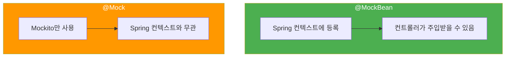
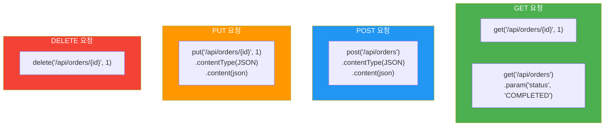

# 컨트롤러 테스트 (@WebMvcTest)

## 정의

컨트롤러 테스트는 **웹 레이어만 로드**하여 HTTP 요청/응답을 테스트합니다. `@SpringBootTest` 대신 `@WebMvcTest`를 사용하여 가볍고 빠르게 테스트합니다.

## 🎯 한눈에 보기

| 항목 | 설명 |
|------|------|
| **핵심** | `@WebMvcTest` + `MockMvc` + `@MockBean` |
| **대상** | `@Controller`, `@RestController` |
| **로드 범위** | 웹 레이어만 (Controller, ControllerAdvice, Filter 등) |
| **속도** | 🚀 빠름 (@SpringBootTest보다 훨씬 빠름) |

> **💡 @WebMvcTest가 로드하는 것**
>
> ```mermaid
> flowchart TD
>     subgraph 로드됨["✅ 로드됨"]
>         C["@Controller"]
>         R["@RestController"]
>         A["@ControllerAdvice"]
>         F["Filter"]
>         I["HandlerInterceptor"]
>     end
>
>     subgraph 로드안됨["❌ 로드 안됨"]
>         S["@Service"]
>         RP["@Repository"]
>         CM["@Component"]
>     end
>
>     style 로드됨 fill:#4caf50,color:#fff
>     style 로드안됨 fill:#f44336,color:#fff
> ```

## 기본 설정

### 필수 import

```java
import org.junit.jupiter.api.Test;
import org.springframework.beans.factory.annotation.Autowired;
import org.springframework.boot.test.autoconfigure.web.servlet.WebMvcTest;
import org.springframework.boot.test.mock.mockito.MockBean;
import org.springframework.test.web.servlet.MockMvc;
import org.springframework.http.MediaType;

import static org.springframework.test.web.servlet.request.MockMvcRequestBuilders.*;
import static org.springframework.test.web.servlet.result.MockMvcResultMatchers.*;
import static org.springframework.test.web.servlet.result.MockMvcResultHandlers.*;
import static org.mockito.BDDMockito.*;
```

### 기본 구조

```java
@WebMvcTest(OrderController.class)  // 테스트할 컨트롤러 지정
class OrderControllerTest {

    @Autowired
    private MockMvc mockMvc;  // HTTP 요청 시뮬레이션

    @MockBean  // Spring 컨텍스트에 Mock 빈 등록
    private OrderService orderService;

    @Test
    void testMethod() throws Exception {
        // 테스트 코드
    }
}
```

### @MockBean vs @Mock



| 어노테이션 | 용도 | 사용 위치 |
|-----------|------|----------|
| `@MockBean` | Spring 컨텍스트에 Mock 등록 | `@WebMvcTest`, `@SpringBootTest` |
| `@Mock` | 순수 Mockito Mock | `@ExtendWith(MockitoExtension.class)` |

## GET 요청 테스트

### 테스트할 컨트롤러

```java
@RestController
@RequestMapping("/api/orders")
@RequiredArgsConstructor
public class OrderController {

    private final OrderService orderService;

    @GetMapping("/{id}")
    public ResponseEntity<OrderResponse> getOrder(@PathVariable Long id) {
        Order order = orderService.findById(id);
        return ResponseEntity.ok(OrderResponse.from(order));
    }

    @GetMapping
    public ResponseEntity<List<OrderResponse>> getAllOrders() {
        List<Order> orders = orderService.findAll();
        List<OrderResponse> responses = orders.stream()
                .map(OrderResponse::from)
                .toList();
        return ResponseEntity.ok(responses);
    }
}
```

### 단건 조회 테스트

```java
@Test
@DisplayName("주문 ID로 주문을 조회한다")
void getOrder_ExistingId_ReturnsOrder() throws Exception {
    // Given
    Long orderId = 1L;
    Order order = new Order(orderId, "맥북", 2000000);

    given(orderService.findById(orderId))
            .willReturn(order);

    // When & Then
    mockMvc.perform(get("/api/orders/{id}", orderId))
            .andExpect(status().isOk())
            .andExpect(jsonPath("$.id").value(1))
            .andExpect(jsonPath("$.productName").value("맥북"))
            .andExpect(jsonPath("$.price").value(2000000))
            .andDo(print());  // 요청/응답 출력 (디버깅용)
}
```

### 목록 조회 테스트

```java
@Test
@DisplayName("모든 주문 목록을 조회한다")
void getAllOrders_ReturnsOrderList() throws Exception {
    // Given
    List<Order> orders = List.of(
            new Order(1L, "맥북", 2000000),
            new Order(2L, "아이폰", 1000000)
    );

    given(orderService.findAll())
            .willReturn(orders);

    // When & Then
    mockMvc.perform(get("/api/orders"))
            .andExpect(status().isOk())
            .andExpect(jsonPath("$.length()").value(2))
            .andExpect(jsonPath("$[0].productName").value("맥북"))
            .andExpect(jsonPath("$[1].productName").value("아이폰"));
}
```

### 쿼리 파라미터 테스트

```java
@Test
@DisplayName("상태로 주문을 필터링한다")
void getOrdersByStatus_ReturnsFilteredOrders() throws Exception {
    // Given
    List<Order> completedOrders = List.of(
            new Order(1L, "맥북", 2000000, OrderStatus.COMPLETED)
    );

    given(orderService.findByStatus(OrderStatus.COMPLETED))
            .willReturn(completedOrders);

    // When & Then
    mockMvc.perform(get("/api/orders")
                    .param("status", "COMPLETED"))
            .andExpect(status().isOk())
            .andExpect(jsonPath("$.length()").value(1));
}
```

## POST 요청 테스트

### 테스트할 컨트롤러

```java
@PostMapping
public ResponseEntity<OrderResponse> createOrder(@RequestBody @Valid OrderRequest request) {
    Order order = orderService.createOrder(request);
    return ResponseEntity
            .status(HttpStatus.CREATED)
            .body(OrderResponse.from(order));
}
```

### 생성 테스트

```java
@Test
@DisplayName("주문을 생성한다")
void createOrder_ValidRequest_ReturnsCreated() throws Exception {
    // Given
    OrderRequest request = new OrderRequest("맥북", 2000000, 1);
    Order createdOrder = new Order(1L, "맥북", 2000000);

    given(orderService.createOrder(any(OrderRequest.class)))
            .willReturn(createdOrder);

    String requestJson = """
            {
                "productName": "맥북",
                "price": 2000000,
                "quantity": 1
            }
            """;

    // When & Then
    mockMvc.perform(post("/api/orders")
                    .contentType(MediaType.APPLICATION_JSON)
                    .content(requestJson))
            .andExpect(status().isCreated())
            .andExpect(jsonPath("$.id").value(1))
            .andExpect(jsonPath("$.productName").value("맥북"));
}
```

### ObjectMapper 사용

```java
@Autowired
private ObjectMapper objectMapper;

@Test
@DisplayName("주문을 생성한다 - ObjectMapper 사용")
void createOrder_WithObjectMapper() throws Exception {
    // Given
    OrderRequest request = new OrderRequest("맥북", 2000000, 1);
    Order createdOrder = new Order(1L, "맥북", 2000000);

    given(orderService.createOrder(any(OrderRequest.class)))
            .willReturn(createdOrder);

    // When & Then
    mockMvc.perform(post("/api/orders")
                    .contentType(MediaType.APPLICATION_JSON)
                    .content(objectMapper.writeValueAsString(request)))
            .andExpect(status().isCreated());
}
```

## 검증 실패 테스트

### Validation 설정

```java
public class OrderRequest {

    @NotBlank(message = "상품명은 필수입니다")
    private String productName;

    @Positive(message = "가격은 양수여야 합니다")
    private int price;

    @Min(value = 1, message = "수량은 1 이상이어야 합니다")
    private int quantity;
}
```

### 검증 실패 테스트

```java
@Test
@DisplayName("상품명이 없으면 400 에러를 반환한다")
void createOrder_EmptyProductName_ReturnsBadRequest() throws Exception {
    // Given
    String invalidRequest = """
            {
                "productName": "",
                "price": 2000000,
                "quantity": 1
            }
            """;

    // When & Then
    mockMvc.perform(post("/api/orders")
                    .contentType(MediaType.APPLICATION_JSON)
                    .content(invalidRequest))
            .andExpect(status().isBadRequest());
}

@Test
@DisplayName("가격이 음수면 400 에러를 반환한다")
void createOrder_NegativePrice_ReturnsBadRequest() throws Exception {
    // Given
    String invalidRequest = """
            {
                "productName": "맥북",
                "price": -1000,
                "quantity": 1
            }
            """;

    // When & Then
    mockMvc.perform(post("/api/orders")
                    .contentType(MediaType.APPLICATION_JSON)
                    .content(invalidRequest))
            .andExpect(status().isBadRequest());
}
```

## PUT/DELETE 테스트

### PUT 요청

```java
@Test
@DisplayName("주문을 수정한다")
void updateOrder_ValidRequest_ReturnsUpdatedOrder() throws Exception {
    // Given
    Long orderId = 1L;
    Order updatedOrder = new Order(orderId, "맥북 프로", 3000000);

    given(orderService.updateOrder(eq(orderId), any(OrderRequest.class)))
            .willReturn(updatedOrder);

    String requestJson = """
            {
                "productName": "맥북 프로",
                "price": 3000000,
                "quantity": 1
            }
            """;

    // When & Then
    mockMvc.perform(put("/api/orders/{id}", orderId)
                    .contentType(MediaType.APPLICATION_JSON)
                    .content(requestJson))
            .andExpect(status().isOk())
            .andExpect(jsonPath("$.productName").value("맥북 프로"));
}
```

### DELETE 요청

```java
@Test
@DisplayName("주문을 삭제한다")
void deleteOrder_ExistingId_ReturnsNoContent() throws Exception {
    // Given
    Long orderId = 1L;
    willDoNothing().given(orderService).deleteOrder(orderId);

    // When & Then
    mockMvc.perform(delete("/api/orders/{id}", orderId))
            .andExpect(status().isNoContent());

    verify(orderService).deleteOrder(orderId);
}
```

## 예외 처리 테스트

### 예외 핸들러

```java
@RestControllerAdvice
public class GlobalExceptionHandler {

    @ExceptionHandler(OrderNotFoundException.class)
    public ResponseEntity<ErrorResponse> handleOrderNotFound(OrderNotFoundException e) {
        return ResponseEntity
                .status(HttpStatus.NOT_FOUND)
                .body(new ErrorResponse("ORDER_NOT_FOUND", e.getMessage()));
    }
}
```

### 예외 테스트

```java
@Test
@DisplayName("존재하지 않는 주문 조회 시 404를 반환한다")
void getOrder_NonExistingId_ReturnsNotFound() throws Exception {
    // Given
    Long orderId = 999L;

    given(orderService.findById(orderId))
            .willThrow(new OrderNotFoundException(orderId));

    // When & Then
    mockMvc.perform(get("/api/orders/{id}", orderId))
            .andExpect(status().isNotFound())
            .andExpect(jsonPath("$.code").value("ORDER_NOT_FOUND"));
}
```

## JsonPath 활용

### 기본 문법

| 표현식 | 설명 | 예시 |
|--------|------|------|
| `$` | 루트 | `$` |
| `.field` | 필드 접근 | `$.name` |
| `[n]` | 배열 인덱스 | `$[0]` |
| `[*]` | 모든 배열 요소 | `$[*].name` |
| `.length()` | 배열 길이 | `$.length()` |

### 예시

```java
// 단순 필드
.andExpect(jsonPath("$.id").value(1))
.andExpect(jsonPath("$.name").value("맥북"))

// 중첩 객체
.andExpect(jsonPath("$.customer.name").value("홍길동"))

// 배열
.andExpect(jsonPath("$.items.length()").value(3))
.andExpect(jsonPath("$.items[0].name").value("맥북"))
.andExpect(jsonPath("$.items[*].price").isArray())

// 존재 여부
.andExpect(jsonPath("$.id").exists())
.andExpect(jsonPath("$.deletedAt").doesNotExist())

// 타입 검증
.andExpect(jsonPath("$.price").isNumber())
.andExpect(jsonPath("$.items").isArray())
.andExpect(jsonPath("$.active").isBoolean())
```

## 실전 예제: 전체 테스트 클래스

```java
@WebMvcTest(OrderController.class)
class OrderControllerTest {

    @Autowired
    private MockMvc mockMvc;

    @Autowired
    private ObjectMapper objectMapper;

    @MockBean
    private OrderService orderService;

    @Nested
    @DisplayName("GET /api/orders/{id}")
    class GetOrder {

        @Test
        @DisplayName("성공: 주문을 조회한다")
        void success() throws Exception {
            // Given
            Order order = new Order(1L, "맥북", 2000000);
            given(orderService.findById(1L)).willReturn(order);

            // When & Then
            mockMvc.perform(get("/api/orders/{id}", 1L))
                    .andExpect(status().isOk())
                    .andExpect(jsonPath("$.id").value(1))
                    .andExpect(jsonPath("$.productName").value("맥북"));
        }

        @Test
        @DisplayName("실패: 존재하지 않는 주문")
        void notFound() throws Exception {
            // Given
            given(orderService.findById(999L))
                    .willThrow(new OrderNotFoundException(999L));

            // When & Then
            mockMvc.perform(get("/api/orders/{id}", 999L))
                    .andExpect(status().isNotFound());
        }
    }

    @Nested
    @DisplayName("POST /api/orders")
    class CreateOrder {

        @Test
        @DisplayName("성공: 주문을 생성한다")
        void success() throws Exception {
            // Given
            Order createdOrder = new Order(1L, "맥북", 2000000);
            given(orderService.createOrder(any())).willReturn(createdOrder);

            OrderRequest request = new OrderRequest("맥북", 2000000, 1);

            // When & Then
            mockMvc.perform(post("/api/orders")
                            .contentType(MediaType.APPLICATION_JSON)
                            .content(objectMapper.writeValueAsString(request)))
                    .andExpect(status().isCreated())
                    .andExpect(jsonPath("$.id").value(1));
        }

        @Test
        @DisplayName("실패: 잘못된 요청")
        void badRequest() throws Exception {
            // Given
            String invalidRequest = """
                    {
                        "productName": "",
                        "price": -1000,
                        "quantity": 0
                    }
                    """;

            // When & Then
            mockMvc.perform(post("/api/orders")
                            .contentType(MediaType.APPLICATION_JSON)
                            .content(invalidRequest))
                    .andExpect(status().isBadRequest());
        }
    }
}
```

## HTTP 메서드별 요약



## 💡 팁

### @WithMockUser로 시큐리티 테스트

Spring Security가 적용된 API를 테스트할 때 사용합니다.

```java
@WebMvcTest(OrderController.class)
class OrderControllerSecurityTest {

    @Autowired
    private MockMvc mockMvc;

    @MockBean
    private OrderService orderService;

    @Test
    @WithMockUser(username = "user", roles = {"USER"})
    @DisplayName("인증된 사용자는 주문을 조회할 수 있다")
    void getOrder_AuthenticatedUser_Success() throws Exception {
        given(orderService.findById(1L)).willReturn(new Order(1L, "맥북", 2000000));

        mockMvc.perform(get("/api/orders/{id}", 1L))
                .andExpect(status().isOk());
    }

    @Test
    @DisplayName("인증되지 않은 사용자는 401 에러를 받는다")
    void getOrder_UnauthenticatedUser_Unauthorized() throws Exception {
        mockMvc.perform(get("/api/orders/{id}", 1L))
                .andExpect(status().isUnauthorized());
    }

    @Test
    @WithMockUser(username = "admin", roles = {"ADMIN"})
    @DisplayName("관리자는 주문을 삭제할 수 있다")
    void deleteOrder_AdminUser_Success() throws Exception {
        mockMvc.perform(delete("/api/orders/{id}", 1L))
                .andExpect(status().isNoContent());
    }
}
```

### 커스텀 사용자 정보로 테스트

```java
@Test
@WithMockUser(
    username = "admin@example.com",
    roles = {"ADMIN"},
    password = "password123"
)
void adminOnlyEndpoint() throws Exception {
    mockMvc.perform(get("/api/admin/users"))
            .andExpect(status().isOk());
}
```

### andDo(print())로 디버깅

```java
mockMvc.perform(get("/api/orders/{id}", 1L))
        .andDo(print())  // 요청/응답 전체 출력
        .andExpect(status().isOk());

// 출력 예시:
// MockHttpServletRequest:
//       HTTP Method = GET
//       Request URI = /api/orders/1
// ...
// MockHttpServletResponse:
//          Status = 200
//    Content type = application/json
//            Body = {"id":1,"productName":"맥북"...}
```

### ResultActions 재사용

```java
@Test
void multipleAssertions() throws Exception {
    ResultActions result = mockMvc.perform(get("/api/orders/{id}", 1L));

    // 여러 검증 분리
    result.andExpect(status().isOk());
    result.andExpect(content().contentType(MediaType.APPLICATION_JSON));
    result.andExpect(jsonPath("$.id").value(1));
    result.andExpect(jsonPath("$.productName").value("맥북"));
}
```

## 자주 하는 실수

### 1. Content-Type 누락

```java
// ❌ 잘못된 예 - POST인데 Content-Type 없음
mockMvc.perform(post("/api/orders")
        .content(json))  // Content-Type 없음!
        .andExpect(status().isCreated());
// → 415 Unsupported Media Type 발생

// ✅ 올바른 예
mockMvc.perform(post("/api/orders")
        .contentType(MediaType.APPLICATION_JSON)  // 필수!
        .content(json))
        .andExpect(status().isCreated());
```

### 2. Path Variable vs Request Param 혼동

```java
// Path Variable: /api/orders/1
mockMvc.perform(get("/api/orders/{id}", 1L))

// Request Param: /api/orders?status=PENDING
mockMvc.perform(get("/api/orders")
        .param("status", "PENDING"))

// 둘 다: /api/orders/1?include=details
mockMvc.perform(get("/api/orders/{id}", 1L)
        .param("include", "details"))
```

### 3. JSON 배열 검증 실수

```java
// ❌ 잘못된 예 - 배열의 특정 요소 접근 시 괄호 누락
.andExpect(jsonPath("$.items.0.name").value("맥북"))  // 에러!

// ✅ 올바른 예
.andExpect(jsonPath("$.items[0].name").value("맥북"))

// 배열 전체 검증
.andExpect(jsonPath("$.items").isArray())
.andExpect(jsonPath("$.items.length()").value(3))
.andExpect(jsonPath("$.items[*].name").exists())
```

### 4. @MockBean vs @Mock 혼동

```java
// ❌ @WebMvcTest에서 @Mock 사용 → 컨트롤러에 주입 안 됨
@WebMvcTest(OrderController.class)
class OrderControllerTest {
    @Mock  // Spring 컨텍스트에 등록 안 됨!
    private OrderService orderService;
}

// ✅ @MockBean 사용
@WebMvcTest(OrderController.class)
class OrderControllerTest {
    @MockBean  // Spring 컨텍스트에 등록됨
    private OrderService orderService;
}
```

### 5. 비동기 응답 처리

```java
// 비동기 컨트롤러 테스트 시
mockMvc.perform(asyncDispatch(
        mockMvc.perform(get("/api/orders/async"))
                .andExpect(request().asyncStarted())
                .andReturn()))
        .andExpect(status().isOk());
```

## 관련 문서

| 문서 | 설명 |
|------|------|
| [메인으로 돌아가기](../README.md) | TDD 가이드 메인 |
| [서비스 빈 테스트](../service/README.md) | Mockito로 의존성 모킹 |
