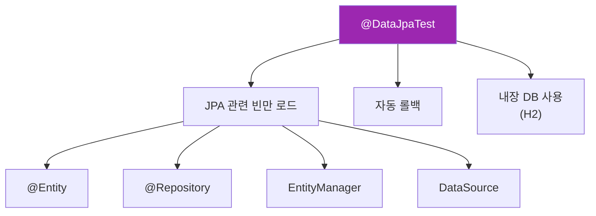
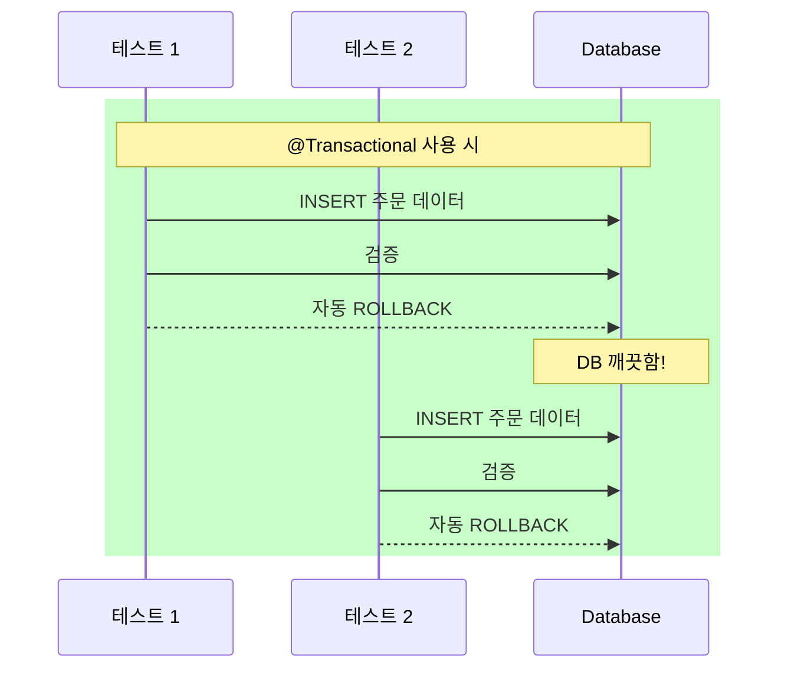
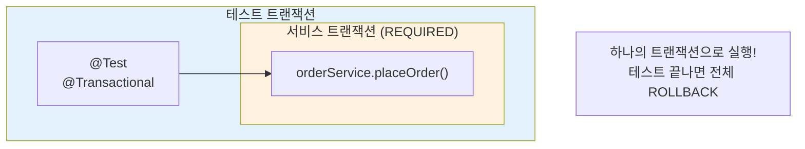
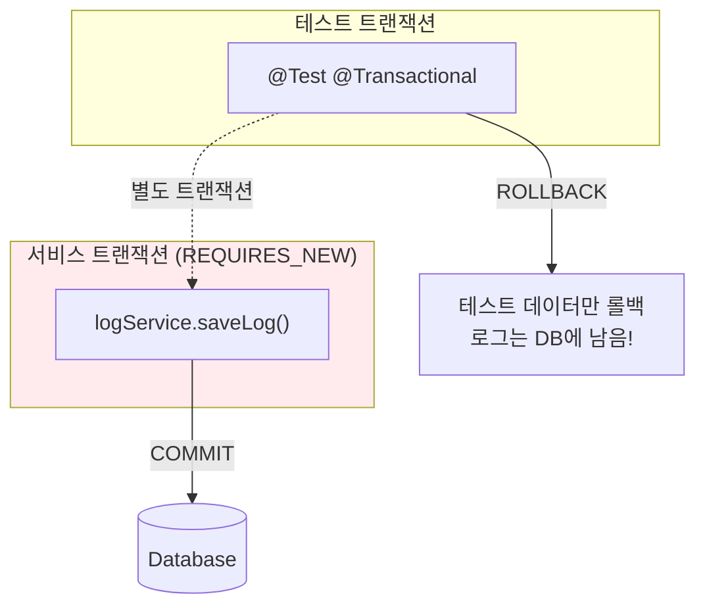
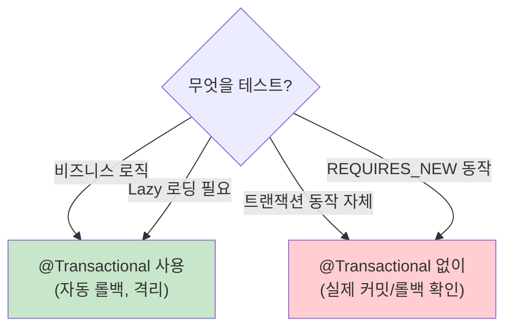
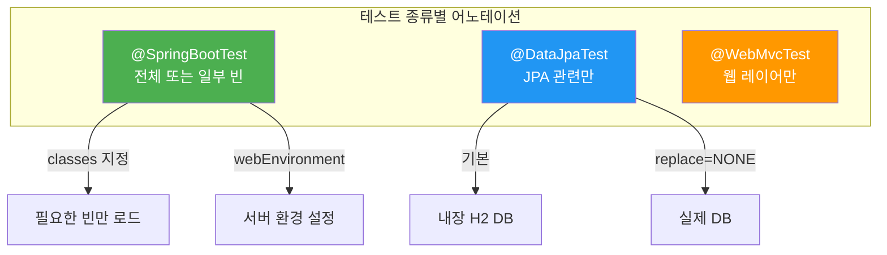

# 통합 테스트 (Integration Test)

## 정의

통합 테스트는 **여러 컴포넌트가 함께 동작하는 것을 검증**하는 테스트입니다. 단위 테스트와 달리 실제 의존성(DB, 외부 서비스)을 사용하여 컴포넌트 간의 연동을 확인합니다.

## 🎯 한눈에 보기

| 항목 | 설명 |
|------|------|
| **핵심** | 여러 레이어가 함께 동작하는지 검증 |
| **대상** | Service + Repository, Controller + Service + DB |
| **속도** | 🚀 단위 테스트보다 느림, E2E보다 빠름 |
| **어노테이션** | `@SpringBootTest`, `@DataJpaTest` |

> **💡 단위 테스트 vs 통합 테스트**
>
> ```mermaid
> flowchart LR
>     subgraph 단위["단위 테스트"]
>         S1["Service"]
>         M1["Mock Repository"]
>         S1 --> M1
>     end
>
>     subgraph 통합["통합 테스트"]
>         S2["Service"]
>         R2["Repository"]
>         DB2[(Database)]
>         S2 --> R2 --> DB2
>     end
>
>     style 단위 fill:#ff9800,color:#fff
>     style 통합 fill:#4caf50,color:#fff
> ```
>
> | 구분 | 단위 테스트 | 통합 테스트 |
> |------|-----------|-----------|
> | **의존성** | Mock 사용 | 실제 의존성 사용 |
> | **범위** | 단일 클래스 | 여러 클래스 연동 |
> | **속도** | ⚡ 빠름 | 🚀 중간 |
> | **목적** | 로직 검증 | 연동 검증 |

## @SpringBootTest 올바르게 사용하기

### 문제: 전체 빈 로드

```java
// ❌ 모든 빈 로드 → 느림!
@SpringBootTest
class OrderServiceTest {
    @Autowired OrderService orderService;
}
```

### 해결: 필요한 빈만 로드

```java
// ✅ 필요한 클래스만 지정
@SpringBootTest(classes = {
    OrderService.class,
    OrderRepository.class,
    JpaConfig.class
})
class OrderServiceIntegrationTest {
    @Autowired OrderService orderService;
}
```

### webEnvironment 옵션

```java
// 서블릿 환경 없이 (가장 빠름)
@SpringBootTest(webEnvironment = WebEnvironment.NONE)

// 랜덤 포트로 실제 서버 (API 테스트 시)
@SpringBootTest(webEnvironment = WebEnvironment.RANDOM_PORT)

// Mock 서블릿 환경 (기본값)
@SpringBootTest(webEnvironment = WebEnvironment.MOCK)
```

| 옵션 | 설명 | 속도 | 용도 |
|------|------|------|------|
| `NONE` | 서블릿 환경 없음 | ⚡ 가장 빠름 | Service 통합 테스트 |
| `MOCK` | Mock 서블릿 | 🚀 빠름 | MockMvc 사용 |
| `RANDOM_PORT` | 실제 서버 | 🐢 느림 | RestTemplate/WebClient |

## @DataJpaTest - Repository 전용 테스트

### 기본 사용법

```java
@DataJpaTest  // JPA 관련 빈만 로드
class OrderRepositoryTest {

    @Autowired
    private OrderRepository orderRepository;

    @Autowired
    private TestEntityManager entityManager;

    @Test
    @DisplayName("주문을 저장하고 조회한다")
    void save_and_findById() {
        // Given
        Order order = new Order("맥북", 2000000);

        // When
        Order savedOrder = orderRepository.save(order);
        entityManager.flush();  // 즉시 DB에 반영
        entityManager.clear();  // 영속성 컨텍스트 초기화

        // Then
        Order foundOrder = orderRepository.findById(savedOrder.getId())
                .orElseThrow();
        assertThat(foundOrder.getProductName()).isEqualTo("맥북");
    }
}
```

### @DataJpaTest 특징



| 특징 | 설명 |
|------|------|
| **슬라이스 테스트** | JPA 관련 빈만 로드하여 빠름 |
| **자동 롤백** | 각 테스트 후 자동으로 롤백 |
| **내장 DB** | 기본적으로 H2 사용 |
| **TestEntityManager** | 테스트용 EntityManager 제공 |

### 실제 DB 사용하기

```java
@DataJpaTest
@AutoConfigureTestDatabase(replace = Replace.NONE)  // 내장 DB 사용 안함
@TestPropertySource(properties = {
    "spring.datasource.url=jdbc:mysql://localhost:3306/test"
})
class OrderRepositoryTest {
    // 실제 MySQL 사용
}
```

## @TestConfiguration - 테스트 전용 빈

### 문제: 프로덕션 빈이 테스트에 부적합

```java
// 프로덕션 코드 - 실제 외부 API 호출
@Service
public class PaymentService {
    public PaymentResult process(Payment payment) {
        return externalApi.call(payment);  // 테스트에서 호출하면 안됨!
    }
}
```

### 해결: 테스트 전용 빈 정의

```java
@TestConfiguration
public class TestConfig {

    @Bean
    @Primary  // 기존 빈 대신 사용
    public PaymentService mockPaymentService() {
        return new PaymentService() {
            @Override
            public PaymentResult process(Payment payment) {
                return new PaymentResult(true, "테스트 결제 성공");
            }
        };
    }
}
```

```java
@SpringBootTest
@Import(TestConfig.class)  // 테스트 설정 적용
class OrderServiceIntegrationTest {

    @Autowired
    private OrderService orderService;  // mockPaymentService 주입됨

    @Test
    void placeOrder_Success() {
        // PaymentService는 항상 성공 반환
    }
}
```

## 테스트 데이터 관리

### 방법 1: @BeforeEach로 직접 생성

```java
@DataJpaTest
class OrderRepositoryTest {

    @Autowired
    private OrderRepository orderRepository;

    private Order testOrder;

    @BeforeEach
    void setUp() {
        testOrder = orderRepository.save(
            new Order("테스트 상품", 10000)
        );
    }

    @Test
    void findById_ReturnsOrder() {
        Order found = orderRepository.findById(testOrder.getId())
                .orElseThrow();
        assertThat(found.getProductName()).isEqualTo("테스트 상품");
    }
}
```

### 방법 2: @Sql로 SQL 스크립트 실행

```java
@DataJpaTest
@Sql("/test-data.sql")  // 테스트 전 실행
class OrderRepositoryTest {

    @Test
    void findAll_ReturnsOrders() {
        List<Order> orders = orderRepository.findAll();
        assertThat(orders).hasSize(3);  // test-data.sql에서 3건 삽입
    }
}
```

```sql
-- src/test/resources/test-data.sql
INSERT INTO orders (id, product_name, price) VALUES (1, '맥북', 2000000);
INSERT INTO orders (id, product_name, price) VALUES (2, '아이폰', 1000000);
INSERT INTO orders (id, product_name, price) VALUES (3, '아이패드', 800000);
```

### 방법 3: TestEntityManager 활용

```java
@DataJpaTest
class OrderRepositoryTest {

    @Autowired
    private TestEntityManager entityManager;

    @Autowired
    private OrderRepository orderRepository;

    @Test
    void findByStatus_ReturnsFilteredOrders() {
        // Given - TestEntityManager로 데이터 준비
        entityManager.persist(new Order("상품A", 1000, OrderStatus.PENDING));
        entityManager.persist(new Order("상품B", 2000, OrderStatus.COMPLETED));
        entityManager.persist(new Order("상품C", 3000, OrderStatus.COMPLETED));
        entityManager.flush();

        // When
        List<Order> completedOrders = orderRepository
                .findByStatus(OrderStatus.COMPLETED);

        // Then
        assertThat(completedOrders).hasSize(2);
    }
}
```

## 트랜잭션 관리

### 왜 테스트에서 @Transactional을 사용할까?



| 장점 | 설명 |
|------|------|
| **테스트 격리** | 각 테스트가 독립적으로 실행 (다른 테스트 데이터 영향 없음) |
| **자동 정리** | 테스트 후 DB 정리 코드 불필요 |
| **빠른 실행** | ROLLBACK은 COMMIT보다 빠름 |
| **반복 가능** | 동일한 테스트를 몇 번이든 실행 가능 |

### 기본 동작: 자동 롤백

```java
@DataJpaTest  // 자동으로 @Transactional 적용
class OrderRepositoryTest {

    @Test
    void saveOrder() {
        orderRepository.save(new Order("테스트", 1000));
        // 테스트 종료 후 자동 롤백 → DB에 데이터 없음
    }
}
```

> **어떤 어노테이션이 @Transactional을 포함할까?**
> - `@DataJpaTest` ✅
> - `@WebMvcTest` ❌ (DB 접근 안 함)
> - `@SpringBootTest` ❌ (직접 추가 필요)

### 롤백 비활성화

```java
@Test
@Rollback(false)  // 롤백하지 않음 (데이터 유지)
void saveOrder_NoRollback() {
    orderRepository.save(new Order("테스트", 1000));
    // 테스트 후에도 DB에 데이터 유지
}
```

### @Commit 사용

```java
@Test
@Commit  // @Rollback(false)와 동일
void saveOrder_Committed() {
    orderRepository.save(new Order("테스트", 1000));
}
```

### 트랜잭션 전파(Propagation) 이해하기

테스트에 `@Transactional`이 있으면, 서비스의 트랜잭션과 **하나로 합쳐집니다**.



```java
@SpringBootTest
class OrderServiceIntegrationTest {

    @Test
    @Transactional  // 테스트 트랜잭션 시작
    void placeOrder_CreatesOrderAndUpdatesStock() {
        // Given
        Long productId = 1L;

        // When - 서비스 트랜잭션이 테스트 트랜잭션에 참여
        orderService.placeOrder(productId, 2);

        // Then - 같은 트랜잭션이므로 변경 사항 확인 가능
        Product product = productRepository.findById(productId).orElseThrow();
        assertThat(product.getStock()).isEqualTo(8);  // 10 - 2 = 8

        // 테스트 끝 → 전체 ROLLBACK
    }
}
```

### REQUIRES_NEW 주의사항

서비스에서 `REQUIRES_NEW`를 사용하면 **별도 트랜잭션**이 생성됩니다.



```java
@Service
public class LogService {

    @Transactional(propagation = Propagation.REQUIRES_NEW)  // 별도 트랜잭션!
    public void saveLog(String message) {
        logRepository.save(new Log(message));
    }
}
```

```java
@Test
@Transactional
void orderWithLog() {
    orderService.placeOrder(1L, 2);  // 테스트 트랜잭션에 참여 → 롤백됨
    logService.saveLog("주문 완료");  // REQUIRES_NEW → 커밋됨! (롤백 안 됨)
}
// 테스트 후: 주문은 롤백, 로그는 DB에 남아있음!
```

### LazyInitializationException 해결

JPA의 지연 로딩(Lazy Loading) 엔티티는 트랜잭션 밖에서 접근하면 예외가 발생합니다.

```java
// ❌ 예외 발생!
@SpringBootTest
class OrderServiceTest {

    @Test
    void getOrderWithItems() {
        Order order = orderService.findById(1L);

        // 트랜잭션 종료 후 Lazy 컬렉션 접근
        List<OrderItem> items = order.getItems();  // LazyInitializationException!
    }
}
```

```java
// ✅ @Transactional로 해결
@SpringBootTest
class OrderServiceTest {

    @Test
    @Transactional  // 트랜잭션 유지
    void getOrderWithItems() {
        Order order = orderService.findById(1L);

        // 같은 트랜잭션 내에서 Lazy 로딩 가능
        List<OrderItem> items = order.getItems();  // 정상 동작!
        assertThat(items).hasSize(3);
    }
}
```

### 트랜잭션 없이 테스트해야 할 때

서비스의 **실제 트랜잭션 동작**을 테스트하려면 테스트에 `@Transactional`을 붙이면 안 됩니다.

```java
// 롤백 동작 테스트 - @Transactional 없이!
@SpringBootTest
class OrderServiceRollbackTest {

    @Autowired
    private OrderService orderService;

    @Autowired
    private OrderRepository orderRepository;

    @AfterEach
    void cleanup() {
        orderRepository.deleteAll();  // 수동 정리 필요
    }

    @Test
    void placeOrder_PaymentFails_RollbacksOrder() {
        // Given - 결제 실패 시나리오 설정
        Long productId = 1L;

        // When & Then - 예외 발생
        assertThatThrownBy(() -> orderService.placeOrderWithPayment(productId, 1000))
                .isInstanceOf(PaymentFailedException.class);

        // Then - 서비스의 트랜잭션이 실제로 롤백되었는지 확인
        List<Order> orders = orderRepository.findAll();
        assertThat(orders).isEmpty();  // 롤백되어 주문 없음!
    }
}
```

### 트랜잭션 테스트 판단 기준



| 상황 | @Transactional | 이유 |
|------|----------------|------|
| 일반적인 CRUD 테스트 | ✅ 사용 | 자동 롤백, 테스트 격리 |
| Lazy 컬렉션 접근 | ✅ 사용 | 트랜잭션 내에서만 로딩 가능 |
| 롤백 동작 검증 | ❌ 사용 안 함 | 실제 롤백 확인 필요 |
| REQUIRES_NEW 검증 | ❌ 사용 안 함 | 별도 트랜잭션 동작 확인 |
| 동시성 테스트 | ❌ 사용 안 함 | 여러 트랜잭션 충돌 테스트 |

## 실전 예제: 주문 서비스 통합 테스트

### 테스트 대상

```java
@Service
@RequiredArgsConstructor
@Transactional
public class OrderService {

    private final OrderRepository orderRepository;
    private final ProductRepository productRepository;

    public Order placeOrder(Long productId, int quantity) {
        Product product = productRepository.findById(productId)
                .orElseThrow(() -> new ProductNotFoundException(productId));

        if (product.getStock() < quantity) {
            throw new InsufficientStockException(productId);
        }

        product.decreaseStock(quantity);
        Order order = Order.create(product, quantity);

        return orderRepository.save(order);
    }

    @Transactional(readOnly = true)
    public List<Order> findOrdersByProductId(Long productId) {
        return orderRepository.findByProductId(productId);
    }
}
```

### 통합 테스트 코드

```java
@SpringBootTest
@Transactional
class OrderServiceIntegrationTest {

    @Autowired
    private OrderService orderService;

    @Autowired
    private ProductRepository productRepository;

    @Autowired
    private OrderRepository orderRepository;

    private Product testProduct;

    @BeforeEach
    void setUp() {
        testProduct = productRepository.save(
            new Product("맥북 프로", 3000000, 10)
        );
    }

    @Test
    @DisplayName("주문 성공 시 재고가 감소하고 주문이 생성된다")
    void placeOrder_Success_DecreasesStockAndCreatesOrder() {
        // When
        Order order = orderService.placeOrder(testProduct.getId(), 2);

        // Then - 주문 생성 확인
        assertThat(order.getId()).isNotNull();
        assertThat(order.getQuantity()).isEqualTo(2);
        assertThat(order.getTotalPrice()).isEqualTo(6000000);

        // Then - 재고 감소 확인
        Product updatedProduct = productRepository.findById(testProduct.getId())
                .orElseThrow();
        assertThat(updatedProduct.getStock()).isEqualTo(8);  // 10 - 2
    }

    @Test
    @DisplayName("재고 부족 시 예외가 발생하고 재고는 변경되지 않는다")
    void placeOrder_InsufficientStock_ThrowsExceptionAndNoStockChange() {
        // When & Then
        assertThatThrownBy(() -> orderService.placeOrder(testProduct.getId(), 100))
                .isInstanceOf(InsufficientStockException.class);

        // 재고가 변경되지 않았는지 확인
        Product product = productRepository.findById(testProduct.getId())
                .orElseThrow();
        assertThat(product.getStock()).isEqualTo(10);  // 변경 없음
    }

    @Test
    @DisplayName("상품별 주문 목록을 조회한다")
    void findOrdersByProductId_ReturnsOrders() {
        // Given
        orderService.placeOrder(testProduct.getId(), 1);
        orderService.placeOrder(testProduct.getId(), 2);
        orderService.placeOrder(testProduct.getId(), 3);

        // When
        List<Order> orders = orderService.findOrdersByProductId(testProduct.getId());

        // Then
        assertThat(orders).hasSize(3);
        assertThat(orders)
                .extracting(Order::getQuantity)
                .containsExactlyInAnyOrder(1, 2, 3);
    }
}
```

## TestContainers 소개

실제 DB(MySQL, PostgreSQL 등)를 Docker 컨테이너로 실행하여 테스트합니다.

### 의존성 추가

```groovy
// build.gradle
testImplementation 'org.testcontainers:testcontainers:1.19.0'
testImplementation 'org.testcontainers:junit-jupiter:1.19.0'
testImplementation 'org.testcontainers:mysql:1.19.0'
```

### 기본 사용법

```java
@SpringBootTest
@Testcontainers
class OrderServiceContainerTest {

    @Container
    static MySQLContainer<?> mysql = new MySQLContainer<>("mysql:8.0")
            .withDatabaseName("testdb")
            .withUsername("test")
            .withPassword("test");

    @DynamicPropertySource
    static void configureProperties(DynamicPropertyRegistry registry) {
        registry.add("spring.datasource.url", mysql::getJdbcUrl);
        registry.add("spring.datasource.username", mysql::getUsername);
        registry.add("spring.datasource.password", mysql::getPassword);
    }

    @Autowired
    private OrderService orderService;

    @Test
    void placeOrder_WithRealMySQL() {
        // 실제 MySQL 컨테이너에서 테스트 실행
    }
}
```

### TestContainers 장점

| 장점 | 설명 |
|------|------|
| **실제 DB** | H2가 아닌 프로덕션과 동일한 DB 사용 |
| **격리** | 컨테이너로 테스트 간 격리 보장 |
| **재현성** | 동일한 환경에서 테스트 재현 가능 |
| **CI/CD** | Docker만 있으면 어디서든 실행 |

## 통합 테스트 어노테이션 정리



| 어노테이션 | 범위 | 속도 | 용도 |
|-----------|------|------|------|
| `@SpringBootTest` | 전체/일부 | 🐢 | Service + Repository 통합 |
| `@DataJpaTest` | JPA만 | 🚀 | Repository 단독 |
| `@WebMvcTest` | 웹만 | 🚀 | Controller (Mock 서비스) |

## 💡 팁

### 테스트 속도 최적화

```java
// 1. 필요한 빈만 로드
@SpringBootTest(classes = {OrderService.class, OrderRepository.class})

// 2. 웹 환경 비활성화
@SpringBootTest(webEnvironment = WebEnvironment.NONE)

// 3. 테스트 프로파일 분리
@ActiveProfiles("test")
```

### application-test.yml 설정

```yaml
# src/test/resources/application-test.yml
spring:
  datasource:
    url: jdbc:h2:mem:testdb
    driver-class-name: org.h2.Driver
  jpa:
    hibernate:
      ddl-auto: create-drop
    show-sql: true
```

## 자주 하는 실수

### 1. flush() 누락

```java
// ❌ 잘못된 예
@Test
void test() {
    orderRepository.save(order);
    // 아직 DB에 반영 안됨 (영속성 컨텍스트에만 있음)
    Order found = orderRepository.findById(order.getId());  // 캐시에서 조회
}

// ✅ 올바른 예
@Test
void test() {
    orderRepository.save(order);
    entityManager.flush();  // DB에 즉시 반영
    entityManager.clear();  // 영속성 컨텍스트 초기화
    Order found = orderRepository.findById(order.getId());  // DB에서 조회
}
```

### 2. 테스트 간 데이터 공유

```java
// ❌ static 변수로 데이터 공유 → 테스트 순서 의존성 발생
static Order sharedOrder;

// ✅ 각 테스트에서 독립적으로 데이터 생성
@BeforeEach
void setUp() {
    testOrder = orderRepository.save(new Order(...));
}
```

### 3. @Transactional 오용

```java
// ❌ 서비스의 트랜잭션 동작을 테스트하려면 테스트에 @Transactional 붙이지 않음
@Test
@Transactional  // 이러면 서비스의 트랜잭션 경계가 의미 없어짐
void testTransactionBehavior() { ... }

// ✅ 트랜잭션 동작 테스트 시
@Test
void testTransactionRollback() {
    // @Transactional 없이 테스트
    // 서비스 내부의 트랜잭션 동작을 검증
}
```

## 관련 문서

| 문서 | 설명 |
|------|------|
| [메인으로 돌아가기](../README.md) | TDD 가이드 메인 |
| [서비스 빈 테스트](../service/README.md) | Mockito로 단위 테스트 |
| [컨트롤러 테스트](../controller/README.md) | @WebMvcTest로 API 테스트 |
