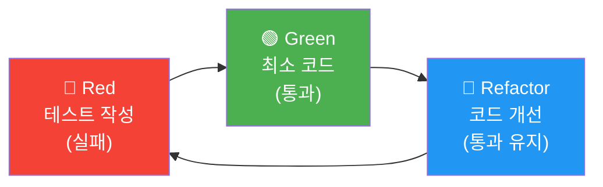
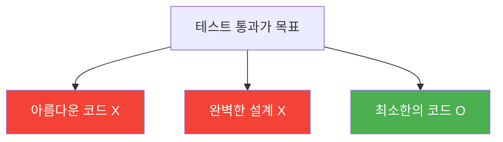
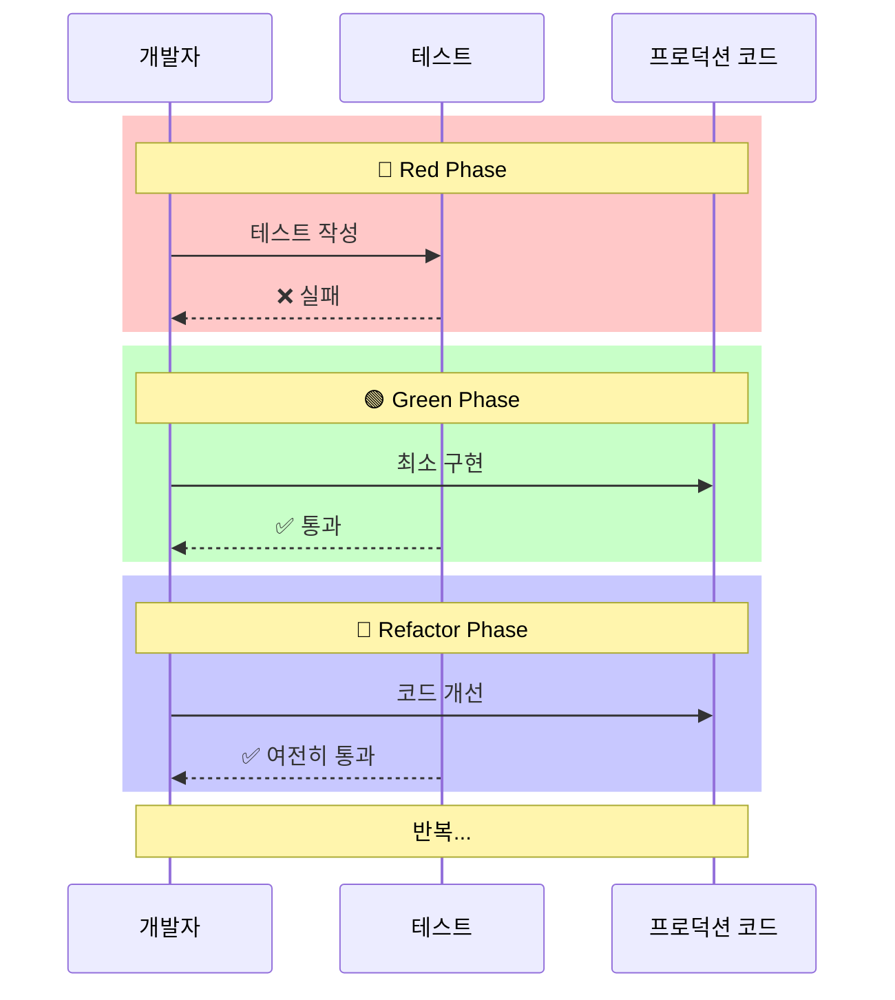

# Red-Green-Refactor 사이클

## 정의

Red-Green-Refactor는 TDD의 핵심 사이클로, **실패하는 테스트 작성(Red)** → **테스트 통과(Green)** → **코드 개선(Refactor)** 단계를 반복합니다.

## 🎯 한눈에 보기

| 단계 | 설명 | 목표 |
|------|------|------|
| **🔴 Red** | 실패하는 테스트 먼저 작성 | 요구사항 정의 |
| **🟢 Green** | 테스트를 통과하는 최소 코드 작성 | 기능 구현 |
| **🔵 Refactor** | 코드 개선 (테스트는 계속 통과) | 품질 향상 |

## 사이클 다이어그램



## 각 단계 상세

### 🔴 Red - 실패하는 테스트 작성

> "테스트가 실패하는 것을 확인해야 한다"

```java
@Test
@DisplayName("두 수를 더하면 합계가 반환된다")
void add_TwoNumbers_ReturnsSum() {
    // Given
    Calculator calculator = new Calculator();

    // When
    int result = calculator.add(2, 3);

    // Then
    assertThat(result).isEqualTo(5);
}
```

이 시점에서 `Calculator` 클래스가 없으므로 **컴파일 에러**가 발생합니다.
이것이 바로 **Red** 상태입니다!

**왜 실패를 먼저 확인할까?**

| 이유 | 설명 |
|------|------|
| 테스트 검증 | 테스트가 실제로 동작하는지 확인 |
| 요구사항 명확화 | 무엇을 구현할지 명확히 정의 |
| 과잉 구현 방지 | 필요한 것만 구현하도록 유도 |

### 🟢 Green - 테스트 통과하는 최소 코드

> "테스트를 통과하는 가장 간단한 코드를 작성한다"

```java
public class Calculator {

    public int add(int a, int b) {
        return a + b;  // 최소한의 구현
    }
}
```

**Green 단계의 핵심 원칙:**



| 원칙 | 설명 |
|------|------|
| **KISS** | 가장 단순하게 구현 |
| **최소 코드** | 테스트 통과에 필요한 것만 |
| **빠른 피드백** | 빨리 Green 상태로 |

### 🔵 Refactor - 코드 개선

> "동작은 유지하면서 코드 품질을 개선한다"

리팩토링 전:
```java
public class Calculator {

    public int add(int a, int b) {
        return a + b;
    }

    public int subtract(int a, int b) {
        return a - b;
    }

    public int multiply(int a, int b) {
        return a * b;
    }
}
```

리팩토링 후 (예: 검증 로직 추가):
```java
public class Calculator {

    public int add(int a, int b) {
        validateInput(a, b);
        return a + b;
    }

    public int subtract(int a, int b) {
        validateInput(a, b);
        return a - b;
    }

    public int multiply(int a, int b) {
        validateInput(a, b);
        return a * b;
    }

    private void validateInput(int a, int b) {
        // 공통 검증 로직
    }
}
```

**Refactor 단계의 핵심:**

| 원칙 | 설명 |
|------|------|
| **테스트 통과 유지** | 리팩토링 후에도 모든 테스트 통과 |
| **작은 단위** | 한 번에 조금씩 변경 |
| **자주 실행** | 변경마다 테스트 실행 |

## 실전 예제: 할인 계산기

### 요구사항
- 10% 할인을 적용하는 기능
- 원가에서 할인 금액을 뺀 최종 가격 반환

### 🔴 Red - 테스트 먼저

```java
class DiscountCalculatorTest {

    @Test
    @DisplayName("10% 할인을 적용하면 할인된 가격이 반환된다")
    void applyDiscount_10Percent_ReturnsDiscountedPrice() {
        // Given
        DiscountCalculator calculator = new DiscountCalculator();
        int originalPrice = 10000;

        // When
        int discountedPrice = calculator.applyDiscount(originalPrice, 10);

        // Then
        assertThat(discountedPrice).isEqualTo(9000);
    }
}
```

**실행 결과**: ❌ 컴파일 에러 (DiscountCalculator 없음)

### 🟢 Green - 최소 구현

```java
public class DiscountCalculator {

    public int applyDiscount(int price, int discountPercent) {
        int discountAmount = price * discountPercent / 100;
        return price - discountAmount;
    }
}
```

**실행 결과**: ✅ 테스트 통과

### 🔴 Red - 추가 테스트

```java
@Test
@DisplayName("할인율이 0이면 원래 가격이 반환된다")
void applyDiscount_ZeroPercent_ReturnsOriginalPrice() {
    // Given
    DiscountCalculator calculator = new DiscountCalculator();

    // When
    int result = calculator.applyDiscount(10000, 0);

    // Then
    assertThat(result).isEqualTo(10000);
}

@Test
@DisplayName("할인율이 100이면 0원이 반환된다")
void applyDiscount_100Percent_ReturnsZero() {
    // Given
    DiscountCalculator calculator = new DiscountCalculator();

    // When
    int result = calculator.applyDiscount(10000, 100);

    // Then
    assertThat(result).isEqualTo(0);
}
```

**실행 결과**: ✅ 모든 테스트 통과

### 🔵 Refactor - 코드 개선

```java
public class DiscountCalculator {

    public int applyDiscount(int price, int discountPercent) {
        validatePrice(price);
        validateDiscountPercent(discountPercent);

        int discountAmount = calculateDiscountAmount(price, discountPercent);
        return price - discountAmount;
    }

    private void validatePrice(int price) {
        if (price < 0) {
            throw new IllegalArgumentException("가격은 0 이상이어야 합니다");
        }
    }

    private void validateDiscountPercent(int percent) {
        if (percent < 0 || percent > 100) {
            throw new IllegalArgumentException("할인율은 0~100 사이여야 합니다");
        }
    }

    private int calculateDiscountAmount(int price, int discountPercent) {
        return price * discountPercent / 100;
    }
}
```

### 🔴 Red - 예외 케이스 테스트

```java
@Test
@DisplayName("할인율이 음수면 예외가 발생한다")
void applyDiscount_NegativePercent_ThrowsException() {
    // Given
    DiscountCalculator calculator = new DiscountCalculator();

    // When & Then
    assertThatThrownBy(() -> calculator.applyDiscount(10000, -10))
            .isInstanceOf(IllegalArgumentException.class)
            .hasMessageContaining("0~100");
}
```

## 사이클 반복 시각화



## TDD 마인드셋

### Do's ✅

| 항목 | 설명 |
|------|------|
| 작은 단계 | 한 번에 하나의 테스트만 |
| 빠른 피드백 | 자주 테스트 실행 |
| 단순한 시작 | 가장 쉬운 케이스부터 |
| 실패 확인 | Red 상태 꼭 확인 |

### Don'ts ❌

| 항목 | 설명 |
|------|------|
| 한 번에 많이 | 여러 기능 동시 구현 |
| 완벽 추구 | Green에서 완벽한 코드 |
| 테스트 건너뛰기 | Red 없이 바로 구현 |
| 리팩토링 미루기 | Refactor 건너뛰기 |

## 관련 문서

| 문서 | 설명 |
|------|------|
| [메인으로 돌아가기](../README.md) | TDD 가이드 메인 |
| [Static 서비스 테스트](../static-service/README.md) | 순수 단위 테스트 시작하기 |
