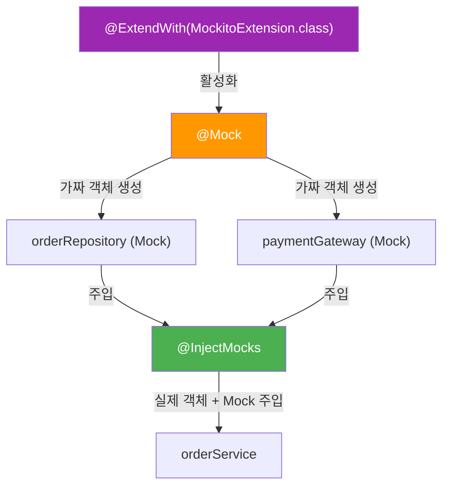
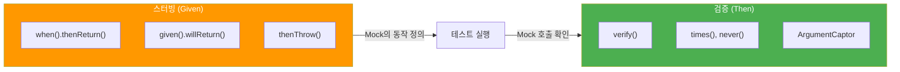

# 서비스 빈 테스트 (Mockito)

## 정의

서비스 빈 테스트는 **Spring 빈으로 등록된 서비스**를 테스트하되, **의존성은 Mock 객체로 대체**하여 빠르고 격리된 테스트를 수행합니다.

## 🎯 한눈에 보기

| 항목 | 설명 |
|------|------|
| **핵심** | `@ExtendWith(MockitoExtension.class)` + `@Mock` + `@InjectMocks` |
| **대상** | `@Service`, `@Component` 등 Spring 빈 서비스 |
| **속도** | ⚡ 매우 빠름 (Spring 컨텍스트 로드 안함) |
| **모킹** | 의존성(Repository, 외부 서비스)을 Mock으로 대체 |

> **💡 왜 Mock을 사용할까?**
>
> ```mermaid
> flowchart LR
>     Service["OrderService"] --> Repo["OrderRepository"]
>     Service --> Payment["PaymentGateway"]
>     Service --> Notify["NotificationService"]
>
>     Repo --> DB[(Database)]
>     Payment --> External["외부 결제 API"]
>     Notify --> Email["이메일 서버"]
> ```
>
> **❌ 실제 의존성 사용 시 문제**
> - DB 연결 필요 → 느림
> - 외부 API 호출 → 불안정
> - 테스트 데이터 관리 어려움
>
> **✅ Mock 사용 시 장점**
> - 의존성 격리 → 빠름
> - 원하는 응답 설정 가능
> - 호출 검증 가능

## 기본 설정

### 필수 import

```java
import org.junit.jupiter.api.Test;
import org.junit.jupiter.api.extension.ExtendWith;
import org.mockito.Mock;
import org.mockito.InjectMocks;
import org.mockito.junit.jupiter.MockitoExtension;

import static org.mockito.Mockito.*;
import static org.mockito.BDDMockito.*;
import static org.assertj.core.api.Assertions.*;
```

### 기본 구조

```java
@ExtendWith(MockitoExtension.class)  // Mockito 활성화
class OrderServiceTest {

    @Mock  // 가짜 객체 생성
    private OrderRepository orderRepository;

    @Mock
    private PaymentGateway paymentGateway;

    @InjectMocks  // Mock들을 주입받은 실제 객체
    private OrderService orderService;

    @Test
    void testMethod() {
        // 테스트 코드
    }
}
```

### 어노테이션 설명



| 어노테이션 | 역할 |
|-----------|------|
| `@ExtendWith(MockitoExtension.class)` | Mockito 기능 활성화 |
| `@Mock` | 가짜 객체(Mock) 생성 |
| `@InjectMocks` | Mock들을 주입받은 테스트 대상 객체 생성 |

## 스터빙 (Stubbing)

### when().thenReturn() - 기본 스터빙

```java
// 테스트할 서비스
public class OrderService {

    private final OrderRepository orderRepository;

    public Order findOrder(Long orderId) {
        return orderRepository.findById(orderId)
                .orElseThrow(() -> new OrderNotFoundException(orderId));
    }
}
```

```java
@Test
@DisplayName("주문 ID로 주문을 조회한다")
void findOrder_ExistingId_ReturnsOrder() {
    // Given
    Long orderId = 1L;
    Order expectedOrder = new Order(orderId, "상품A", 10000);

    when(orderRepository.findById(orderId))
            .thenReturn(Optional.of(expectedOrder));

    // When
    Order result = orderService.findOrder(orderId);

    // Then
    assertThat(result.getId()).isEqualTo(orderId);
    assertThat(result.getProductName()).isEqualTo("상품A");
}
```

### given().willReturn() - BDD 스타일

```java
@Test
@DisplayName("주문 ID로 주문을 조회한다 - BDD 스타일")
void findOrder_ExistingId_ReturnsOrder_BDD() {
    // Given
    Long orderId = 1L;
    Order expectedOrder = new Order(orderId, "상품A", 10000);

    given(orderRepository.findById(orderId))
            .willReturn(Optional.of(expectedOrder));

    // When
    Order result = orderService.findOrder(orderId);

    // Then
    assertThat(result.getId()).isEqualTo(orderId);
}
```

### thenThrow() - 예외 스터빙

```java
@Test
@DisplayName("존재하지 않는 주문 조회 시 예외가 발생한다")
void findOrder_NonExistingId_ThrowsException() {
    // Given
    Long orderId = 999L;

    when(orderRepository.findById(orderId))
            .thenReturn(Optional.empty());

    // When & Then
    assertThatThrownBy(() -> orderService.findOrder(orderId))
            .isInstanceOf(OrderNotFoundException.class)
            .hasMessageContaining("999");
}
```

### 여러 번 호출 시 다른 결과

```java
@Test
@DisplayName("첫 번째는 성공, 두 번째는 실패한다")
void multipleInvocations() {
    // Given
    when(paymentGateway.process(any()))
            .thenReturn(true)   // 첫 번째 호출
            .thenReturn(false); // 두 번째 호출

    // When & Then
    assertThat(paymentGateway.process(new Payment())).isTrue();
    assertThat(paymentGateway.process(new Payment())).isFalse();
}
```

## 검증 (Verification)

### verify() - 호출 검증

```java
// 테스트할 서비스
public class OrderService {

    private final OrderRepository orderRepository;
    private final NotificationService notificationService;

    public Order createOrder(OrderRequest request) {
        Order order = new Order(request);
        Order savedOrder = orderRepository.save(order);
        notificationService.sendOrderConfirmation(savedOrder);
        return savedOrder;
    }
}
```

```java
@Test
@DisplayName("주문 생성 시 저장소와 알림 서비스가 호출된다")
void createOrder_CallsRepositoryAndNotification() {
    // Given
    OrderRequest request = new OrderRequest("상품A", 10000);
    Order savedOrder = new Order(1L, "상품A", 10000);

    when(orderRepository.save(any(Order.class)))
            .thenReturn(savedOrder);

    // When
    orderService.createOrder(request);

    // Then
    verify(orderRepository).save(any(Order.class));
    verify(notificationService).sendOrderConfirmation(savedOrder);
}
```

### 호출 횟수 검증

```java
// 정확히 1번 호출
verify(orderRepository, times(1)).save(any());

// 정확히 3번 호출
verify(paymentGateway, times(3)).process(any());

// 호출되지 않음
verify(notificationService, never()).sendErrorAlert(any());

// 최소 1번 이상 호출
verify(orderRepository, atLeastOnce()).findById(any());

// 최대 3번까지 호출
verify(paymentGateway, atMost(3)).process(any());
```

### 인자 검증

```java
@Test
@DisplayName("저장 시 올바른 주문 정보가 전달된다")
void createOrder_PassesCorrectOrderToRepository() {
    // Given
    OrderRequest request = new OrderRequest("상품A", 10000);
    when(orderRepository.save(any())).thenAnswer(invocation -> invocation.getArgument(0));

    // When
    orderService.createOrder(request);

    // Then - ArgumentCaptor로 실제 전달된 값 캡처
    ArgumentCaptor<Order> orderCaptor = ArgumentCaptor.forClass(Order.class);
    verify(orderRepository).save(orderCaptor.capture());

    Order capturedOrder = orderCaptor.getValue();
    assertThat(capturedOrder.getProductName()).isEqualTo("상품A");
    assertThat(capturedOrder.getPrice()).isEqualTo(10000);
}
```

## Argument Matchers

### 기본 매처

```java
// 어떤 값이든 매칭
when(repository.findById(any())).thenReturn(Optional.of(order));

// 특정 타입의 어떤 값이든
when(repository.findById(anyLong())).thenReturn(Optional.of(order));

// 특정 문자열 패턴
when(repository.findByName(contains("상품"))).thenReturn(List.of(order));

// null이 아닌 값
when(repository.save(notNull())).thenReturn(savedOrder);

// 특정 값
when(repository.findById(eq(1L))).thenReturn(Optional.of(order));
```

### 매처 조합 규칙

```java
// ❌ 잘못된 사용 - 일부만 매처 사용
when(service.process(anyString(), 100))  // 컴파일 에러!

// ✅ 올바른 사용 - 모두 매처 사용
when(service.process(anyString(), eq(100)))

// ✅ 또는 모두 실제 값 사용
when(service.process("test", 100))
```

## 실전 예제: 주문 서비스

### 테스트 대상

```java
@Service
@RequiredArgsConstructor
public class OrderService {

    private final OrderRepository orderRepository;
    private final ProductRepository productRepository;
    private final PaymentService paymentService;

    @Transactional
    public OrderResult placeOrder(OrderRequest request) {
        // 1. 상품 조회
        Product product = productRepository.findById(request.getProductId())
                .orElseThrow(() -> new ProductNotFoundException(request.getProductId()));

        // 2. 재고 확인
        if (product.getStock() < request.getQuantity()) {
            throw new InsufficientStockException(product.getId());
        }

        // 3. 주문 생성
        Order order = Order.create(product, request.getQuantity());

        // 4. 결제 처리
        PaymentResult paymentResult = paymentService.processPayment(
                order.getTotalPrice(),
                request.getPaymentMethod()
        );

        if (!paymentResult.isSuccess()) {
            throw new PaymentFailedException(paymentResult.getMessage());
        }

        // 5. 재고 감소 및 저장
        product.decreaseStock(request.getQuantity());
        Order savedOrder = orderRepository.save(order);

        return new OrderResult(savedOrder, paymentResult);
    }
}
```

### 테스트 코드

```java
@ExtendWith(MockitoExtension.class)
class OrderServiceTest {

    @Mock
    private OrderRepository orderRepository;

    @Mock
    private ProductRepository productRepository;

    @Mock
    private PaymentService paymentService;

    @InjectMocks
    private OrderService orderService;

    private Product product;
    private OrderRequest request;

    @BeforeEach
    void setUp() {
        product = new Product(1L, "맥북", 2000000, 10);
        request = new OrderRequest(1L, 2, PaymentMethod.CARD);
    }

    @Test
    @DisplayName("정상적인 주문이 성공한다")
    void placeOrder_ValidRequest_Succeeds() {
        // Given
        given(productRepository.findById(1L))
                .willReturn(Optional.of(product));

        given(paymentService.processPayment(anyInt(), any()))
                .willReturn(new PaymentResult(true, "결제 성공"));

        given(orderRepository.save(any(Order.class)))
                .willAnswer(invocation -> {
                    Order order = invocation.getArgument(0);
                    return new Order(1L, order.getProduct(), order.getQuantity());
                });

        // When
        OrderResult result = orderService.placeOrder(request);

        // Then
        assertThat(result.isSuccess()).isTrue();
        assertThat(result.getOrder().getQuantity()).isEqualTo(2);

        verify(productRepository).findById(1L);
        verify(paymentService).processPayment(4000000, PaymentMethod.CARD);
        verify(orderRepository).save(any(Order.class));
    }

    @Test
    @DisplayName("상품이 없으면 예외가 발생한다")
    void placeOrder_ProductNotFound_ThrowsException() {
        // Given
        given(productRepository.findById(anyLong()))
                .willReturn(Optional.empty());

        // When & Then
        assertThatThrownBy(() -> orderService.placeOrder(request))
                .isInstanceOf(ProductNotFoundException.class);

        verify(paymentService, never()).processPayment(anyInt(), any());
        verify(orderRepository, never()).save(any());
    }

    @Test
    @DisplayName("재고가 부족하면 예외가 발생한다")
    void placeOrder_InsufficientStock_ThrowsException() {
        // Given
        Product lowStockProduct = new Product(1L, "맥북", 2000000, 1);
        given(productRepository.findById(1L))
                .willReturn(Optional.of(lowStockProduct));

        // When & Then
        assertThatThrownBy(() -> orderService.placeOrder(request))
                .isInstanceOf(InsufficientStockException.class);

        verify(paymentService, never()).processPayment(anyInt(), any());
    }

    @Test
    @DisplayName("결제가 실패하면 예외가 발생한다")
    void placeOrder_PaymentFailed_ThrowsException() {
        // Given
        given(productRepository.findById(1L))
                .willReturn(Optional.of(product));

        given(paymentService.processPayment(anyInt(), any()))
                .willReturn(new PaymentResult(false, "잔액 부족"));

        // When & Then
        assertThatThrownBy(() -> orderService.placeOrder(request))
                .isInstanceOf(PaymentFailedException.class)
                .hasMessageContaining("잔액 부족");

        verify(orderRepository, never()).save(any());
    }
}
```

## 스터빙 vs 검증 정리



| 구분 | 목적 | 사용 시점 |
|------|------|----------|
| **스터빙** | Mock이 어떻게 동작할지 정의 | Given (준비) |
| **검증** | Mock이 어떻게 호출되었는지 확인 | Then (검증) |

## 💡 팁

### @Spy vs @Mock 비교

```java
// @Mock: 모든 메서드가 기본값 반환 (null, 0, false 등)
@Mock
private OrderRepository mockRepository;

// @Spy: 실제 객체의 메서드 호출, 필요한 것만 스터빙
@Spy
private OrderRepository spyRepository = new OrderRepositoryImpl();

@Test
void spyExample() {
    // Spy는 실제 메서드 호출
    Order order = spyRepository.findById(1L);  // 실제 로직 실행

    // 특정 메서드만 스터빙
    doReturn(Optional.of(mockOrder))
            .when(spyRepository).findById(1L);
}
```

| 구분 | @Mock | @Spy |
|------|-------|------|
| 기본 동작 | 아무것도 안 함 (null 반환) | 실제 메서드 호출 |
| 스터빙 | 필수 | 선택 (필요한 것만) |
| 사용 시점 | 완전한 격리가 필요할 때 | 일부만 대체할 때 |

### @Captor 어노테이션

ArgumentCaptor를 더 깔끔하게 선언합니다.

```java
@ExtendWith(MockitoExtension.class)
class OrderServiceTest {

    @Mock
    private OrderRepository orderRepository;

    @Captor  // ArgumentCaptor를 필드로 선언
    private ArgumentCaptor<Order> orderCaptor;

    @Test
    void createOrder_CapturesCorrectOrder() {
        // When
        orderService.createOrder(request);

        // Then
        verify(orderRepository).save(orderCaptor.capture());

        Order captured = orderCaptor.getValue();
        assertThat(captured.getProductName()).isEqualTo("맥북");
    }
}
```

### BDDMockito로 가독성 향상

```java
// 전통적인 Mockito
when(repository.findById(1L)).thenReturn(Optional.of(order));
verify(repository).save(any());

// BDDMockito - Given/When/Then과 일치
given(repository.findById(1L)).willReturn(Optional.of(order));
then(repository).should().save(any());
```

## 자주 하는 실수

### 1. 불필요한 스터빙 (UnnecessaryStubbingException)

```java
// ❌ 잘못된 예 - 사용하지 않는 스터빙
@Test
void test() {
    when(repository.findById(1L)).thenReturn(order);  // 사용 안 함!
    when(repository.findById(2L)).thenReturn(order2); // 이것만 사용

    service.processOrder(2L);  // findById(1L) 호출 안 함
}
// → UnnecessaryStubbingException 발생!

// ✅ 해결 방법 1: 필요한 스터빙만 작성
@Test
void test() {
    when(repository.findById(2L)).thenReturn(order2);
    service.processOrder(2L);
}

// ✅ 해결 방법 2: lenient() 사용 (권장하지 않음)
@Test
void test() {
    lenient().when(repository.findById(1L)).thenReturn(order);
}
```

### 2. any()와 실제 값 혼용

```java
// ❌ 잘못된 예 - 매처와 실제 값 혼용
when(service.process(any(), 100)).thenReturn(result);  // 컴파일 에러!

// ✅ 올바른 예 - 모두 매처 또는 모두 실제 값
when(service.process(any(), eq(100))).thenReturn(result);
when(service.process("test", 100)).thenReturn(result);
```

### 3. void 메서드 스터빙

```java
// ❌ 잘못된 예 - void 메서드에 when() 사용
when(notificationService.send(any())).thenThrow(new Exception());  // 에러!

// ✅ 올바른 예 - doThrow() 사용
doThrow(new RuntimeException("전송 실패"))
        .when(notificationService).send(any());

// void 메서드 아무것도 안 하게
doNothing().when(notificationService).send(any());
```

### 4. 스터빙 순서 실수

```java
// ❌ 잘못된 예 - 더 구체적인 스터빙이 나중에
when(repository.findById(anyLong())).thenReturn(Optional.empty());
when(repository.findById(1L)).thenReturn(Optional.of(order));  // 무시됨!

// ✅ 올바른 예 - 구체적인 것 먼저
when(repository.findById(1L)).thenReturn(Optional.of(order));
when(repository.findById(anyLong())).thenReturn(Optional.empty());
```

## 관련 문서

| 문서 | 설명 |
|------|------|
| [메인으로 돌아가기](../README.md) | TDD 가이드 메인 |
| [Static 서비스 테스트](../static-service/README.md) | 순수 단위 테스트 |
| [컨트롤러 테스트](../controller/README.md) | @WebMvcTest로 API 테스트 |
